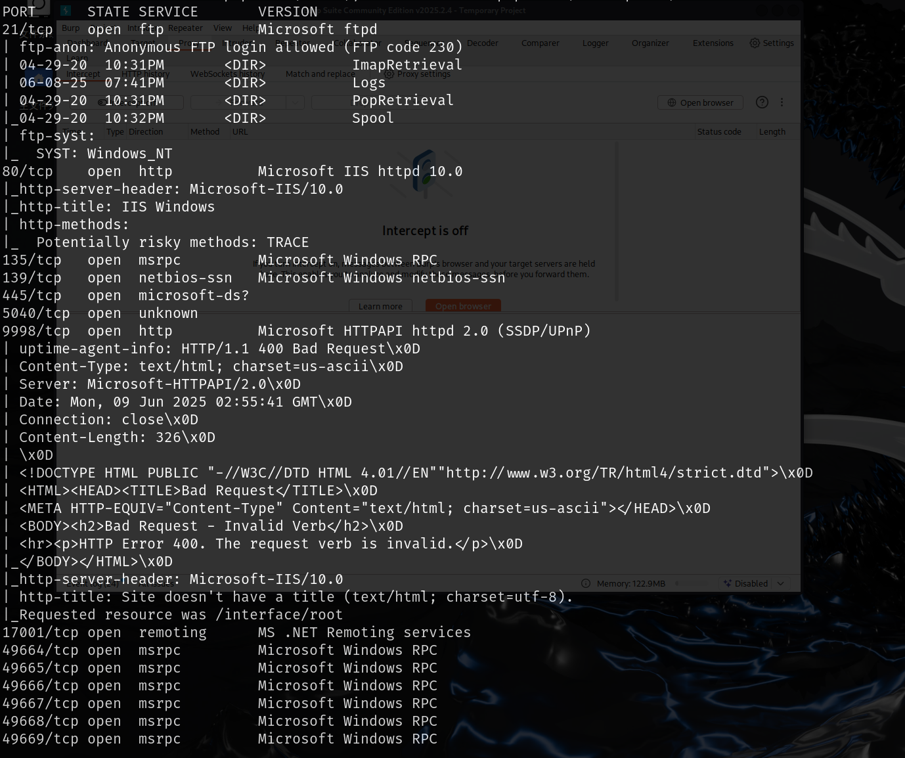
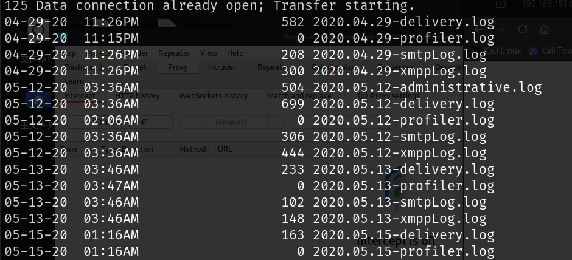
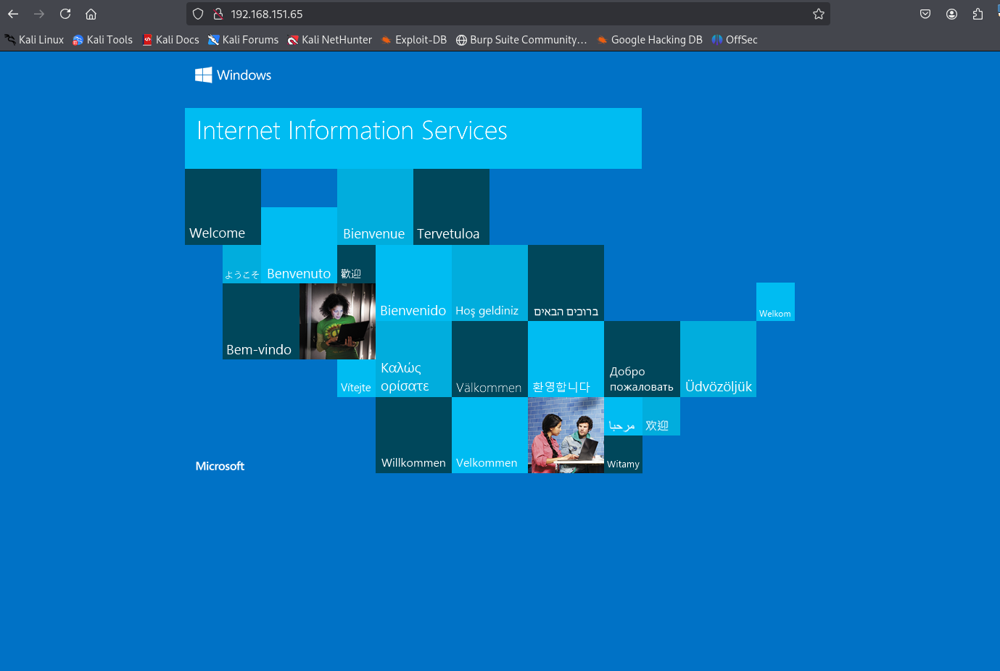
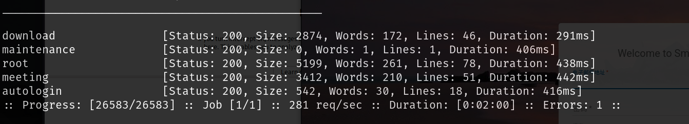
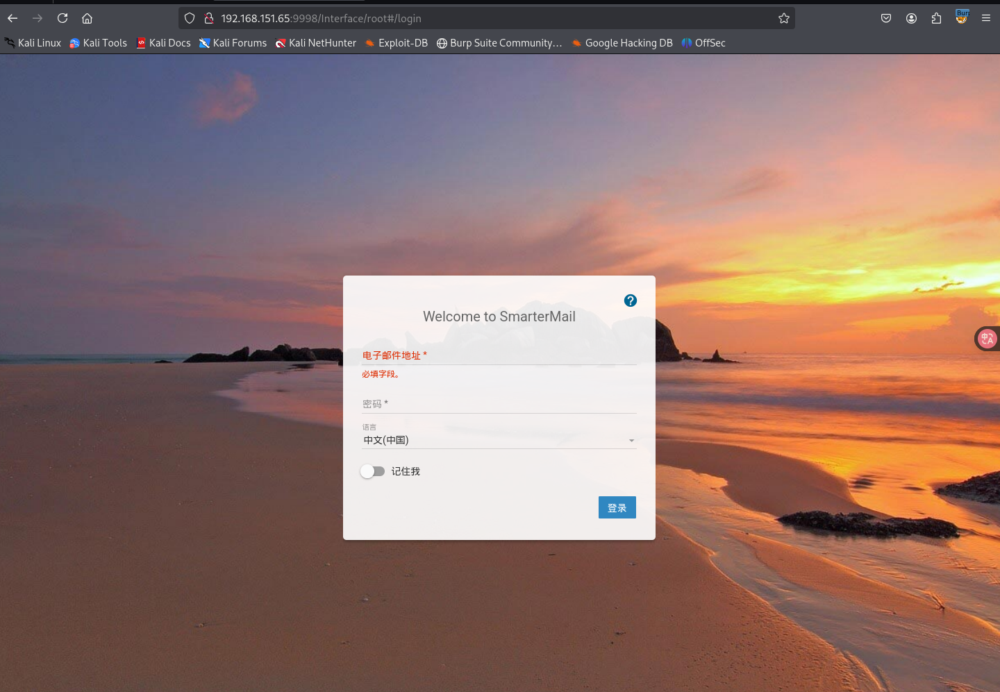
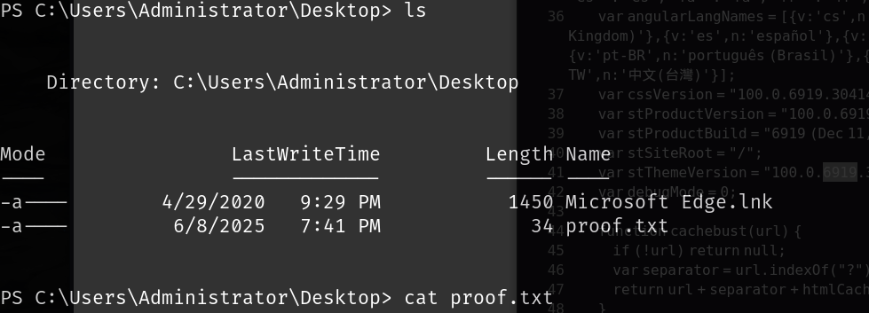

# 信息收集

## nmap



## 21-ftp

ftp允许匿名登录

```
ftp Anonymous@192.168.151.65
密码为空
```

其中有一些log文件



## 80-web

是IIS默认页面，没有其他有用的信息



## 9998-smartmail

扫到一些目录，但是没有有用的信息





# [CVE-2019-7214](./https://github.com/devzspy/CVE-2019-7214)

去搜索smartmail exp就可以搜索到该漏洞，修改exp时只需要修改目标ip和监听ip和端口，不需要修改目标端口，踩坑也是在这里，不需要修改17001端口为9998

