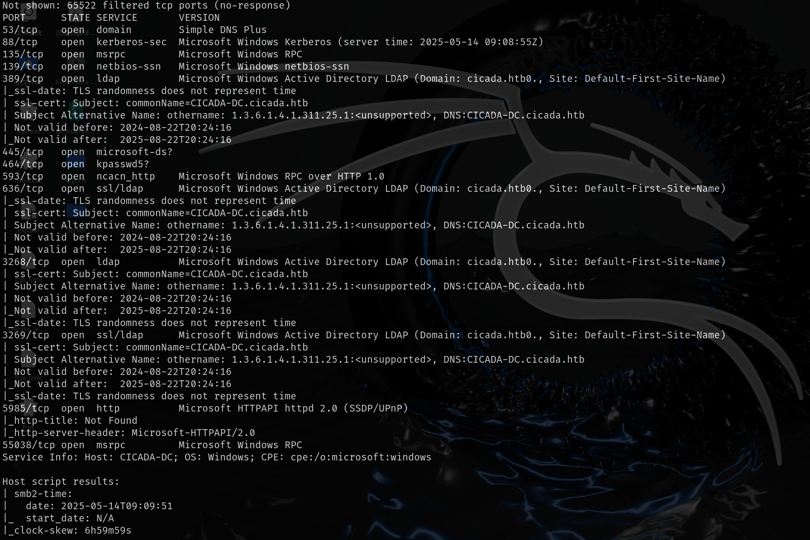
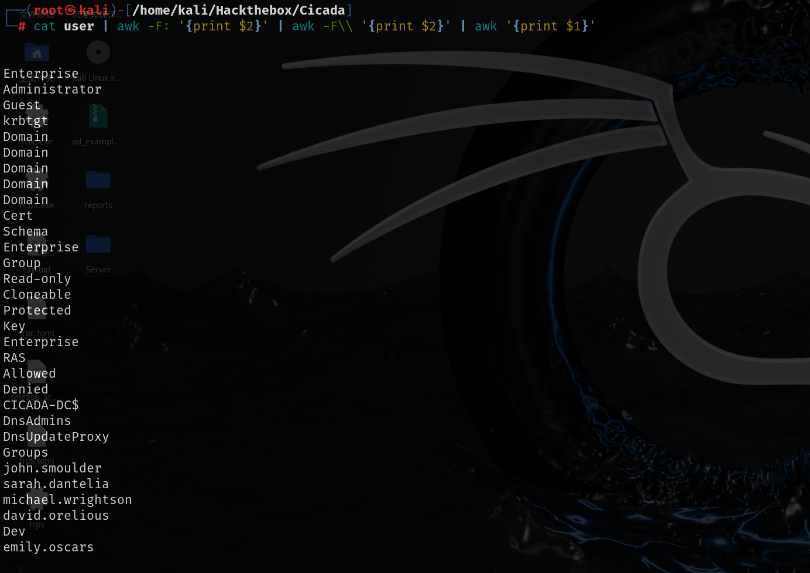

该靶机主要是通过不断信息收集找到不同用户，再使用不同用户进行信息收集最终拿到管理员权限

# 信息收集

## nmap



## smb

smb中有一份HR写的文件，里面有默认密码


```
Cicada$M6Corpb*@Lp#nZp!8
```

但是通过其他信息收集都没有找到用户信息，那就通过爆破RID枚举用户


将爆破出来的用户进行部分筛选



使用爆破出来的用户结合上面的密码再爆破smb，winrm，ldap，winrm没有可以登录的用户，smb进行测试之后发现`michael.wrightson`可以登录


然后再使用`michael.wrightson`该用户来枚举ldap,其中有段注释怕忘记密码，直接将密码写在注释了


```
david.orelious:aRt$Lp#7t*VQ!3
```

# getshell

然后再通过得到的新用户账号密码来爆破smb，winrm等

使用该用户登录smb，DEV文件夹下有一个powershell脚本，下载该脚本


该脚本的内容是做一个备份，有一个用户的账号密码


```
emily.oscars:Q!3@Lp#M6b*7t*Vt
```

# 提权

该用户可以远程登录

上述smb中的powershell脚本的作用是备份，所以该用户很大可能有备份的权限（SeBackupPrivilege），查看后果真有该权限

使用该权限备份sam文件和system文件

sam文件存储本地用户账户信息（**NTLM**）

system文件它包含解密 SAM 所需的加密密钥


然后使用ntlm就可以远程登录

