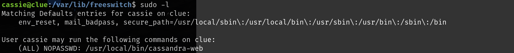

# 信息收集

## nmap


## smb


`freeswitch`是8021端口开放的服务，`cassandra`是3000端口开放的服务


可以在网上查到这两个服务的目录结构，和smb中的有一点不同

### freeswitch

```
目录树状图
freeswitch
├── bin
├── certs
├── conf
├── db
├── fonts
├── grammar
├── htdocs
├── images
├── include
├── lib
├── log
├── mod
├── recordings
├── run
├── scripts
├── sounds
└── storage
————————————————
配置目录说明
conf/
├── autoload_configs 存放自动加载的配置文件
├── chatplan  聊天计划
├── dialplan  拨号计划
├── directory 用户目录
├── extensions.conf
├── freeswitch.xml
├── fur_elise.ttml
├── ivr_menus
├── jingle_profiles
├── lang
├── mime.types
├── mrcp_profiles
├── notify-voicemail.tpl
├── sip_profiles
├── skinny_profiles
├── tetris.ttml
├── vars.xml        常用变量
├── voicemail.tpl
└── web-vm.tpl
————————————————
```

`smb`中`\freeswitch\etc\freeswitch`目录对应的就是`conf/配置目录`，这个目录结构在后面文件读取时要用到，通过搜索可以查到，`autoload_configs`下`event_scoket.conf.xml`存放有密码

还需要注意的为路径可能是`/etc/freeswitch`或`/usr/local/freeswitch`


在smb中下载到本地，其中密码为`ClueCon`


## 80端口

80端口返回403，扫目录扫到backup，访问也为空

## 3000端口

3000端口部署了Cassandra web服务

Cassandra web存在远程文件读取漏洞


并且可以成功利用


根据脚本的help命令，还可以访问该服务的两个关键文件


## 8021端口

8021端口开放了freeswitch服务

并且该服务存在命令执行漏洞


利用是需要知道`default password for FreeSWITCH`，这里脚本的默认密码就是`ClueCon`,上面通过smb得到的配置目录下的密码就是`ClueCon`，如果上面得到的密码是正确的那么该脚本大概率可以使用


# get shell

**思路就是先文件读取，得到密码，然后命令执行反弹shell**

## Remote file read

根据help的提示读取`/proc/sched_debug`，该文件显示了系统进程的调度策略，任务的状态等信息。


`/proc/<cass-web-pid>/cmdline`经过查询，`cmdline`中保存的进程运行时的命令行参数

可以通过self来查询`cassandra web`进程，也可以通过`pid=930（/proc/sched_debug中有显示）`来查询


得到`cassie`的密码,注意前面的U和P分别代表账号密码，因为读取`/etc/passwd`中只用`cassie`用户没有Ucassie用户

```
cassie:SecondBiteTheApple330
```


该账号可以访问smb，但是和匿名访问的文件相同，不可以通过ssh远程登录


## Command execution

之前已经通过smb得到了密码为`ClueCon`，尝试利用脚本


显示认证失败，所以前面`smb`得到的密码是错误的，`smb`中共享的文件夹`backup`，可能是先前版本的备份.但前面通过查询我们已经知道了放置密码的配置文件(`event_socket.conf.xml`)的大概位置，可以通过文件读取漏洞尝试读到靶机中的配置文件。

需要尝试的有四个地址（第一个是正确的）：

```

/etc/freeswitch/autoload_configs/event_socket.conf.xml
/etc/freeswitch/conf/autoload_configs/event_socket.conf.xml

/usr/local/freeswitch/autoload_configs/event_socket.conf.xml
/usr/local/freeswitch/conf/autoload_configs/event_socket.conf.xml
```

freeswitch默认目录是有conf目录，配置文件在conf下，因为smb中备份的`freeswitch\etc\freeswitch\autoload_configs`，配置文件直接在`freeswitch`下，所以这里可以猜测配置文件是直接在根目录下，没有`conf`文件夹

在`/etc/freeswitch/autoload_configs/event_socket.conf.xml`中读取到`password`为`StrongClueConEight021`


然后在命令执行脚本中修改密码，就可以成功命令执行了。


接下来要做的就是反弹shell


# 提权

当前用户是`freeswitch`，查看有哪些可以以root权限运行的二进制文件，输入之前的密码是错误的，但是我们知道cassie的账密，切换到这个用户尝试提权

```
cassie:SecondBiteTheApple330
```



该用户可以以root权限运行`cassandra-web`服务，但是该服务又存在远程文件访问漏洞，现在是以root权限运行，应该是可以通过root权限进行远程文件访问漏洞的

3000端口运行时显示端口已占用，3000端口是以普通用户运行的`cassandra`服务


修改端口为3002，3002端口为root用户运行的`cassandra`服务，我们当前只有一个shell，需要让这个后台运行，我们要在本地执行远程文件访问，加上**'&'**符合让该服务后台运行


以root权限运行的`cassandra`服务是运行在本地的，所以执行远程文件访问也只能在本地执行，尝试将exp上传到靶机，但是无法上传，靶机对防火墙做了限制

查看exp，是通过get方法提交，我们可以通过curl来访问/etc/shadow，可以成功访问到，说明是以root权限来进行远程文件访问的


home下还有一个anthony用户，并且有ssh文件夹，但是进入.ssh是没有权限的

并且查看`.bash_history`,该用户的私钥就是root用户的私钥，读取他的私钥，就可以连接到该用户


连接之前需要先给`id_rsa`文件600权限

连接anthony用户失败，连接root用户成功

