# 信息收集

## nmap

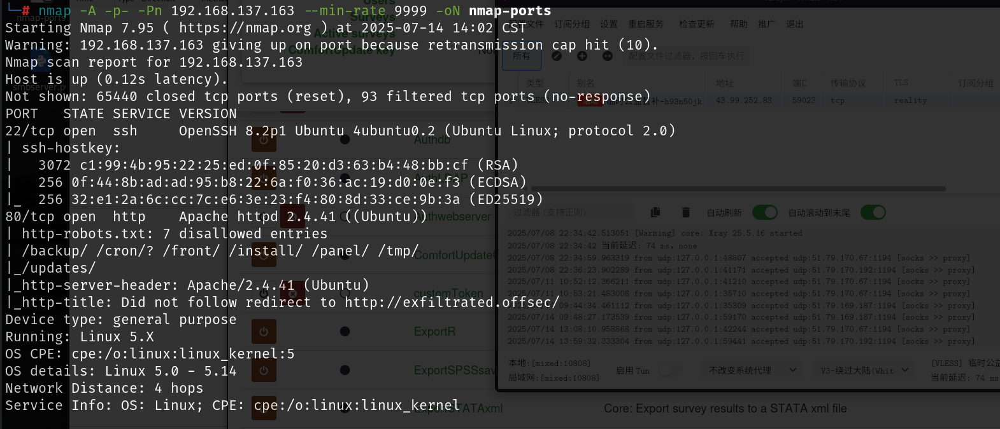

# 80端口

80端口扫目录存在/login/admin/登录界面，测试弱密码就可以登录成功，账号密码为`admin，admin`

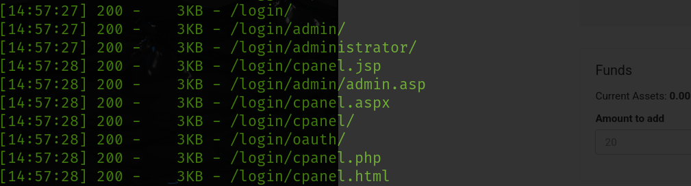

登录之后可以进入到管理员设置界面，其中表示了`Subrion CMS v 4.2.1`，搜索该cms的漏洞，该版本存在任意文件上传

https://github.com/Swammers8/SubrionCMS-4.2.1-File-upload-RCE-auth-

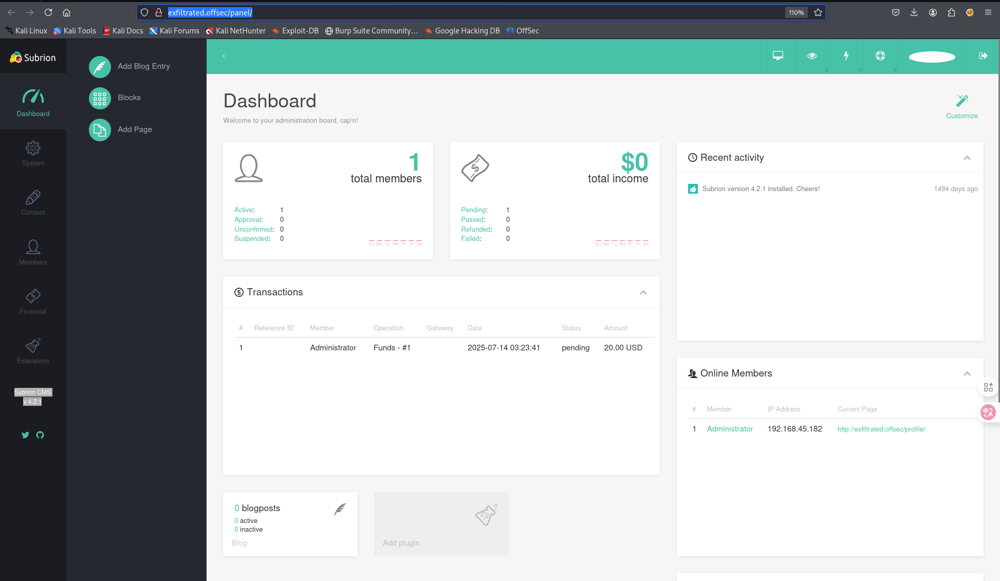

利用已有的exp就可以getshell

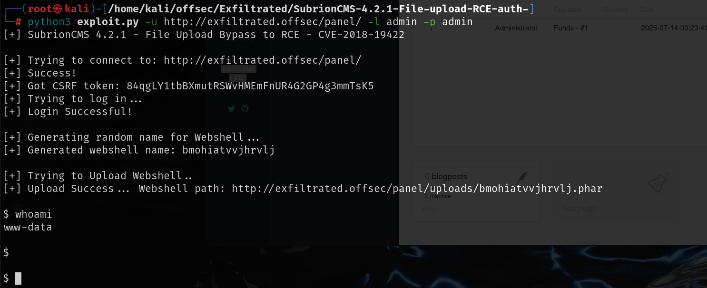

# 提权

## 内核提权

这个shell是受限的，原理是上传的后门为一句话木马，源码中将我们的输入使用get请求上传，然后将返回包打印出来，有些命令是没有回显的

可以通过上传文件这个界面将文件内容进行修改，修改为php反弹shell的后门，然后访问这个文件就可以得到一个不受限的shell

访问的路径也需要查看exp源码得知，需要去除/panel，直接访问uploads目录

http://exfiltrated.offsec/uploads/bmohiatvvjhrvlj.phar

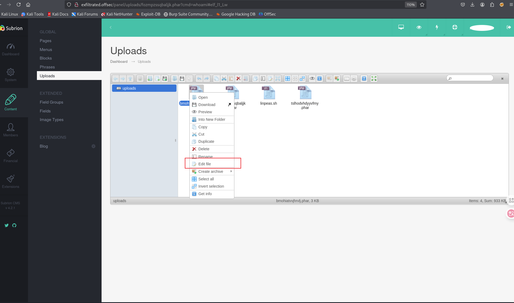

不受限的shell可以用来运行linpeas.sh

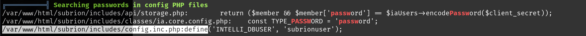

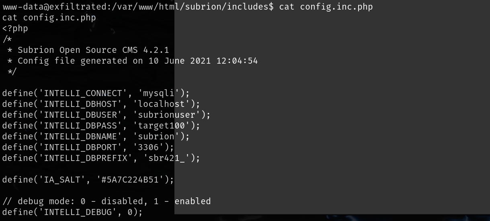

```
subrionuser:target100
```

其中member表中存有admin用户的数据，破解改密码之后密码也是admin，这是之前登录后台的时候使用的账号密码，没有对提权有用的信息

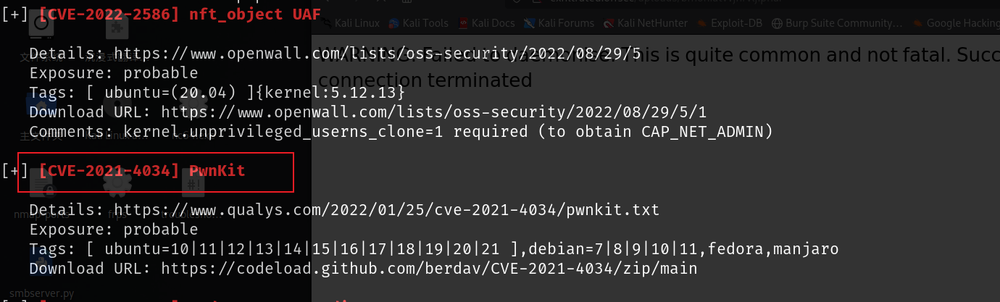

最后还是使用内核漏洞提权，使用PwnKit提权

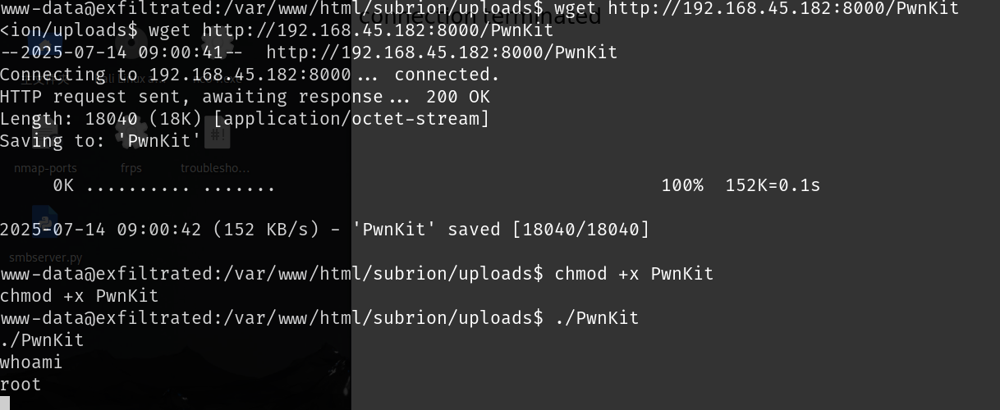

## 方法二

看了wp之后使用了另一种方法，自动运行任务中有一个`/opt/image-exif.sh`脚本

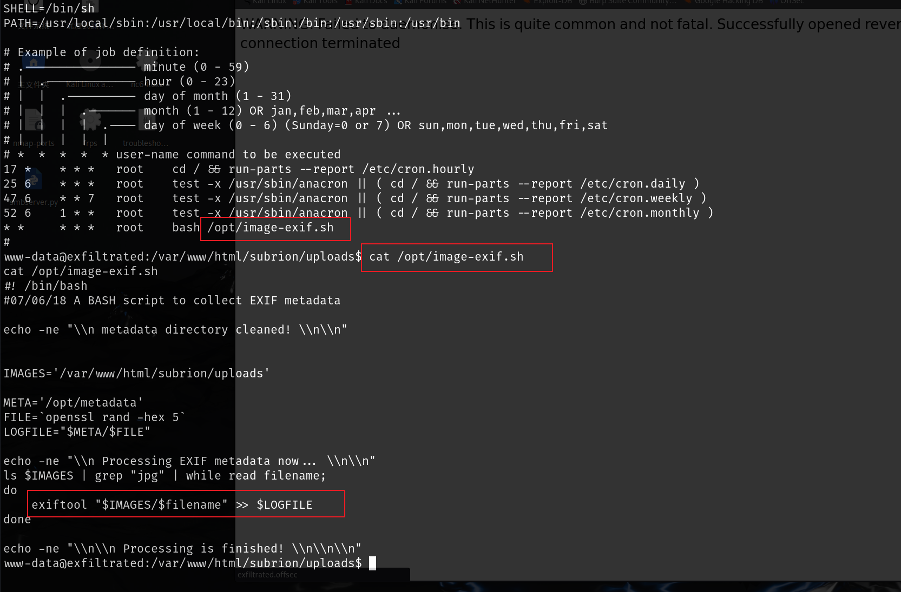

脚本内容大概就是读取`/var/www/html/subrion/uploads`其中的jpg文件，然后执行`exiftool`

`exiftool`是查看文件属性的命令行工具

发现该工具的一个漏洞，`exiftool`执行时会执行文件中的命令

[UNICORDev/exploit-CVE-2021-22204: CVE-2021-22204（ExifTool）漏洞利用程序 - 任意代码执行 --- UNICORDev/exploit-CVE-2021-22204: Exploit for CVE-2021-22204 (ExifTool) - Arbitrary Code Execution](./https://github.com/UNICORDev/exploit-CVE-2021-22204)

exp中的python文件是用来生成包含反向shell的jpg文件的

思路就是上传一个包含反向`shell`的`jpg`文件到`uploads`下，定时任务运行时就会调用`exiftool`工具去查看该文件属性，可以执行反向shell

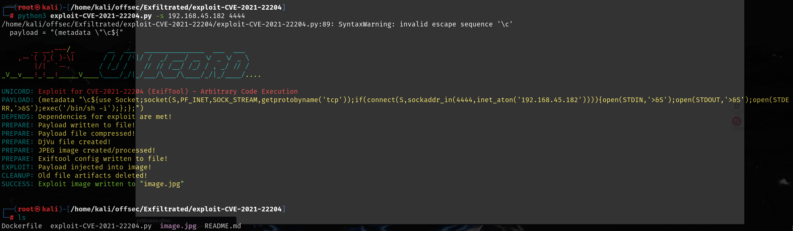

然后将jpg文件上传到uploads目录下，本地监听4444端口，过一会就可以得到shell

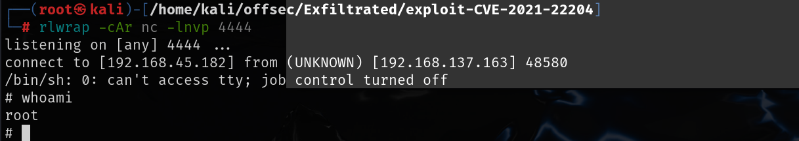