# 信息收集

## nmap

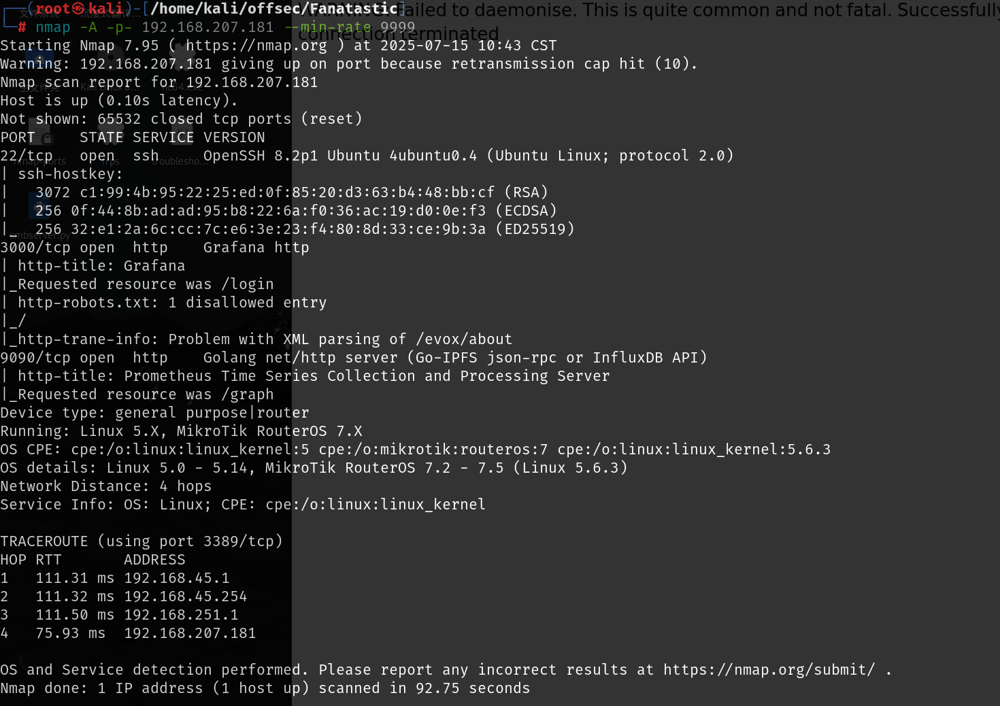

# 3000端口

这个版本存在任意文件读取漏洞

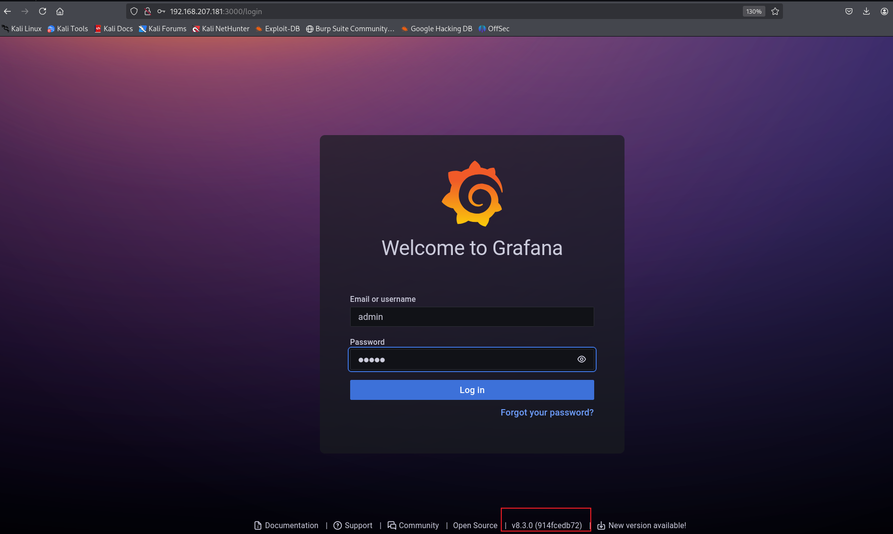

[taythebot/CVE-2021-43798: CVE-2021-43798 - Grafana 8.x 路径遍历（预认证） --- taythebot/CVE-2021-43798: CVE-2021-43798 - Grafana 8.x Path Traversal (Pre-Auth)](./https://github.com/taythebot/CVE-2021-43798)

这个现成的exp中给出了攻击面，读取`Sqlite`数据库，读取`defaults.ini`配置文件然后使用配置文件中的`secret_key`来解密数据库中的内容

解密脚本也有现成的

[jas502n/Grafana-CVE-2021-43798: Grafana 未授权任意文件读取漏洞 --- jas502n/Grafana-CVE-2021-43798: Grafana Unauthorized arbitrary file reading vulnerability](./https://github.com/jas502n/Grafana-CVE-2021-43798?source=post_page-----792d7014d7a0---------------------------------------)

先读取`sqlite`数据库，使用`sqlitebrowser`打开，`data_source`表下有sysadmin用户的密码，为什么要找这个用户，是因为读取`/etc/passwd`时存在该用户，并且有sh权限，应该可以登录

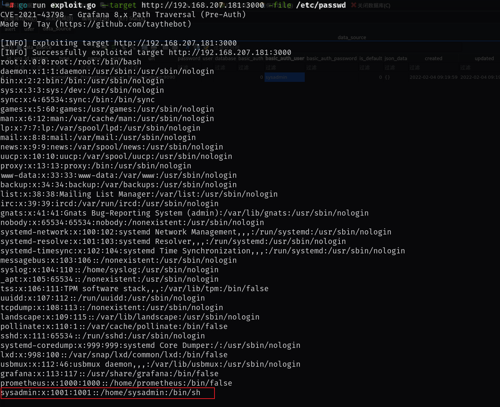

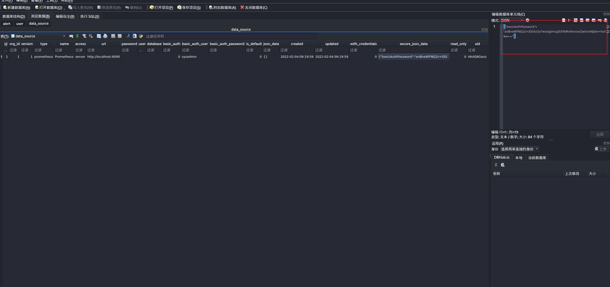

然后读取配置文件，找到其中的`secret_key`

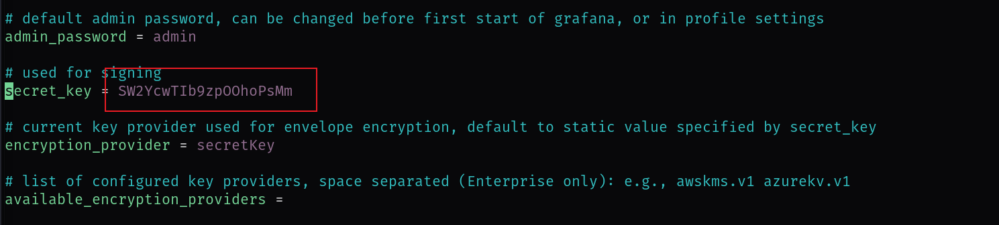

然后将AESDecrypt中的内容进行修改

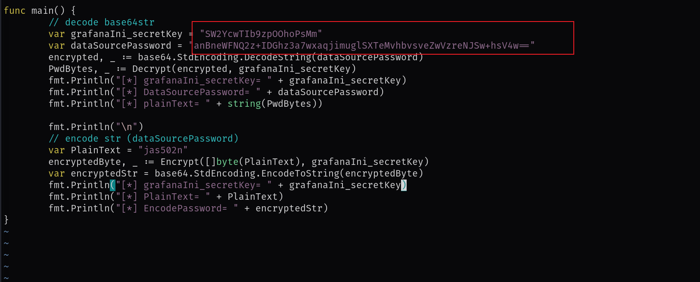

运行时会出现几个问题，这里直接给出解决方法

```
go mod init aesdecrypt
go env -w GOPROXY=https://mirrors.aliyun.com/goproxy/
go mod tidy
go run AESDecrypt.go
```

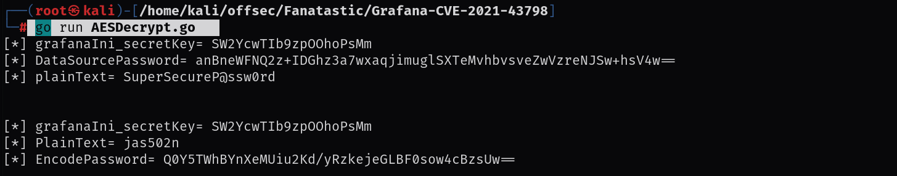

```
SuperSecureP@ssw0rd
```

这个密码是sysadmin用户的密码，该用户在/etc/passwd中正好存在，所以可以尝试ssh登录

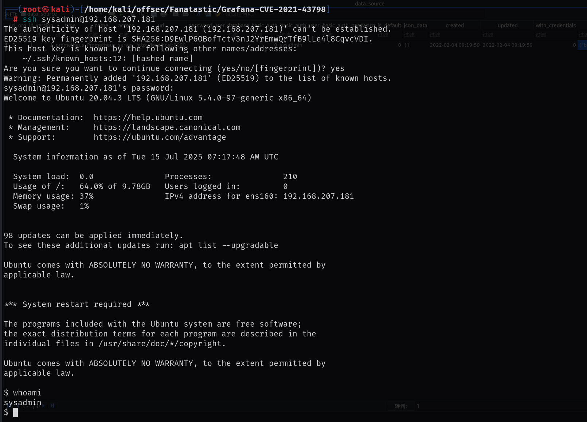

# 提权

1. 该用户属于磁盘组

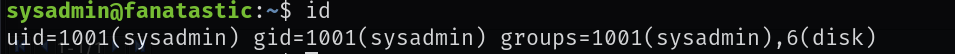

2. 列出 /dev 设备的所有者和组所有者 

```
ls -l /dev
```

3. 你也可以找到属于磁盘组的分区

```
find /dev -group disk
```

4. **同时显示可用的分区**--下面要进入的磁盘就是在这其中

   ```
   df -h
   ```

5. 利用

debugfs /dev/sda2
然后通过ls cd等命令查看想要查看的内容
ls查看后可以使用q退出
常见的方法有查看.ssh下的私钥，使用私钥登录

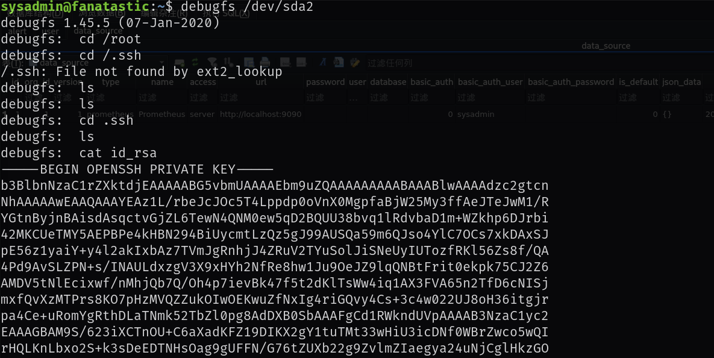

本地保存之后赋予600权限然后使用私钥登录即可得到root权限

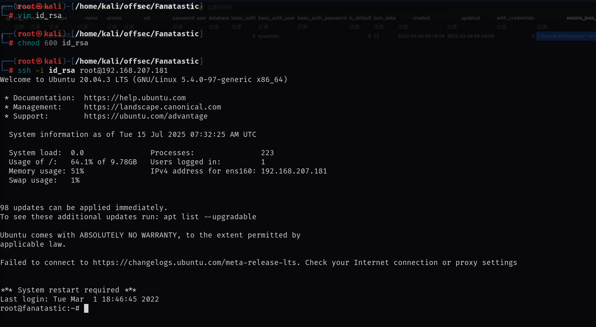