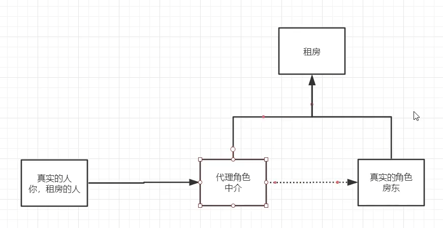

# 静态代理

看不太懂的可以看狂神的视频

https://www.bilibili.co

## 原理及代码实现



租房是要实现的业务，定义为接口

房东要出租房子，实现这个接口

中介要认识房东，并且附加中介要做的事，如收中介费等

客户要租房子，客户就是启动类，通过中介去租房子，中介又认识房东

### **rent.java**

```java
public interface rent {
   public void rent();
}
```

### **host.java**

```java
public class host implements rent{
    public void rent(){
        System.out.println("房东要出租房子");
    }
}
```

### **proxy.java**

```java
public class proxy {
    private host HOST;
    public proxy(host HOST){
        this.HOST = HOST;
    }
    public void rent(){
        System.out.println("I am the proxy, I will rent the house for you");
        HOST.rent();
    }
    public void proxyfree(){
        System.out.println("收取中介费");
    }
    public void hetong() {
        System.out.println("签租房合同");
    }
    public void see(){
        System.out.println("看房子");
    }
}
```

### **Client.java**

```java
public class Client {
    public static void main(String[] args) {
        host HOST = new host();
        proxy PROXY = new proxy(HOST);
        PROXY.rent();
        PROXY.see();
        PROXY.hetong();
        PROXY.proxyfree();
    }
}
```

## 优缺点

### 优点：

- 可以使真是角色跟纯粹，不再关注一些其他事情
- 公共的业务由代理完成，实现了业务的分工
- 公共业务发生扩展时也只需要修改代理类代码，方便集中和管理

### 缺点：

每个房东只对应一个中介，但实际情况下应该是一个中介对应多个房东，即一个真实类只对应一个代理，代码量会翻倍

# 动态代理

- 动态代理也需要一个代理类，真实类，启动器
- 动态代理的代理类是动态生成的，静态代理的代理类使我们提前写好的

## 原理及代码实现

### `InvocationHandler`接口

该接口有一个`invoke`方法

```java
Object invoke(Object proxy, 方法 method, Object[] args)；
```

`invoke`方法中编写要代理类要实现的方法

JDK 动态代理在运行时自动生成的代理类中会自动调用 `invoke()`

### **Proxy类**

`Proxy`提供了创建动态代理类和实例的静态方法，它也是由这些方法创建的所有动态代理类的超类。

动态代理类:

```java
public static Object newProxyInstance(ClassLoader loader, 类<?>[] interfaces, InvocationHandler h) throws IllegalArgumentException
```

**参数**

- `loader` – 类加载器来定义代理类
- `interfaces` – 代理类实现的接口列表
- `h` – 调度方法调用的调用处理函数

### 代码

#### **rent.java**

```java
public interface rent {
     void rent();
}

```

#### **host.java**

```java
public class host implements rent {
    public void rent(){
        System.out.println("房东要租房");
    }
}

```

#### **proxyInvocationHandler.java**

```java

import java.lang.reflect.InvocationHandler;
import java.lang.reflect.Proxy;
import java.lang.reflect.Method;
public class proxyInvocationHandler implements InvocationHandler {
    //被代理的接口
    private rent RENT;
    //set方法代替构造方法
    public void sethost(rent RENT){
        this.RENT = RENT;
    }
    
    //动态生成代理类
    public Object getproxy(){
        return Proxy.newProxyInstance(this.getClass().getClassLoader(),RENT.getClass().getInterfaces(),this);

    }
    
    //处理代理类实例，并且实现需要附加的操作，Invoke函数是InvocationHandler接口中有的，要实现这个接口就要实现Invoke函数，顺便在invoke函数中可以加入我们想要实现的方法
    public Object invoke(Object proxy,Method method,Object[] args)throws Throwable {
        free();
        Object obj = method.invoke(RENT,args);
        return obj;
    }
     public void free(){
        System.out.println("收中介费");
    }
}

```

#### **Client.java**

```java
public class Client {
    public static void main(String[] args) {
        //定义真实角色
        host HOST = new host();
        //代理角色
        proxyInvocationHandler ProxyInvocationHandler = new proxyInvocationHandler();
        ProxyInvocationHandler.sethost(HOST);

        //动态生成代理类
        rent proxy1 = (rent) ProxyInvocationHandler.getproxy();
        proxy1.rent();
    }
}

```


