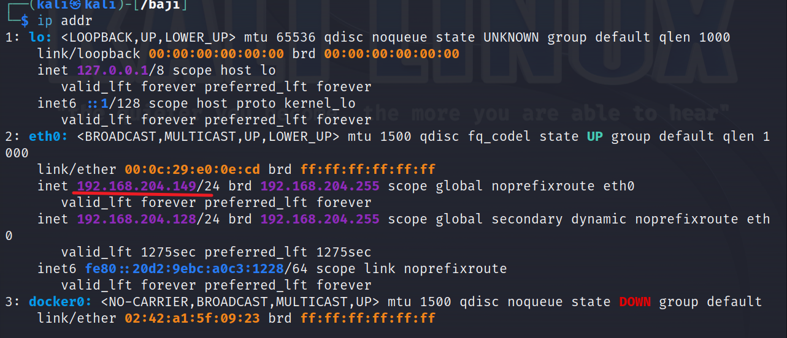
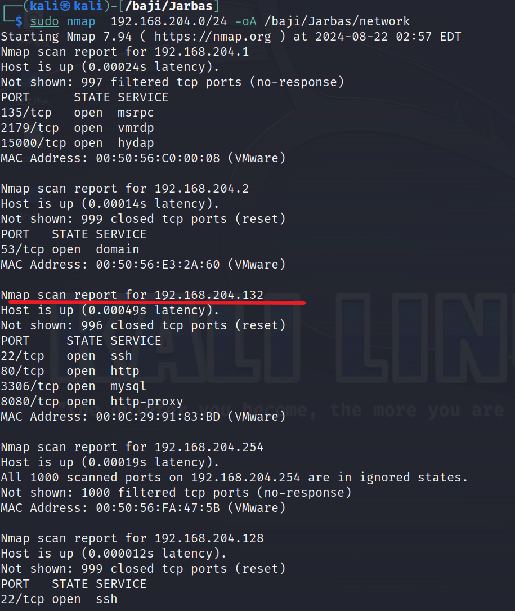
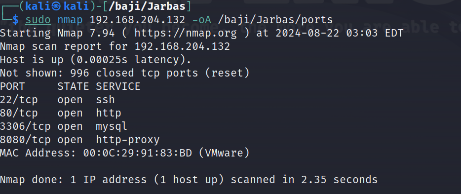
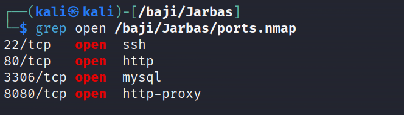
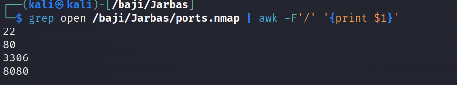

# 1.信息收集

## 网段扫描

查看本机 ip，然后扫描该网段



打靶机时可以未开靶机时扫描一次，然后打开靶机扫描一次，就可以判断哪个是靶机 ip，可以看到靶机 ip 为 192.168.204.132，开放端口为 22，80,3306,8080



扫描端口，将扫描结果保存，然后将端口分离出来



先分离出开放的端口





### 补充 awk 的使用

语法

```
awk options 'pattern {action}' file

```

