# 1.信息收集

## 网段扫描，端口扫描

查看本机 ip，然后扫描该网段

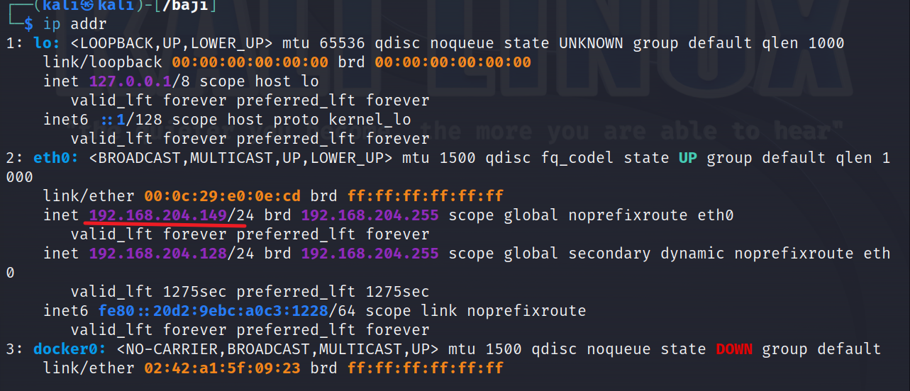

打靶机时可以未开靶机时扫描一次，然后打开靶机扫描一次，就可以判断哪个是靶机 ip，可以看到靶机 ip 为 192.168.204.132，开放端口为 22，80,3306,8080

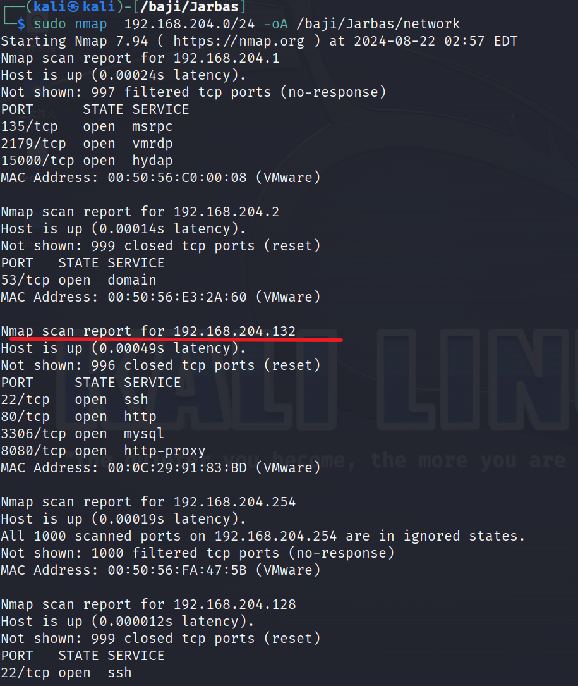

扫描端口，将扫描结果保存，然后将端口分离出来

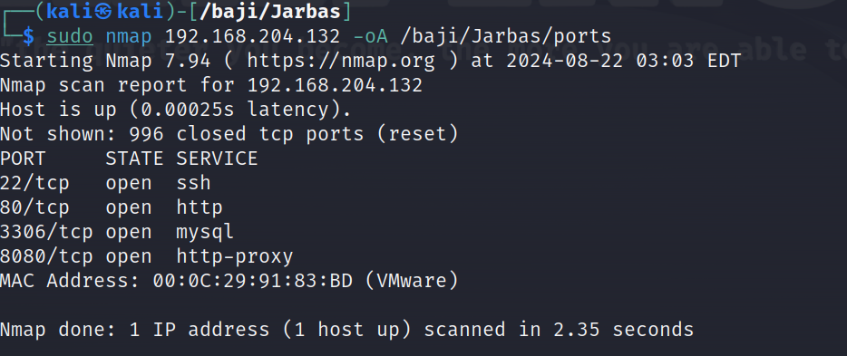

先分离出开放的端口

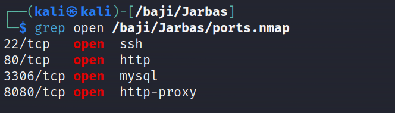

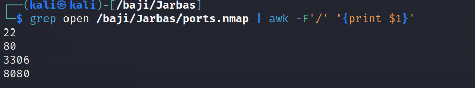

这里 awk 命令的意思是，以 **/** 为分界线，打印第一列

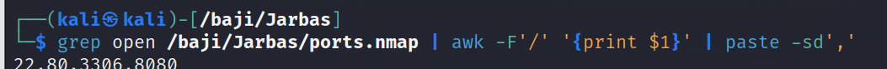

再进行变量指定

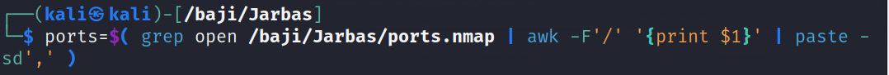

此时打印ports就是打印这四个端口

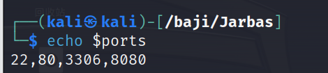

### 补充 awk 的使用

#### **语法**：

```
awk options 'pattern {action}' file
```

#### **选项参数说明：**

- `options`：是一些选项，用于控制 `awk` 的行为。
- `pattern`：是用于匹配输入数据的模式。如果省略，则 `awk` 将对所有行进行操作。
- `{action}`：是在匹配到模式的行上执行的动作。如果省略，则默认动作是打印整行。

#### options 参数说明

- `-F <分隔符>` 或 `--field-separator=<分隔符>`： 指定输入字段的分隔符，默认是空格。使用这个选项可以指定不同于默认分隔符的字段分隔符。
- `-v <变量名>=<值>`： 设置 `awk` 内部的变量值。可以使用该选项将外部值传递给 `awk` 脚本中的变量。
- `-f <脚本文件>`： 指定一个包含 `awk` 脚本的文件。这样可以在文件中编写较大的 `awk` 脚本，然后通过 `-f` 选项将其加载。
- `-V` 或 `--version`： 显示 `awk` 的版本信息。
- `-h` 或 `--help`： 显示 `awk` 的帮助信息，包括选项和用法示例。

#### 常见用法

打印整行

```
awk '{print}' file
```

打印特定列：

```
awk '{print $1, $2}' file
```

使用分隔符指定列：

```
awk -F',' '{print $1, $2}' file
```

打印行数：

```
awk '{print NR, $0}' file
NR表示当前记录的行号
$0表示当前行的所有内容
```

也可以不加 NR，不加 NR 时不会输出行号

打印行数满足条件的行：

```
awk '/pattern/ {print NR, $0}' file
pattern是正则表达式
```

对 file 中第一行的第一个字段进行累加

```
例：
10
20
30
40
执行后就是 100 
```


```
awk '{sum += $1} END {print sum}' file
```

打印最大值：

```
awk 'max < $1 {max = $1} END {print max}' file
```

格式化输出：

```
awk '{printf "%-10s %-10s\n", $1, $2}' file
```

### 补充paste的使用

#### **参数**

- `-d <分隔符>`：使用指定的字符作为分隔符代替制表符进行合并。
- `-s`：按行而不是按列合并文件。
- `--serial`：按序列方式对输入进行合并，而不是按列。
- `-z`：使用null字符（ASCII值为0）而不是换行符作为行分隔符。
- `-h`：在每个输出行之前添加文件名称。
- `-v`：显示版本信息并退出。

## 2.详细信息扫描

-sT表示进行TCP扫描会，进行完整的TCP连接建立过程，不加-sT参数默认为-sS，-sS是发送SYN包，只建立TCP握手的第一步，再有防火墙的情况下可能会对不完整的TCP建立过滤；

-p表示待扫描的端口（后跟待扫描的端口21，22，80，8080）；

-sV表示探测开放服务的版本，-O表示探测操作系统版本，扫描结果如下：

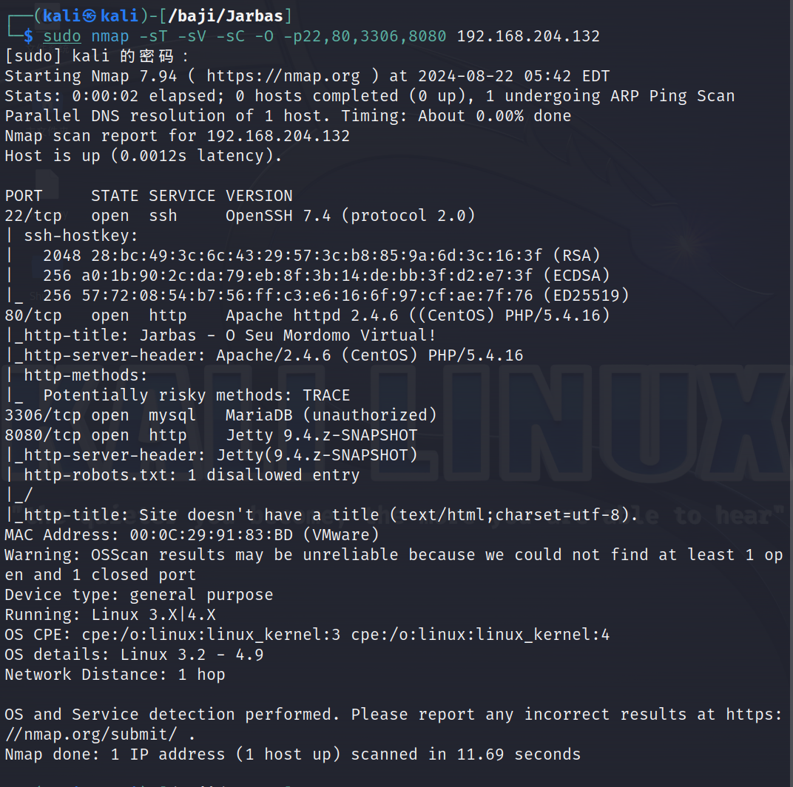

再扫描UDP端口，显示全部关闭

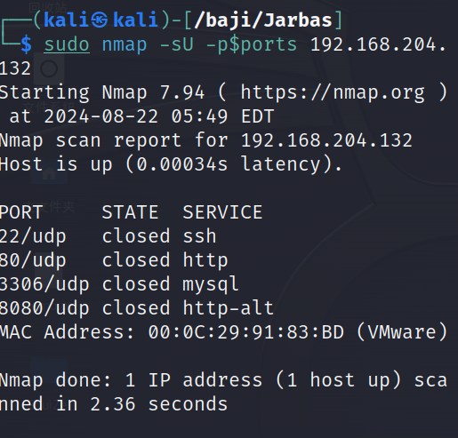

## 3.漏洞扫描

使用nmap自带的漏扫工具进行漏洞扫描，-script=vuln参数

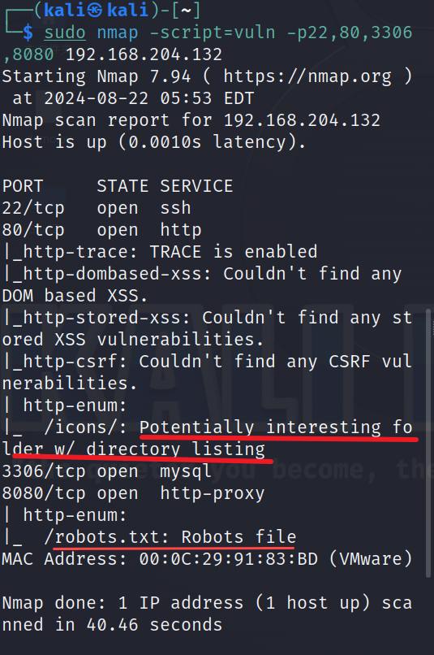

漏洞扫描显示有潜在的目录列表，扫目录试试，这里是使用dirsearch扫目录的，发现个html页面，尝试打开

还发现一个robots.txt文件

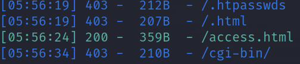

直接访问靶机ip也可以打开一个网页，暂时没有思路，先跳过（此时默认端口是80）


访问192.168.204.132/access.html页面，这是三段加密的字符串，先尝试进行破解

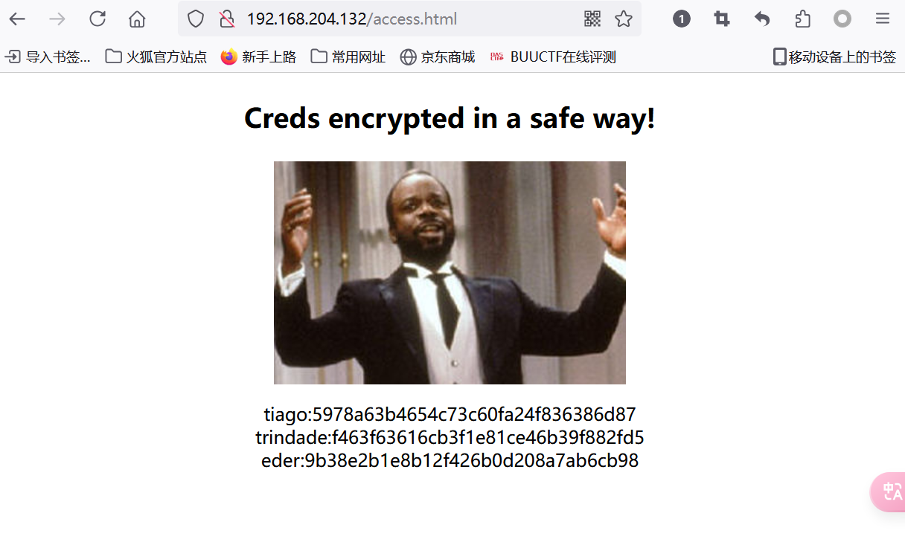

使用hash-identifier识别加密算法，发现是MD5

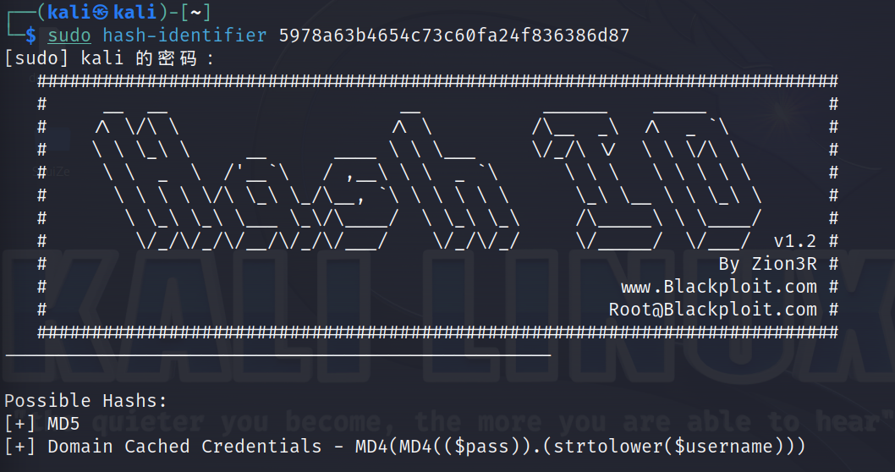

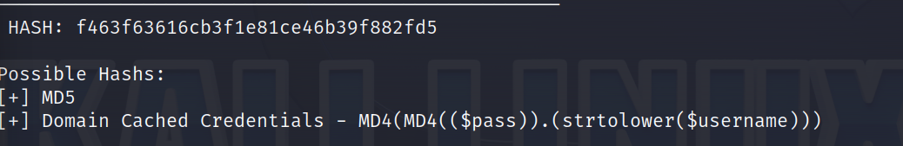

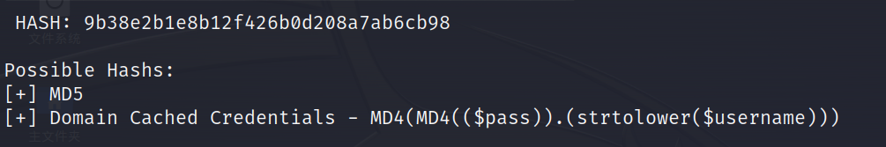

使用在线网站破解

```
https://hashes.com/en/decrypt/hash
```

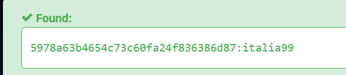tiago:italia99

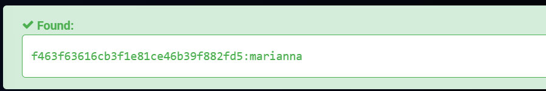

trindade:marianna

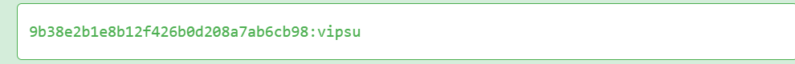

eder:vipsu

访问192.168.204.132/Robots.txt发现无法访问

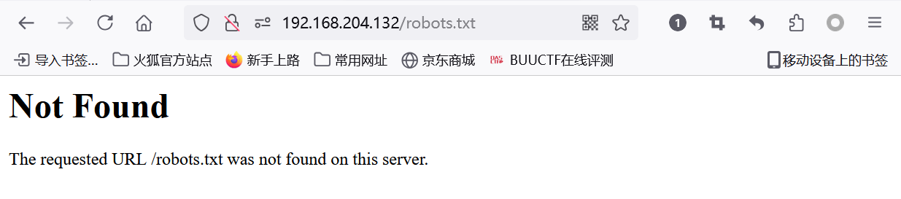

此时默认的是80端口，但还开放了8080端口，此时就应该想到使用8080端口访问

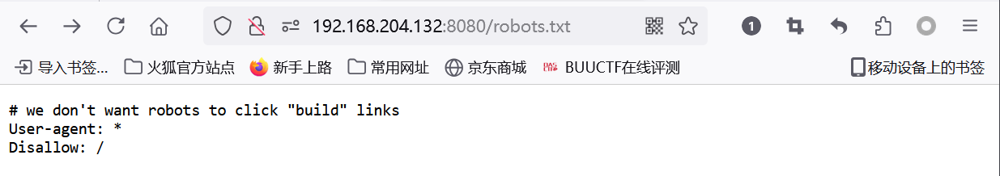

访问192.168.204.132:8080，发现登录页面

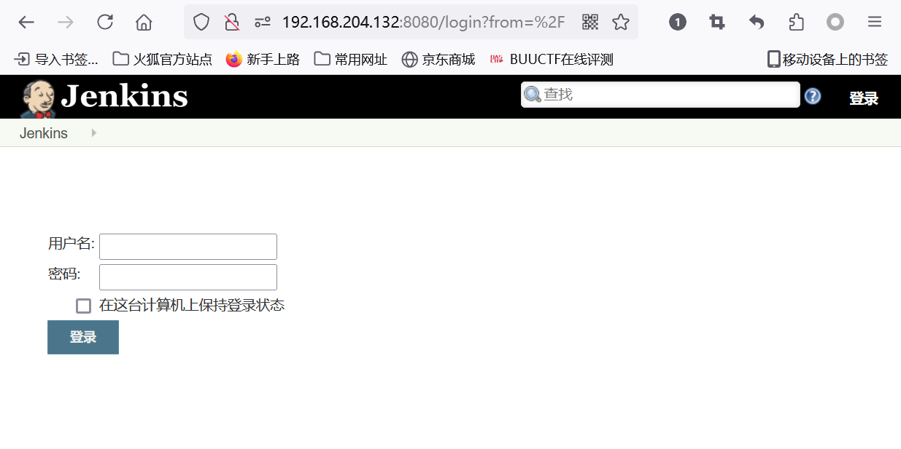

猜测上面/access.html页面冒号前面的为用户名，后面的为密码，尝试使用破解的密码登录,前两个不行，最后一个成功登录

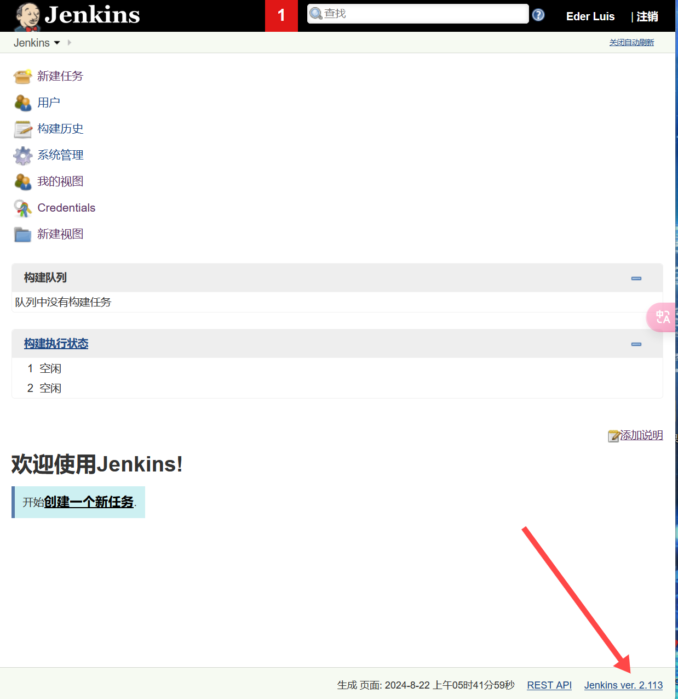

成功登录到该cms后台页面，创建一个新任务

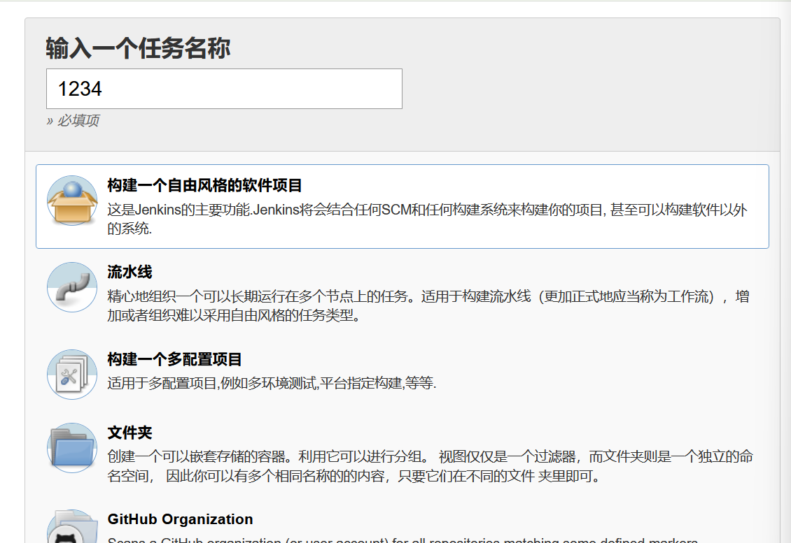

发现下面有命令执行，进行shell反弹

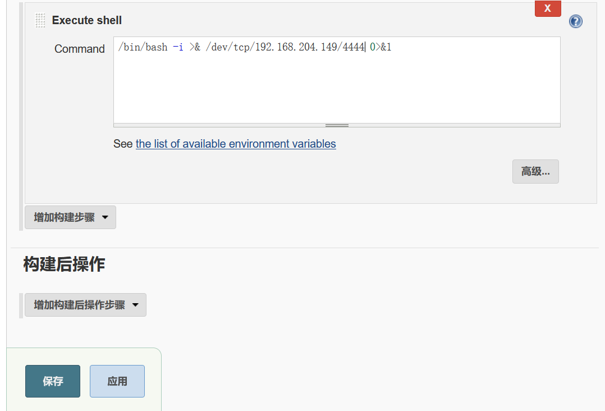

先进行监听，然后再构建任务

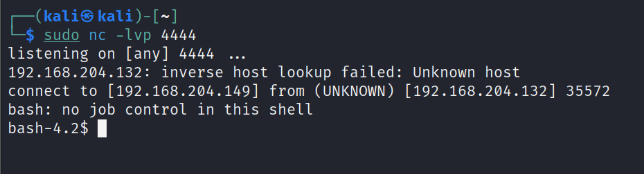

# 2.提权

