# 信息收集

## nmap

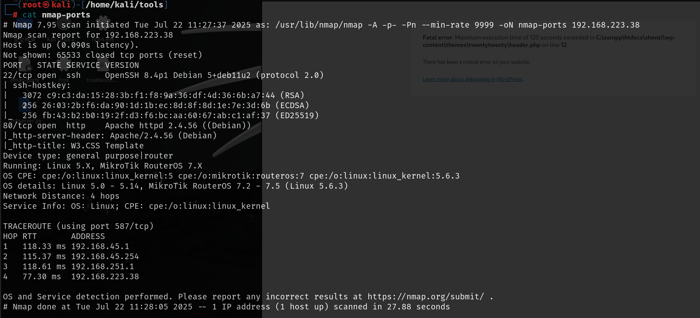

# web

可以在主页面找到登录界面，并且还有注册界面，我们先注册一个账户试试

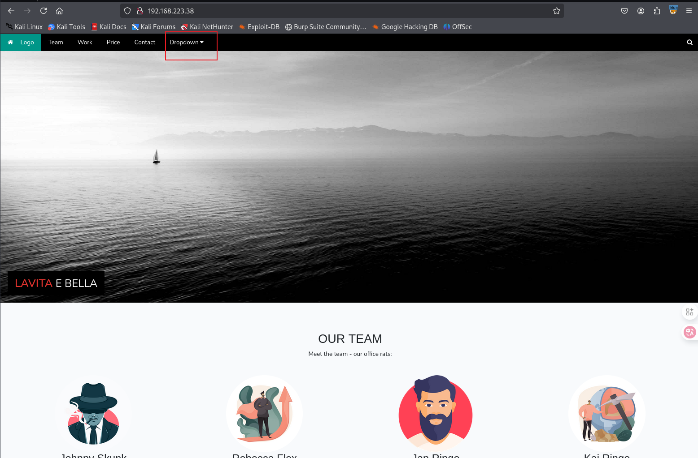

注册登录之后，是一个文件上传的页面，随便上传一张图片，下方就可以查看

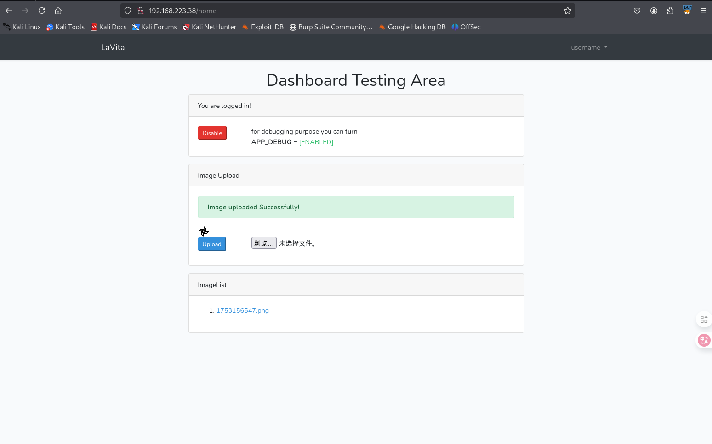

查看的时候，有时候会查看成功，有时候就会出现404，应该是会自动删除图片，需要快一点查看，但是报错之后显示了该系统的版本号

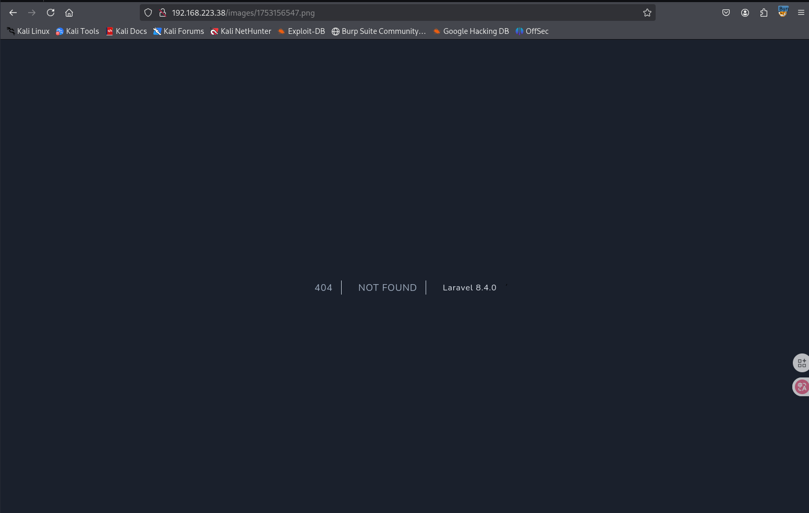

搜索该版本的漏洞可以搜到一个远程代码执行漏洞，并且有已经写好的exp

[joshuavanderpoll/CVE-2021-3129: Laravel RCE Exploit Script - CVE-2021-3129](./https://github.com/joshuavanderpoll/CVE-2021-3129/tree/main)

按照其中给出的步骤运行之后会显示需要下载一个PHPGGC文件，但是如果国内没有代理下载就会失败

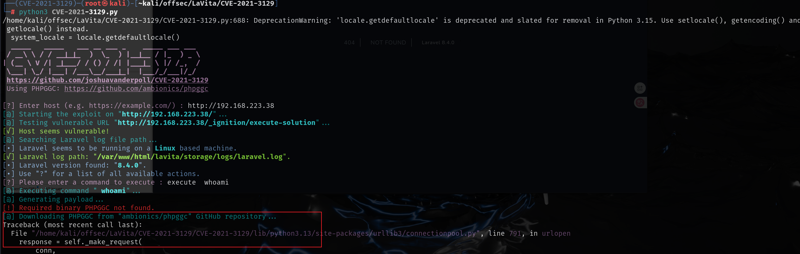

通过exp源码是可以找到要下载的文件，将该文件下载以后解压到exp文件夹内就可以使用了，输入要执行的命令就会成功回显了

https://github.com/ambionics/phpggc/archive/refs/heads/master.zip

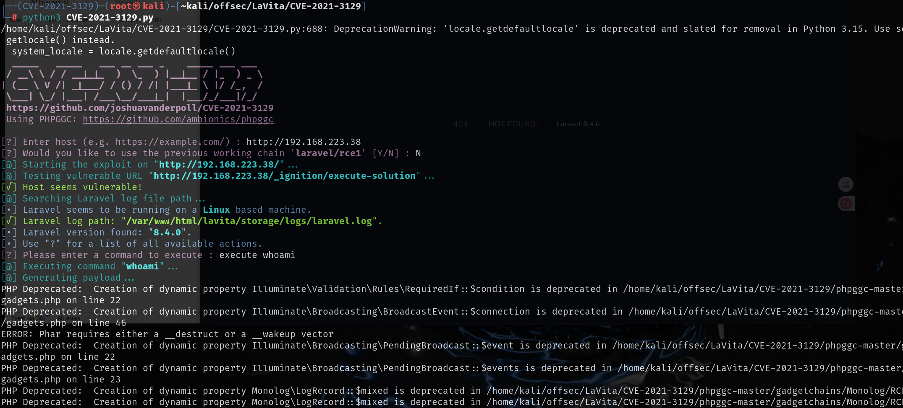

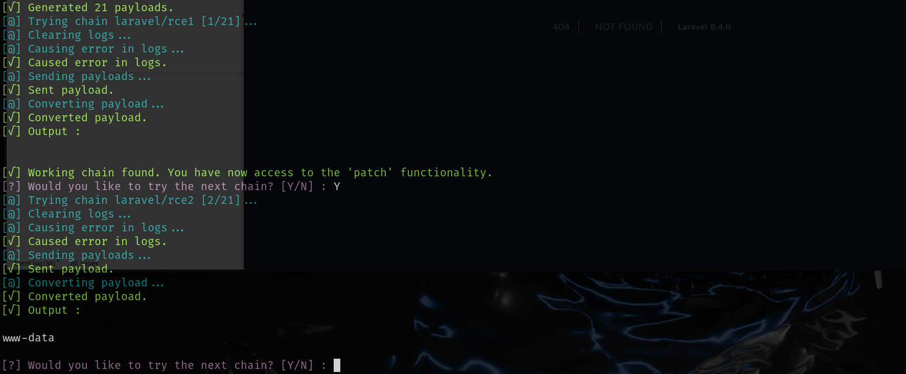

然后利用nc去反弹shell，这个exp有时候会执行失败，什么都不回显，多执行几次就好了

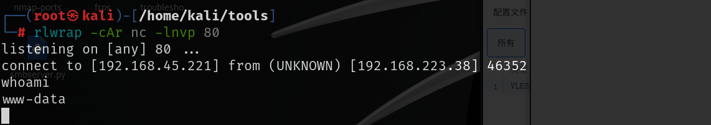

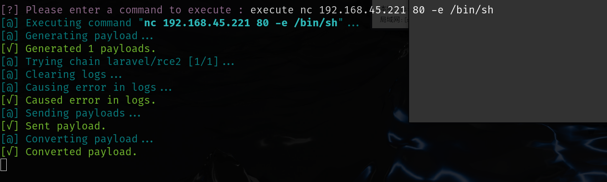

# 提权

运行pspy64发现会自动执行一个删除图片的php文件，并且UID为1001,1001是skunk用户，先尝试劫持这个php文件，先拿到skunk用户的权限

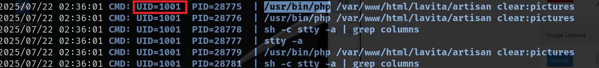

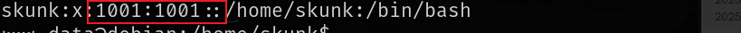

将`artisan`文件中的内容改为php语言的反向shell，然后监听端口等待就可以了

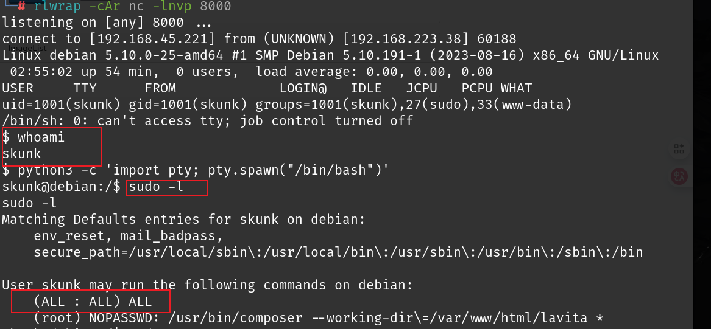

可以执行composer命令，根据GTFOBins中的方法即可提权

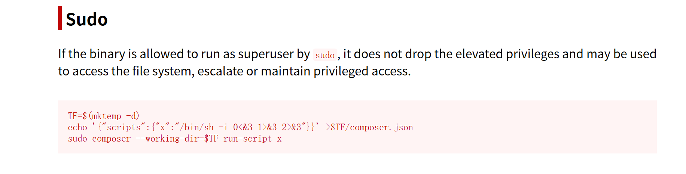

工作目录实在`/var/www/html/lavita`下，skunk没有写入权限，所以要使用`www-data`用户将`composer.json`写到`/var/www/html/lavita`，然后skunk用户使用`composer.json`来提权

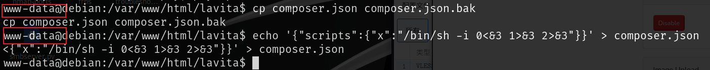

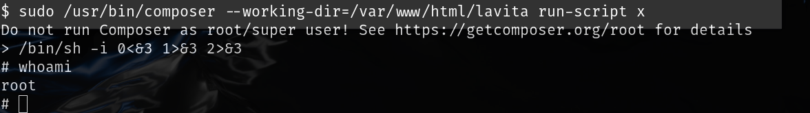