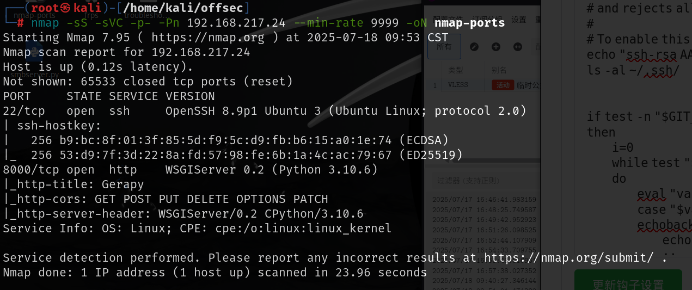
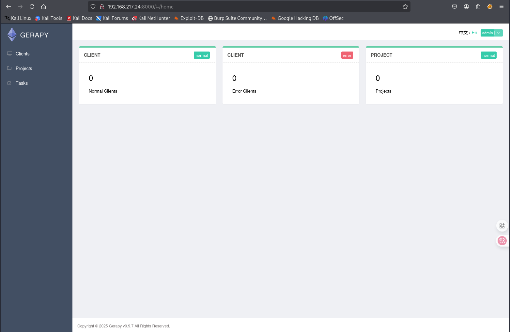
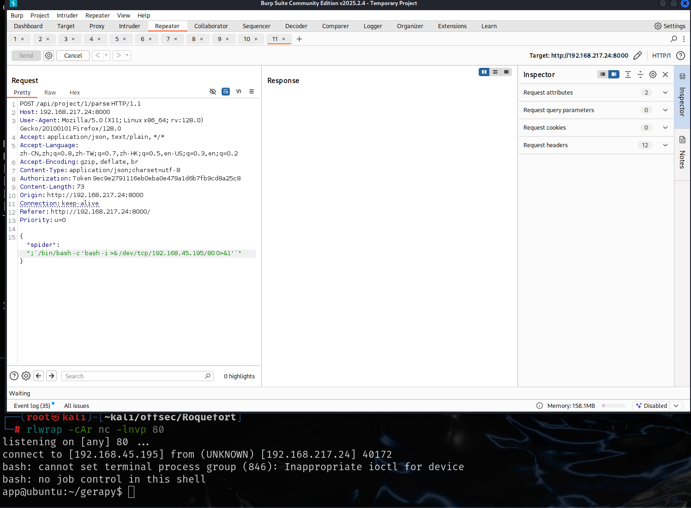
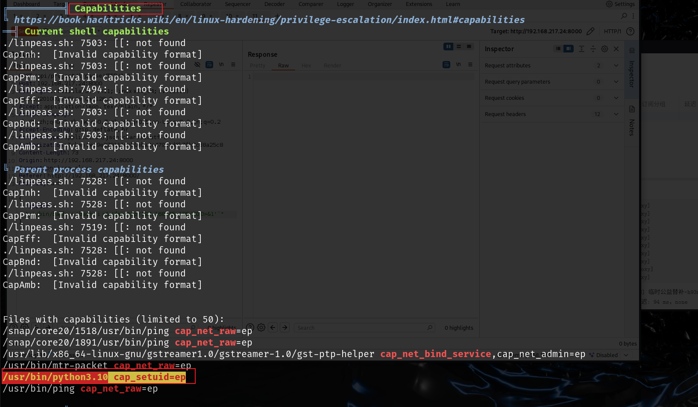
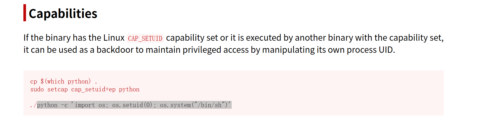
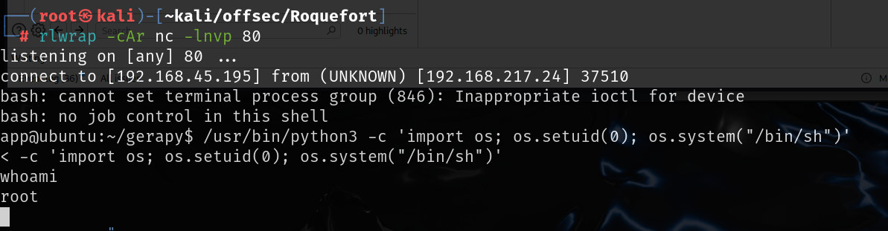

# 信息收集

## nmap

# 8000端口

8000端口是个登录页面，使用弱密码`admin,admin`就登录成功了

搜索`gerapy 0.9.7`，该版本存在经过认证的远程代码执行

[Gerapy parse 后台远程命令执行漏洞-秋刀鱼实验室](./https://www.saury.net/2148.html)

根据这篇文章对漏洞进行复现

将命令改为反向shell

# 提权

python命令有capabilities机制，通过GTFObins中的方法就可以提权

