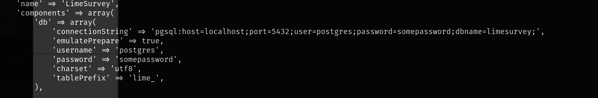

# 信息收集

## nmap


# 80端口

对80端口先扫目录，其中的assets和vendor下都是一写js和css文件，old目录看似和80端口直接访问的界面是一样的，但是仔细对比会多了一个模块


仔细对比的话old目录是多了一个`provided Plattforms`模块


其中的调查给出了跳转链接


访问这个跳转连接跳转到的是`http://customers-survey.marketing.pg/`，正常是不可以访问的，需要将域名映射添加到`/etc/hosts`，顺便将之前的域名也添加进去

```
echo "192.168.102.225 customers-survey.marketing.pg" >> /etc/hosts

echo "192.168.102.225 marketing.pg" >> /etc/hosts
```


这个页面还给出了一个邮箱`admin@marketing.pg`，后面可能会用到

然后对得到的这个新域名扫目录，其中泄露的一些文件中没有找到有用的信息


访问admin界面是一个后台登录界面，尝试弱密码，`admin:password`成功登录


## getshell

找了一圈没有可以进行命令执行的地方，并且右下角版本号为5.3.24，网上也搜索不到该版本的漏洞，搜索`limesurvey getshell`，找到一个webshell的插件，只需要导入就可以使用

https://github.com/p0dalirius/LimeSurvey-webshell-plugin

<font color=red>这里需要注意的是下载zip文件之后不可以直接导入，需要现将`plugin`文件夹中`config.xml`移出来到根目录下，以便导入时可以直接读取，否则导入时会显示无法解析config.xml</font>


上传之后还需要点击左侧激活

然后访问`url+{upload/plugins/#Name/#Shell_file_name}`，<font color=red>注意这里的Name要区分大小写，否则会404找不到文件</font>

我访问的地址应该是:http://customers-survey.marketing.pg/upload/plugins/webshell/webshell.php?action=exec&cmd=id


可以成功命令执行然后反弹shell即可

根据url可以知道是直接访问了上传目录中的php文件实现的命令执行，那么更方便点可以直接上传一个反弹shell的php文件，直接访问php文件即可反弹shell


根据这个方法访问shell.php成功得到了shell

# 提权

## 切换到t.miller

在limeSurvey网站目录下找到一些配置文件

`/var/www/LimeSurvey/application/config/config-sample-mysql.php`


```
root:root
```

`/var/www/LimeSurvey/application/config/config-sample-dblib.php`


```
sa:somepassword
```

`/var/www/LimeSurvey/application/config/config-sample-pgsql.php`



```
postgres:somepassword
```

`/var/www/LimeSurvey/application/config/config-sample-sqlsrv.php`


```
sa:somepassword
```

`/var/www/LimeSurvey/application/config/config.php`


```
limesurvey_user:EzPwz2022_dev1$$23!!
```

本地开放了端口3306，尝试连接mysql数据库，使用config.php中的账号密码可以成功连接，但是数据库中的账号密码是之前登录`limesurvey`的账号密码，破解加密后的密码为password，在之前尝试getshell的时候找到这里有个数据库备份，备份的内容和连接到数据库的内容是相同的，


想要得到local.txt现需要切换用户，使用这几个密码尝试切换到不同用户

可以使用数据库连接密码切换到t.miller用户，该用户有local.txt


## 切换到m.sander

该用户可以以sudo权限运行sync脚本


运行sync脚本显示`note missing`，该文件有可读权限，先查看文件内容


这个脚本就是将上传的参数文件和`/home/m.sander/personal/notes.txt`文件进行对比，不同就更新并且输出不同的内容，理论上该脚本可以用于文件读取，因为可以输出不同的内容

查看了wp发现该用户在mlocate组中，该组用于快速查找文件和目录的命令行工具


wp说能查找到 `/home/m.sander/personal/creds-for-2022.txt`这个文件，我自己实测是不行的


但是其中还有一段限制，参数中不可以有`m.sander`，所以不能直接使用`/home/m.sander/personal/creds-for-2022.txt`


但是可以创建一个软链接，链接到`/home/m.sander/personal/creds-for-2022.txt`文件


```
pa$$word@123$$4!!
EzPwz2022_dev1$$23!!
EzPwz2022_12345678#!
```

给出的三个密码中最后一个可以切换到m.sander用户


## 提权到root

