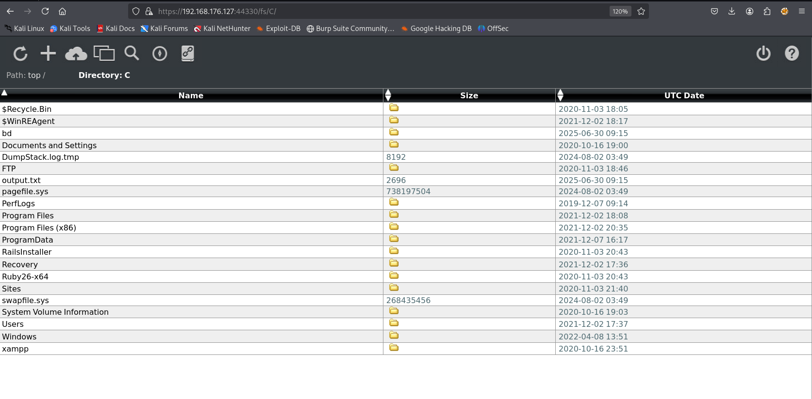

# 信息收集

## nmap

## 8000端口

访问时会跳出初始配置页面，需要配置管理员账号密码

文件服务器下可以访问C盘和D盘的文件，并且是可读可写，可以尝试写入后门

尝试了一下可以直接读取两个flag，但学习期间还是要尝试拿到shell

开放的45332也是web服务，并且是php语言开发的

这个文件夹可以解析php代码，上传一个php后门到该目录下

# 提权

获取shell的时候根据cms的版本号查询过相关漏洞

6.5版本存在本地提权漏洞

https://www.exploit-db.com/exploits/48789

漏洞原理就是允许本地低权限攻击者通过替换bd.exe将权限升级到管理员，开机会自动启动bd.exe

kali上生成exe的后门，将靶机上原有的bd.exe改名，然后将后门上传至C:\bd文件夹下，命名为bd.exe，可以通过之前的文件上传的网页上传，也可以使用powershell上传

然后重启计算机

