# 信息收集

## nmap

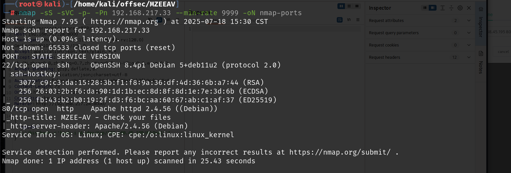

# 80端口

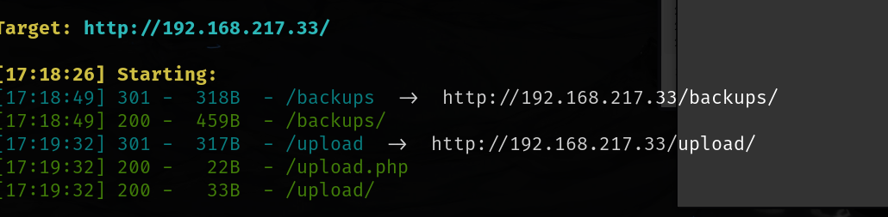

`backups`下有源码，其中给出了`upload.php,listing.php`的源码

**upload.php**

```php
<?php

/* Get the name of the uploaded file */
$filename = $_FILES['file']['name'];

/* Choose where to save the uploaded file */
$tmp_location = "upload/file.tmp";
$location = "upload/".$filename;


/* Move the file temporary */
move_uploaded_file($_FILES['file']['tmp_name'], $tmp_location);


/* Check MagicBytes MZ PEFILE 4D5A*/
$F=fopen($tmp_location,"r");
$magic=fread($F,2);
fclose($F);
$magicbytes = strtoupper(substr(bin2hex($magic),0,4)); 
error_log(print_r("Magicbytes:" . $magicbytes, TRUE));

/* if its not a PEFILE block it - str_contains onlz php 8*/
//if ( ! (str_contains($magicbytes, '4D5A'))) {
if ( strpos($magicbytes, '4D5A') === false ) {
	echo "Error no valid PEFILE\n";
	error_log(print_r("No valid PEFILE", TRUE));
	error_log(print_r("MagicBytes:" . $magicbytes, TRUE));
	exit ();
}


rename($tmp_location, $location);


?>
```

先将上传的文件改名为`temp.file`，然后进行判断是否合法，主要的判断依据是读取了前两个字节，然后转换为十六进制，如果转换后不是`4D5A`，那么就报错并且退出，如果是`4D5A`，那么就将`temp.file`改为原来的文件名

十六进制`4D5A`的`ASCII`为`MZ`，那么给上传的php后门加上`MZ`文件头即可

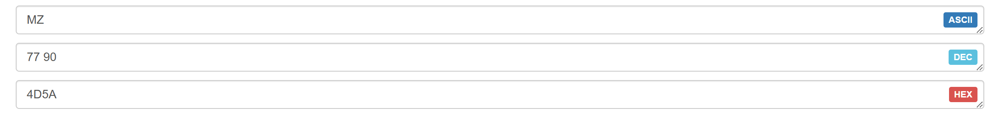

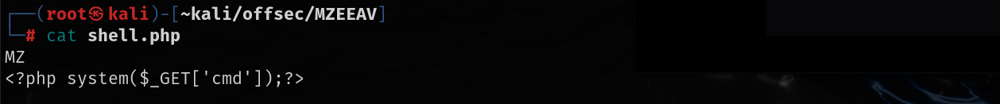

将该文件上传之后访问`list.php`可以查看是否成功，如果成功会保存为原来的文件名，如果不成功就会保存为`temp.file`

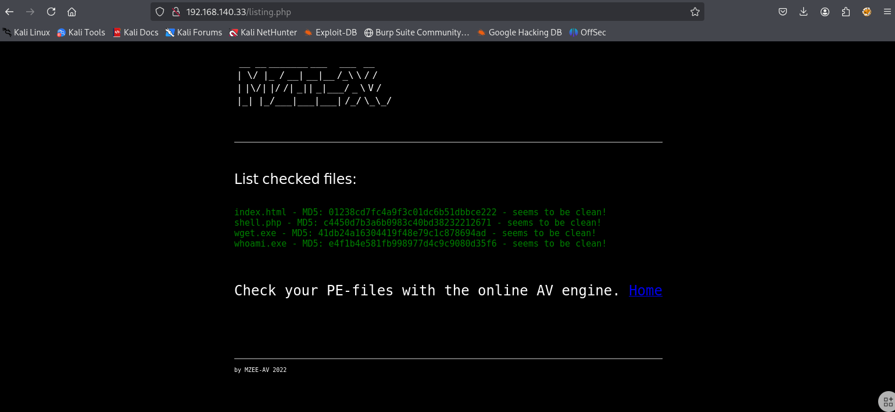

然后通过`upload/shell.php`访问后门就可以命令执行了

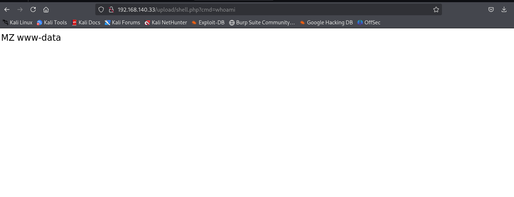

可以直接上传php语句的反向shell，访问之后就会得到一个shell

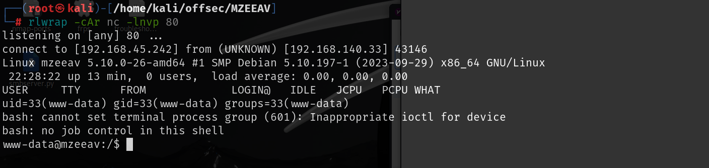

# 提权

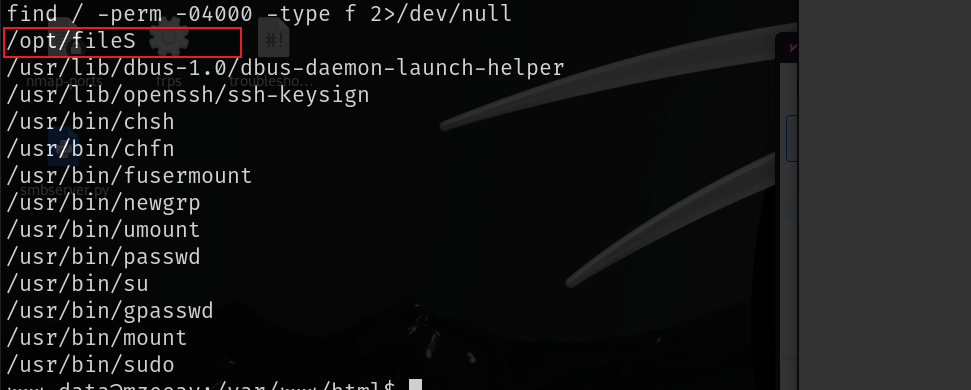

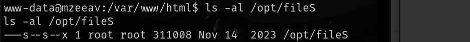

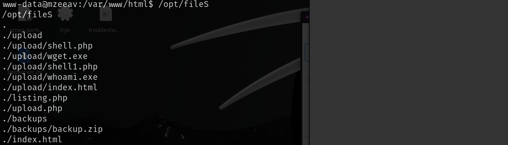

发现一个意料之外的文件，运行之后会打印出当前文件夹以及子文件夹下的所有内容

根据`/opt/fileS --help`中的提示可以命令执行，并且这个是有suid权限的，可以访问/root目录

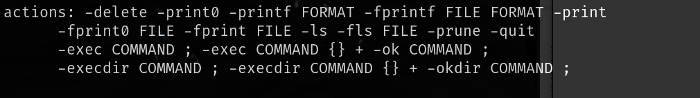

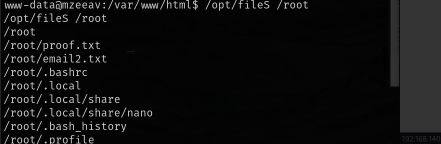

根据help的提示打印一下/root目录就可以得到第二个flag

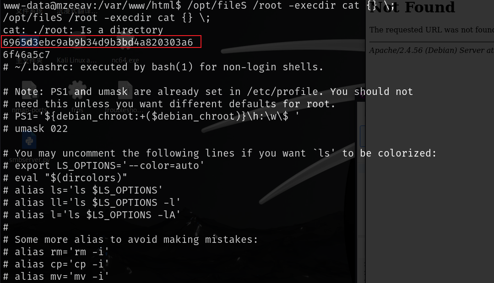

根据help中的网址，这个工具有find功能

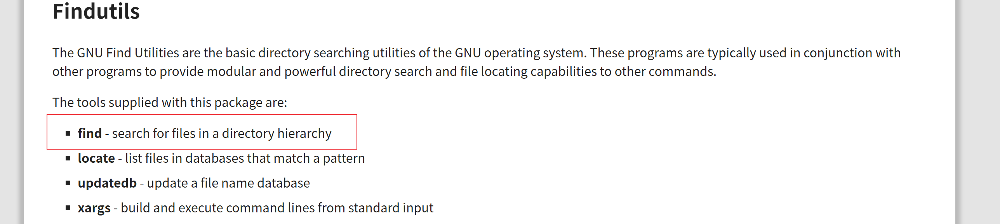

可以通过GTFOBins中find命令的SUID提权方法来提权

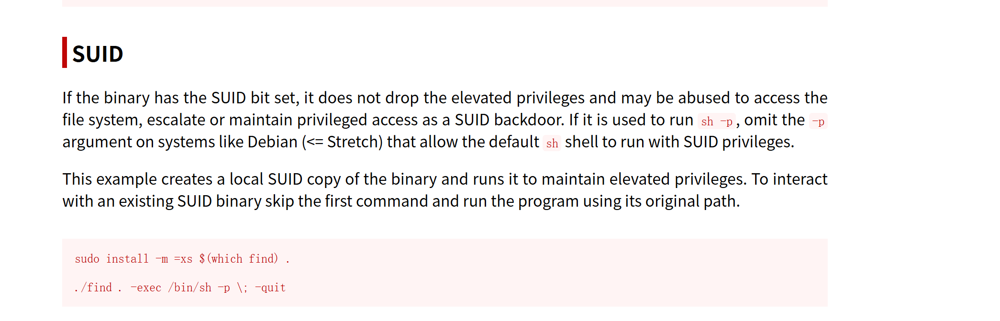

经过修改之后就是这样

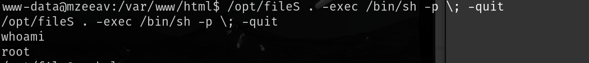