## nmap

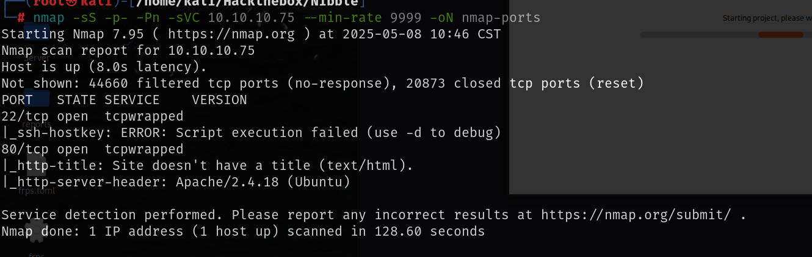

## 80端口

源码下给出了其他目录

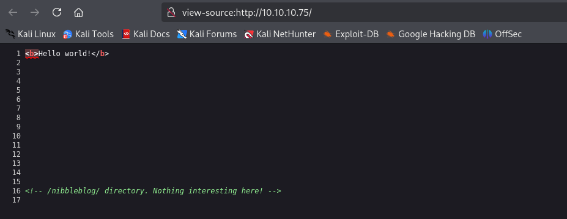

然后对/nibbleblog进行目录扫描，发现admin.php的登录页面，update.php和README中都有版本号：`Nibbleblog 4.0.3`，搜索对应的漏洞发现任意文件上传，并且是一个msf脚本

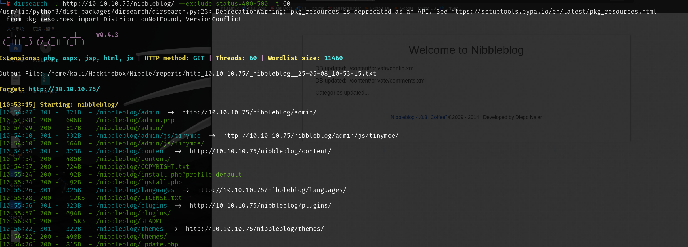

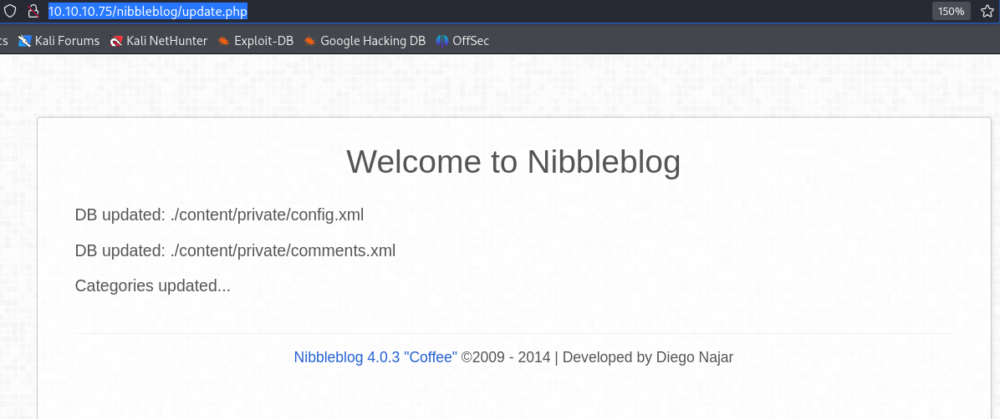

直接在msf中使用，需要账号密码

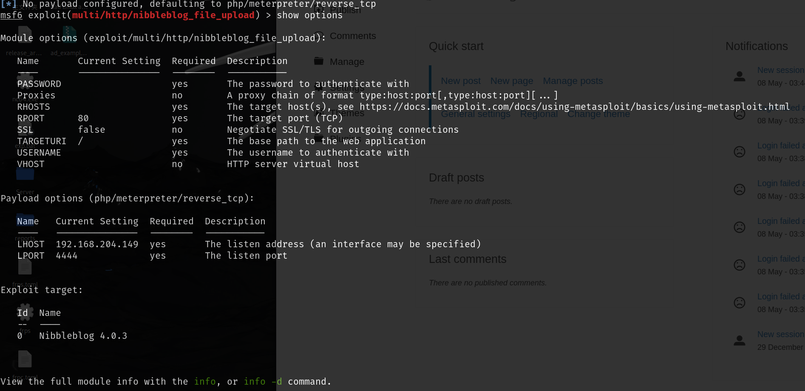

content目录下记录了admin账号的登录情况，在截图之前已经有尝试过一次

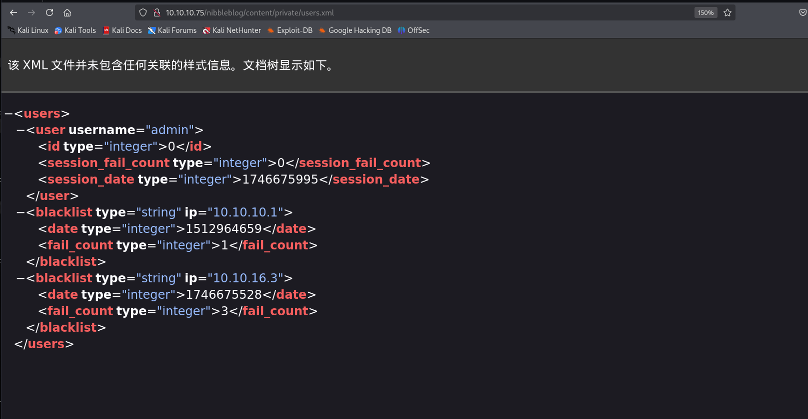

猜测密码为nibbles,可以成功登录

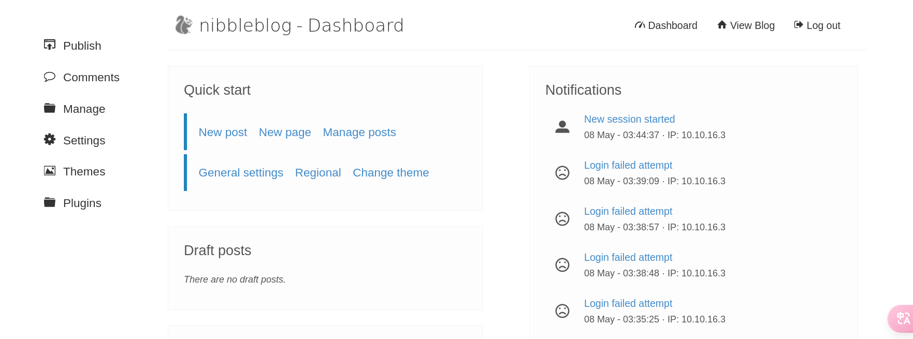

然后配置msf的参数，需要设置网站更目录，账号密码，网站ip，监听ip，成功之后就会得到nibbles用户的shell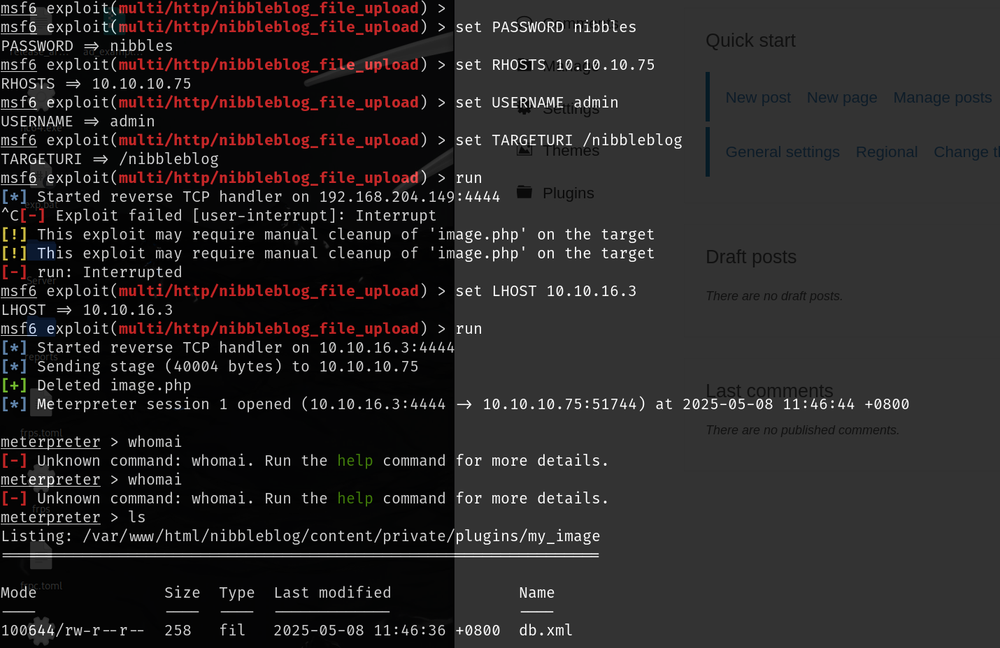

## 提权

该用户有执行一个.sh脚本的sudo权限，但是发现该目录需要解压后才存在，那就直接手动创建一个这样的目录和文件，在monitor.sh中写入反弹shell的脚本

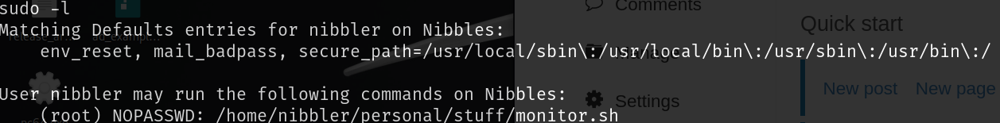

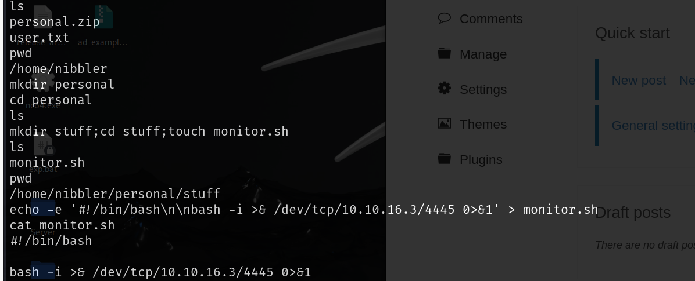

以sudo权限运行该脚本就可以成功反弹到root的shell

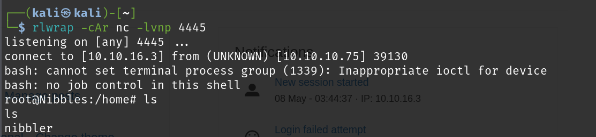