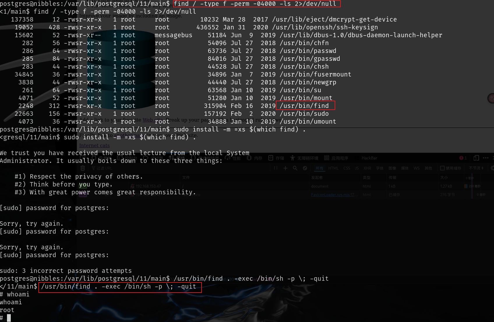

## nmap

## 21端口

21端口ftp服务开放，但是无法匿名登录，并且也没有用户凭据，无法登陆

## 80端口

扫目录无任何有用信息，查看源码，查看请求头，都没有找到有用信息

## 5437

根据`nmap`的扫描结果，得知该端口是`postgresql`数据库，搜索`postgresql exp`，其中有一篇[可以远程代码执行](https://github.com/squid22/PostgreSQL_RCE)，使用时需要修改py文件的`攻击ip`和`监听ip`

查看具有suid权限的文件，find命令可以通过suid提权，但是运行sudo需要用户密码，直接运行第二条也可以提权

