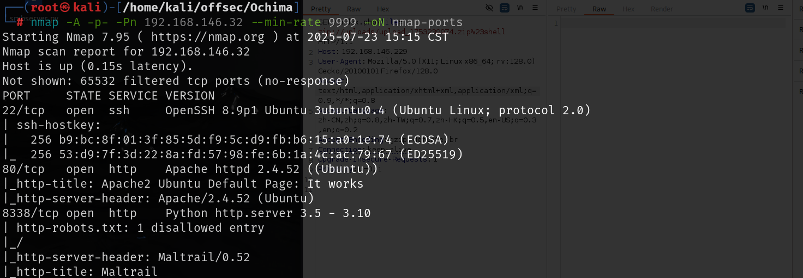
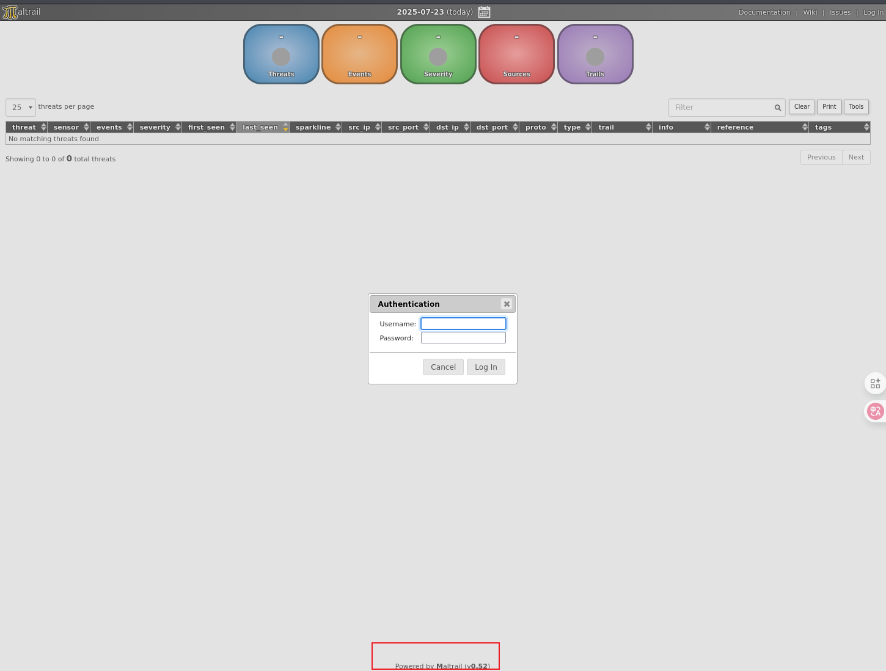
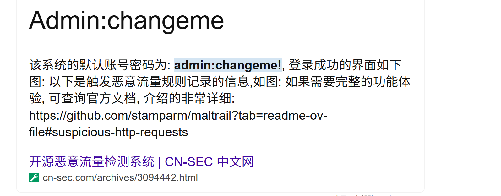
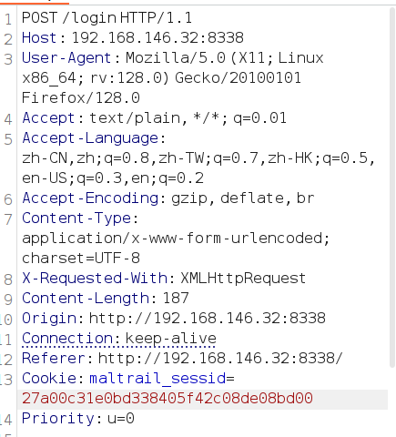
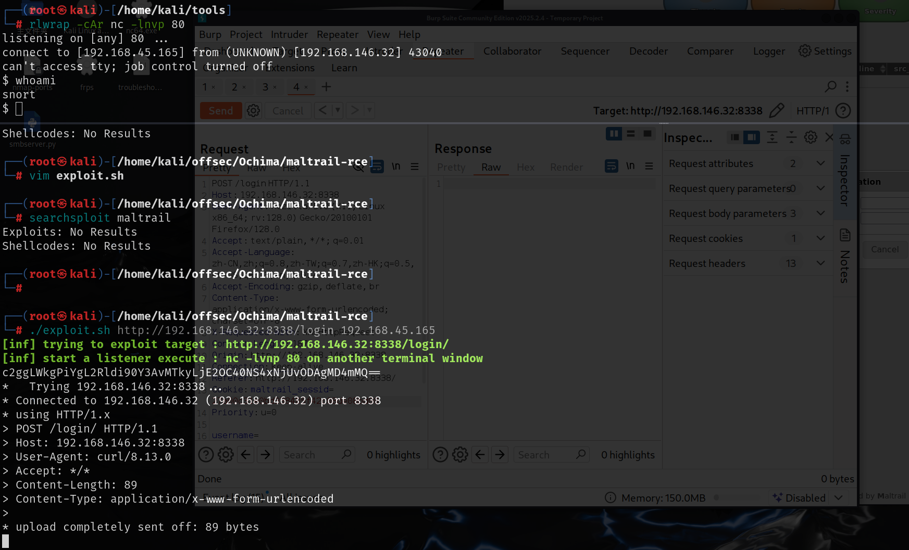
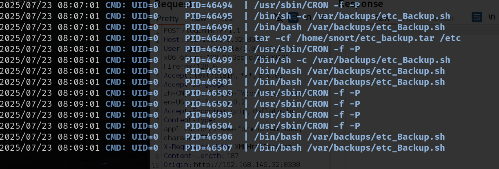
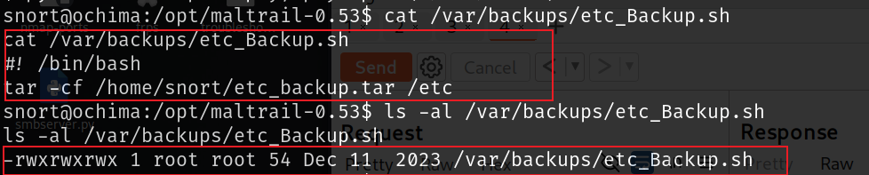
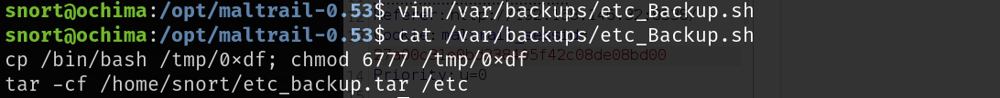
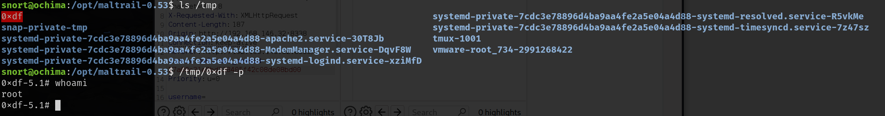

# 信息收集

## nmap

# 8338端口

这个界面需要登录，最下面给出了这个系统以及版本号

搜素这个系统的默认密码，可以查到`admin:changeme!`

使用这个密码就可以成功登录，根据版本号可以搜索到0.53版本存在远程代码执行漏洞，并且是在登录页面，但是其中的端口为1337，需要修改一下，否则无法反弹shell，修改为80，目标url为http://url/login，可以通过抓包得到

[rvizx/maltrail-rce: MalTrail - Command Injection / RCE](./https://github.com/rvizx/maltrail-rce/tree/main)

# 提权

允许pspy，root用户每过一段时间会运行`/var/backups/etc_Backup.sh`

查看了该文件的权限，所有人都可读可写，那么我们就可以在其中写入恶意语句，以root权限来执行，就可以成功提权

