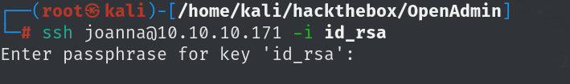

## nmap


## web

### 目录扫描


ona页面下是一个游客的后台页面，其他按钮点击都显示权限不足，但是这里有该管理平台的版本号


点击DOWNLOAD会跳转到`OpenNetAdmin`的下载页面，说明这是`OpenNetAdmin 18.1.1`


### 获得www-data的shell

搜索相关漏洞可以找到可以找到这篇文章，该版本存在远程命令执行，并且存在exp

[amriunix/ona-rce: OpenNetAdmin 18.1.1 - Remote Code Execution](./https://github.com/amriunix/ona-rce)

使用该python脚本检查后该页面存在漏洞


使用exp可以直接得到shell，但是权限是www-data,并且没有办法使用cd，应该是这个脚本的bug，并且还存在两个可以使用bash会话的用户，应该是要登录到那两个用户


最终在该`/local/config/`下找到数据库连接的账号密码,但是使用该shell无法使用mysql


```
ona_sys:n1nj4W4rri0R!
```

## 获得jimmy用户shell

使用这个密码来连接刚才/etc/passwd中看到的两个用户，可以成功连接到jimmy，ssh也可以连接到


### 连接数据库（错误的做法）

现在连接数据库来查看数据库中的内容


```
mysql> show tables
    -> ;
+------------------------+
| Tables_in_ona_default  |
+------------------------+
| blocks                 |
| configuration_types    |
| configurations         |
| custom_attribute_types |
| custom_attributes      |
| dcm_module_list        |
| device_types           |
| devices                |
| dhcp_failover_groups   |
| dhcp_option_entries    |
| dhcp_options           |
| dhcp_pools             |
| dhcp_server_subnets    |
| dns                    |
| dns_server_domains     |
| dns_views              |
| domains                |
| group_assignments      |
| groups                 |
| host_roles             |
| hosts                  |
| interface_clusters     |
| interfaces             |
| locations              |
| manufacturers          |
| messages               |
| models                 |
| ona_logs               |
| permission_assignments |
| permissions            |
| roles                  |
| sequences              |
| sessions               |
| subnet_types           |
| subnets                |
| sys_config             |
| tags                   |
| users                  |
| vlan_campuses          |
| vlans                  |

```


查数据库，查表，查列，最终找到两个没用的用户，密码破解之后也是简单密码

```
  1 | guest    | 098f6bcd4621d373cade4e832627b4f6 (test)
  2 | admin    | 21232f297a57a5a743894a0e4a801fc3 (admin)
```

### 发现本地运行的网站（正确的做法）

最终在/var/www/下发现其他网站，`main.php`下打印出了`joanna`用户的私钥，有了私钥就可以ssh连接


前面访问网站的时候默认页面是apache2，去/etc/apache2下看配置文件，找到一个在本地52846端口监听的本地网站


curl访问一下就可以得到私钥


将私钥复制到本地连接一下，需要输入私钥的密码



那就使用john再破解一下

```
ssh2john id_rsa > sshjohn
```


使用密码和私钥就可以成功连接


## 提权

该用户可以以sudo权限运行`nano`修改`/opt/priv`文件，该文件为空，Ctrl+R就可以读取任意文件，直接读取/root/root.txt

