## nmap

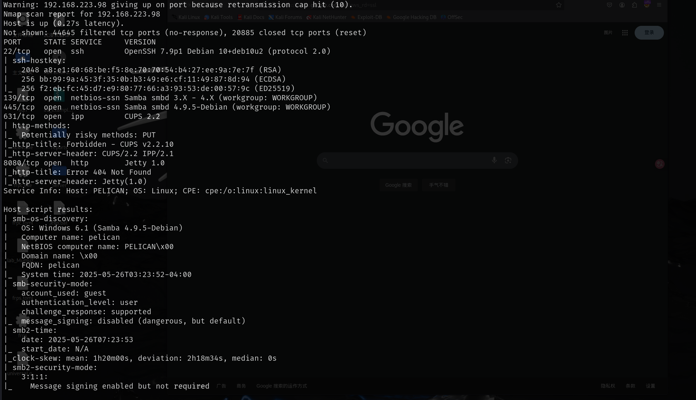

## web

### dirsearch-目录扫描

直接访问8080端口显示not found，扫目录搜索更多信息

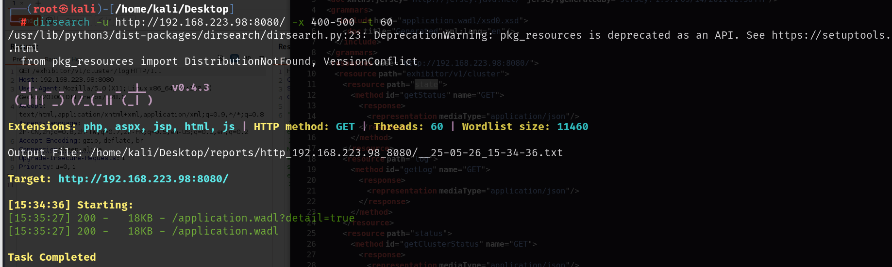

wadl(web应用程序描述语言)，该语言要求正式而精确地描述每个可用资源

查看方式：`base`后面是`url`的基础部分，后面跟路径，路径后还有具体的参数

例如：http://192.168.223.98:8080/exhibitor/v1/cluster/state

http://192.168.223.98:8080/exhibitor/v1/cluster/state

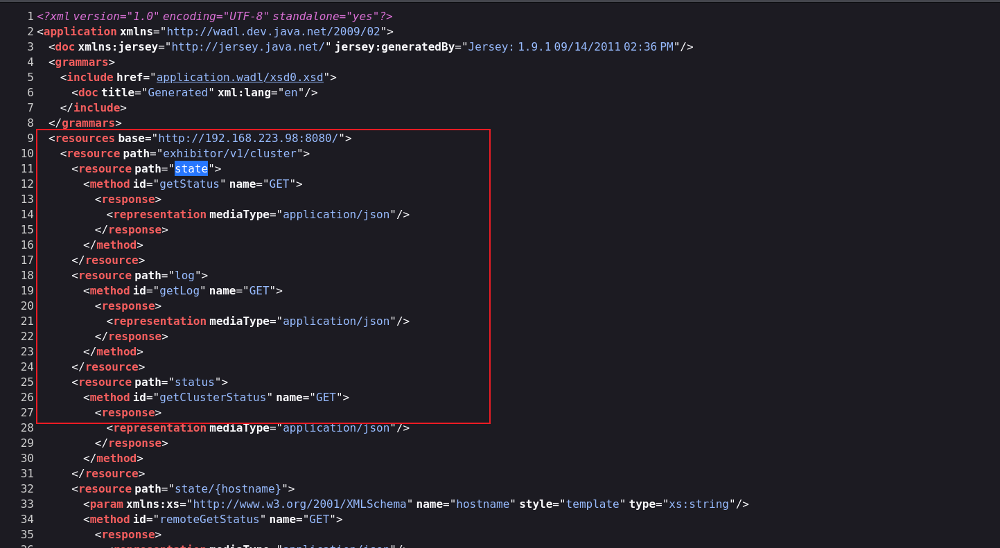

该页面最下方有`ui`界面和`config`界面

访问http://192.168.223.98:8080/exhibitor/v1/config/get-state，该页面下是zookeeper的配置页面，有相关配置信息，得知版本为`v1.0`

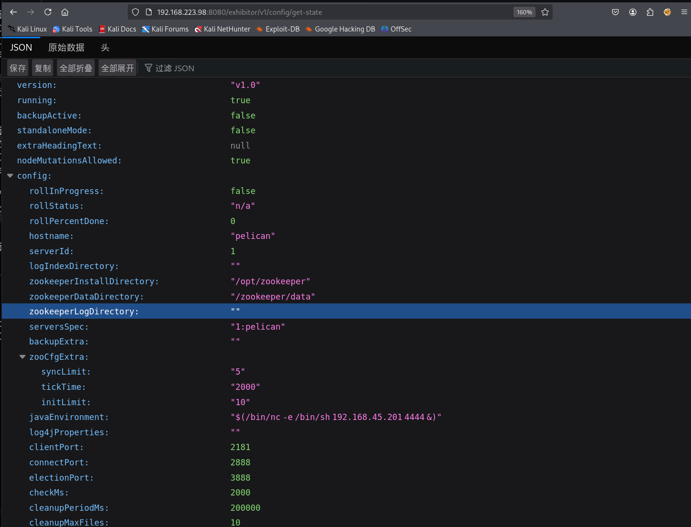

### CVE-2019-5029

然后访问ui界面，可以搜索一下exhibitor存在的相关漏洞

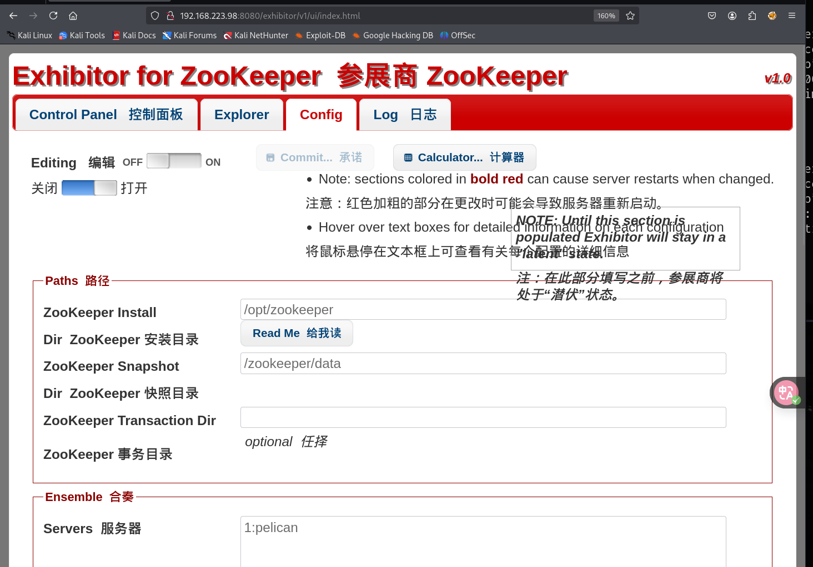

使用seachsploit搜索存在一个`Web UI 1.7.1`的远程代码执行，我们是有web ui的，尝试利用

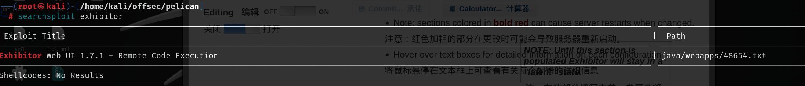

### get shell

需要将config页面编辑打开，然后编辑`java.env script`其中写入需要执行的命令，然后提交就可以执行命令，写入反弹shell的命令可以成功得到shell

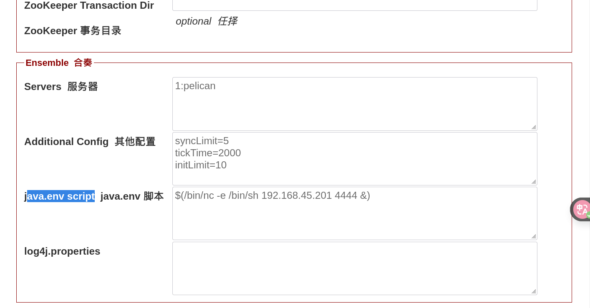

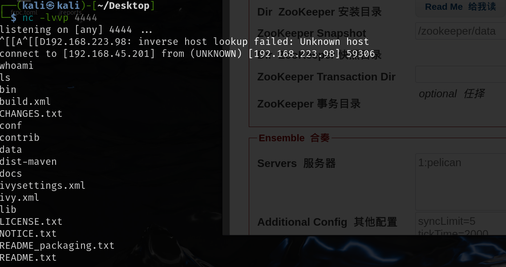

拿到的是charles用户的权限


## 提权

sudo -l 可以发现该用户可以使用sudo权限运行gcore这个脚本，搜了一下该脚本可以文件读取

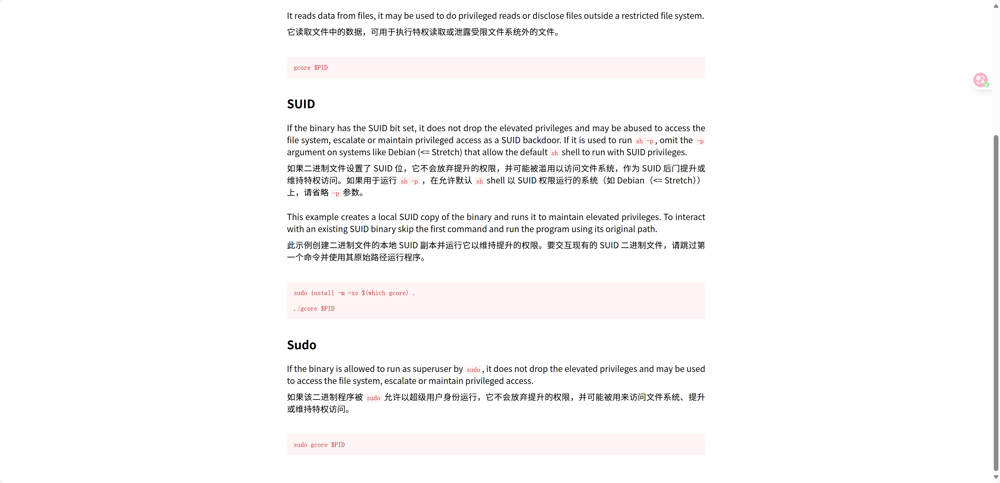

在进程中发现一个密码存储的进程，使用gcore读取一下

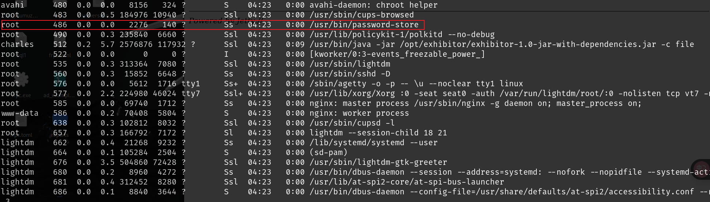

```
-o 指定输出文件名称 后面跟进程的pid
sudo gcore -a -o out1 486
```

但是读取了out1.486文件之后是乱码，使用strings提取其中的字符串

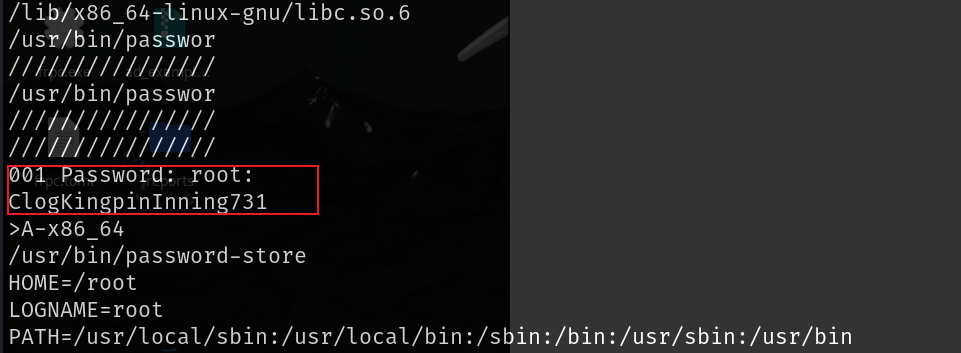

发现有一个是root的密码，输入密码就可以成功提权到root

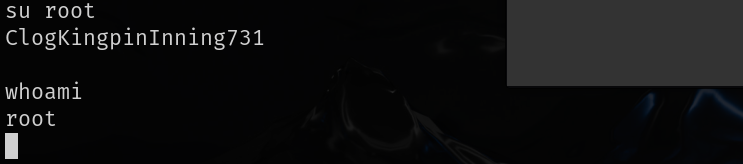