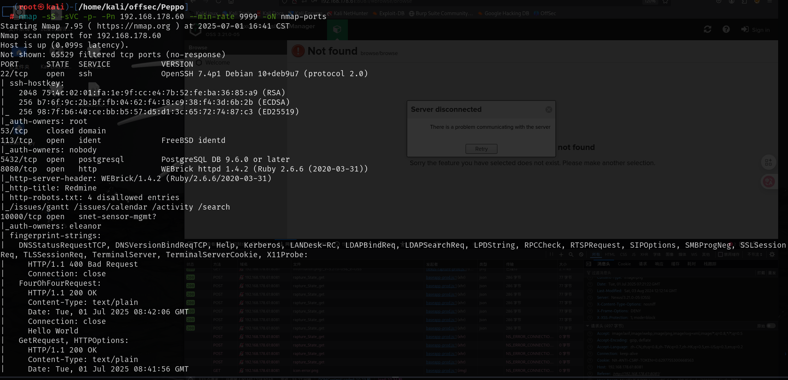
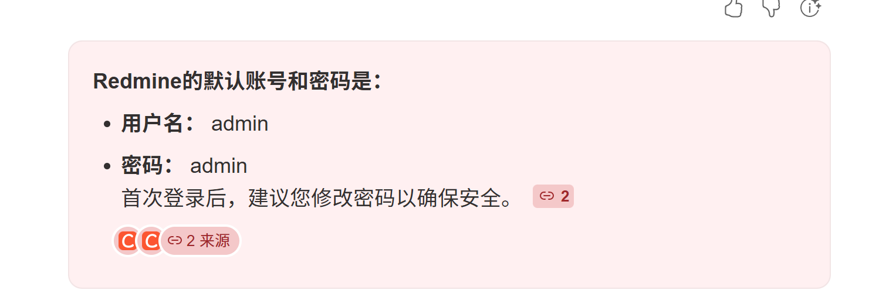
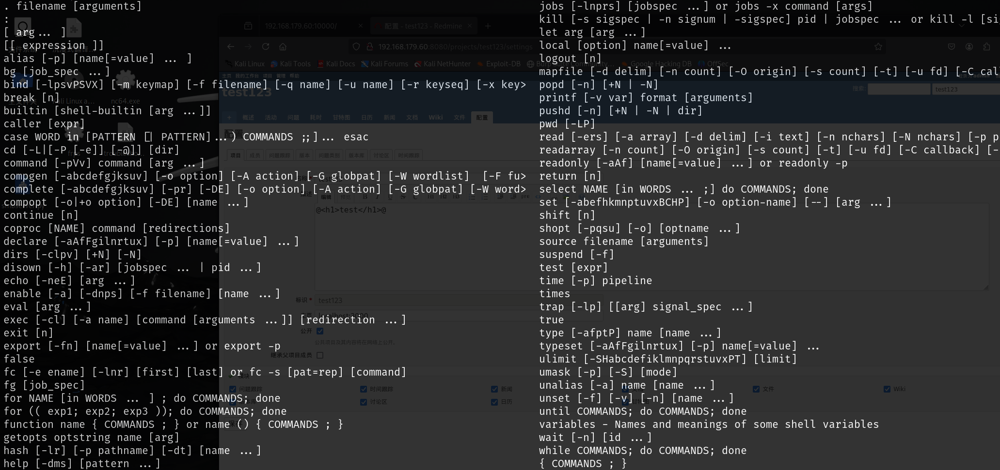
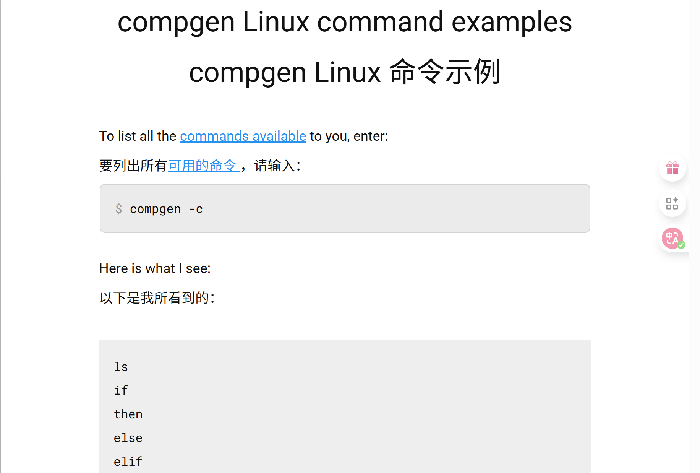
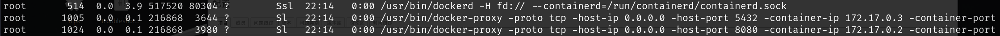
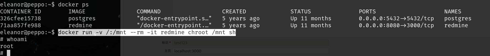

# 信息收集

## nmap



这里注意`auth-owners`用户：`nobody,eleanor`

# 8080端口



登陆之后也没有发现有用的信息

# ssh登录

账号密码就是nmap中发现的`eleanor:eleanor`

得到的是一个受限的shell





通过查询得知`compgen -c`可以查看可以使用的命令

尝试了两种读取的方式

```
source local.txt
exec 3< local.txt
```

## 突破受限shell

https://gtfobins.github.io/gtfobins/ed/

```
ed
!/bin/bash

还需要添加环境变量

export PATH=/usr/local/sbin:/usr/sbin:/sbin:/usr/local/bin:/usr/bin:/bin

```

# 提权



这两个服务是以docker运行的，并且我们可以执行docker

https://gtfobins.github.io/gtfobins/docker/

