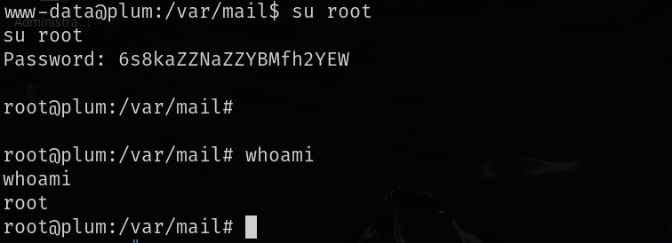

# 信息收集

## nmap

# 80端口

`gobuster`扫目录扫到一个`readme`

其中在changelog中有更新的版本号，这个系统最新更新的是`pluxml 5.8.7`

搜索这个版本号可以搜到任意代码执行漏洞，具体细节可以看这篇[CVE-2022-25018.pdf](./https://github.com/MoritzHuppert/CVE-2022-25018/blob/main/CVE-2022-25018.pdf)，其中给出了一个`youtube`的[video](./https://www.youtube.com/watch?v=Gbe2UNCB0tY)

这个视频中有漏洞利用的步骤，第一步要先登录到管理员，但是我们没有找到管理员登录界面，扫目录也没有扫到

主页面有个`RSS feed of  the articles`，点击后会下载一个`feed.php`

查看一下发现这里有个和admin页面相关的，直接访问这个链接访问不到，但是我们访问http://192.168.160.28/core/admin就会跳转到admin登录界面

然后使用弱密码`admin:admin`就可以登录

左侧的`static pages`->编辑`static 1`->将`Content`中的内容改为恶意的php代码->`save the page`->返回主页访问`static 1`->就会执行恶意代码

# 提权

运行linpeas.sh时发现本地运行了25端口，开启了邮件服务，并且/var/mail下还有邮件

查看了之后又一份root发给www-data的，其中包含了root用户的密码

使用该密码就可以直接登录到root用户

