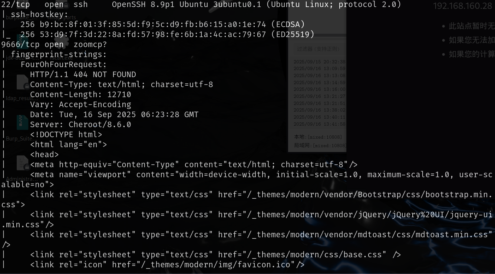
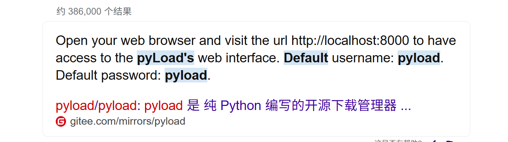
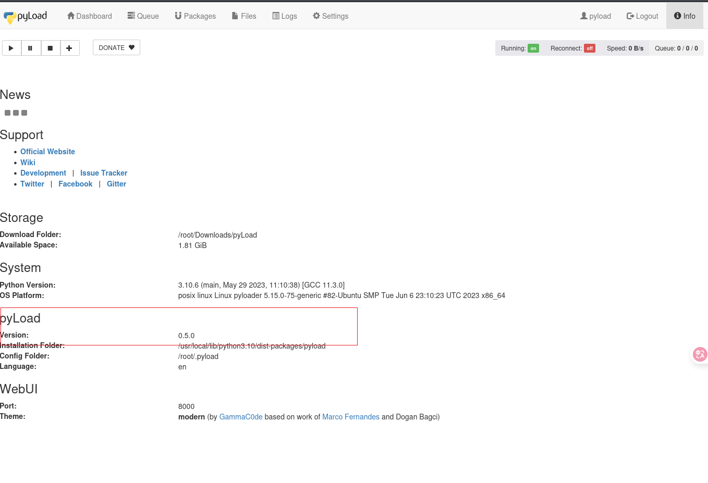
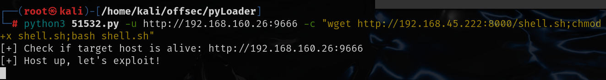
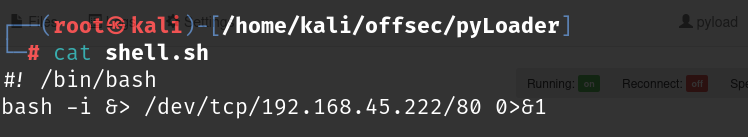
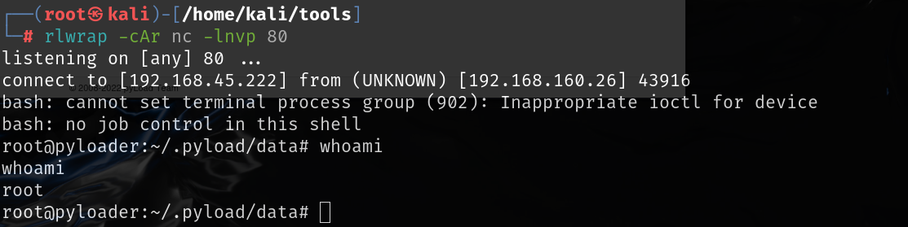

```
title: Proving Grounds Practice-Pyloader
date: 2025-9-16 20:00:00
tags: 红队
categories: 红队打靶-Linux
```


# 信息收集

## nmap



# 9666端口

这个端口默认界面是个登录界面，使用默认密码`pyload:pyload`即可登录



登录之后查看左上角的info，其中有版本号0.5.0



经过查询该版本存在[Remote Code Execution (RCE) - Python webapps Exploit](./https://www.exploit-db.com/exploits/51532)

直接运行exp执行命令即可





拿到的直接就是root权限

