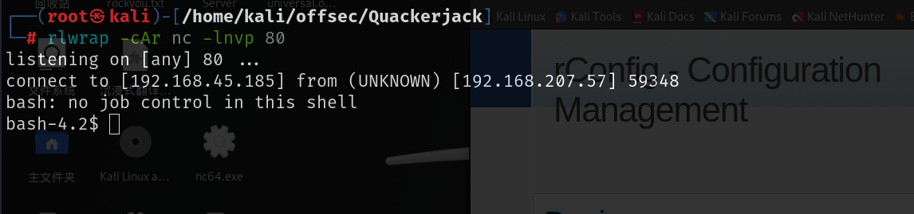
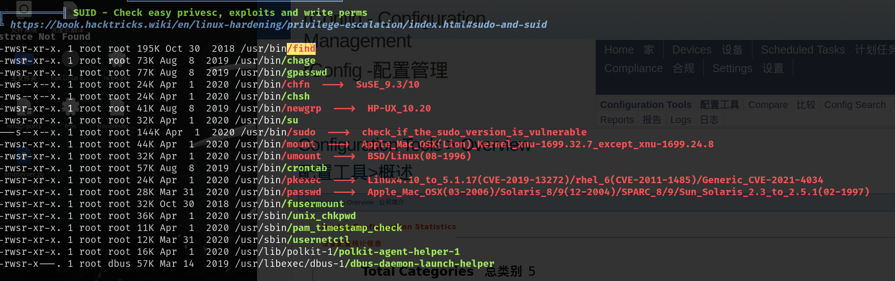

# 信息收集

## nmap


# 8081端口

## sql注入


rconfig 3.9.4存在多个漏洞，存在未授权sql注入，可以注入拿到登录的账号密码

存在任意代码执行

本地提权漏洞，下面链接中有各个漏洞的exp

[v1k1ngfr/exploits-rconfig: 针对 rconfig <= 3.9.4 的漏洞代码 --- v1k1ngfr/exploits-rconfig: Exploit codes for rconfig <= 3.9.4](./https://github.com/v1k1ngfr/exploits-rconfig)

exp需要进行修改，在第二个get请求时需要添加忽略ssl证书认证，否则会报错


然后运行脚本就可以读取到后台登录的账号密码


```
abgrtyu
```

通过该密码就可以登录到后台


## 任意代码执行-getshell

上面说到的存在任意代码执行漏洞，该漏洞需要经过认证，账号密码我们已经有了


要运行还是需要修改exp，忽略ssl认证，在get请求中添加`verify=False`，否则会报错，修改之后就可以成功运行，可以得到shell




# 提权

上面提到的rconfig这个管理系统的本地提权漏洞是不能使用的，因为要输入apache账户的密码

可以通过其他方式提权，找到了find命令具有suid权限



通过[find | GTFOBins](./https://gtfobins.github.io/gtfobins/find/#suid)就可以提权


